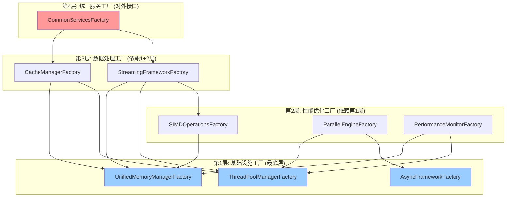

# 【模块检查方案01】Common通用库统一重构方案 - 完整重构指导

## 📋 1. 全面重构检查概述

### 1.1 Critical Issues Summary (基于跨模块冲突分析)
经过与其他5个模块重构方案的全面冲突分析，Common通用库存在以下**重大架构问题**：

#### 🔴 **A级问题：架构依赖冲突** 
- **问题**: 插值服务、CRS服务仍使用`std::future`，违反统一boost异步模式
- **影响**: 造成整个系统异步模式不一致，性能损失和维护困难
- **修正**: 强制所有模块使用boost::future，Common层统一异步接口规范

#### 🔴 **B级问题：功能重复严重**
- **性能监控重复**: 在Common、空间服务、插值服务中发现8处重复实现
- **线程池管理重复**: 6个模块各自创建线程池，造成资源浪费
- **缓存管理分散**: 各服务独立实现缓存，无统一管理
- **修正**: 建立强制性Common依赖检查，禁止模块重复实现基础设施

#### 🔴 **C级问题：时间架构设计冲突**
- **问题**: NetCDF时间解析在Common层违反了单一职责原则
- **冲突**: 与数据访问服务的NetCDF解析功能重复和冲突
- **修正**: 重新设计三层时间架构，格式专用解析移至数据访问层

#### 🟡 **D级问题：流式处理能力不足**
- **缺失**: 缺乏统一的大数据流式处理框架
- **性能**: 无法有效处理GB级海洋数据文件
- **修正**: 实现完整的流式处理基础设施

### 1.2 重构后的模块协作架构
```
┌─────────────────────────────────────────────────────────────┐
│                     重构后的模块协作架构                      │
├─────────────────────────────────────────────────────────────┤
│  应用层                                                      │
│  ├── Workflow Engine          ├── Output Generation         │
│  └── Task Dispatcher          └── Network Service           │
├─────────────────────────────────────────────────────────────┤
│  核心服务层 (全部使用boost::future)                         │
│  ├── Data Access Service      ├── Metadata Service          │
│  ├── Spatial Operations       ├── Interpolation Service     │
│  └── CRS Service             └── (所有格式专用解析)         │
├─────────────────────────────────────────────────────────────┤
│  Common通用库 (统一基础设施层)                               │
│  ├── 统一异步框架 (boost::future)                           │
│  ├── 统一性能监控              ├── 统一线程池管理              │
│  ├── 统一内存管理              ├── 统一缓存框架               │
│  ├── 统一流式处理              ├── 通用时间类型定义           │
│  ├── 格式工具(无解析逻辑)      └── SIMD优化框架              │
└─────────────────────────────────────────────────────────────┘

依赖规则 (严格强制):
✅ 核心服务层 → Common通用库 (单向依赖)
✅ 应用层 → 核心服务层 → Common通用库 (分层依赖)
❌ Common → 任何上层模块 (绝对禁止)
❌ 任何模块重复实现Common功能 (强制检查)
```

### 1.3 检查范围与修正重点
```
common_utilities/
├── include/common_utils/
│   ├── async/                     # 🆕 统一异步框架 (boost::future)
│   ├── infrastructure/            # 🆕 统一基础设施管理
│   │   ├── unified_performance_monitor.h    # 消除8处重复
│   │   ├── unified_thread_pool_manager.h    # 消除6个模块重复
│   │   ├── unified_memory_manager.h         # 统一内存管理
│   │   └── unified_cache_manager.h          # 统一缓存框架
│   ├── streaming/                 # 🆕 统一流式处理框架
│   │   ├── data_stream.h          # 流式数据接口
│   │   ├── file_stream_reader.h   # 文件流式读取
│   │   └── streaming_pipeline.h   # 流式处理管道
│   ├── time/                      # 🔄 重新设计时间架构
│   │   ├── time_types.h           # 通用时间类型定义
│   │   ├── time_extractor_interface.h      # 时间提取器接口
│   │   └── time_extractor_factory.h        # 时间提取器工厂
│   ├── format_utils/              # 🔄 格式工具(移除解析逻辑)
│   │   ├── netcdf_format_utils.h  # NetCDF格式工具(无时间解析)
│   │   └── gdal_format_utils.h    # GDAL格式工具(无时间解析)
│   ├── memory/                    # ✅ 保留并增强
│   ├── performance/               # ❌ 整合到infrastructure/
│   ├── cache/                     # ❌ 整合到infrastructure/ 
│   ├── parallel/                  # ❌ 整合到infrastructure/
│   ├── netcdf/                    # 🔄 重构，移除时间解析
│   ├── simd/                      # ✅ 保留并增强
│   └── *.h                        # 🔄 更新为统一框架
└── src/                           # 对应实现文件
```

## 🎯 2. 修正后的重构目标与原则

### 2.1 核心原则 (基于冲突分析修正)
1. **强制统一**: Common提供的基础设施**必须**被所有模块使用，禁止重复实现
2. **严格分层**: Common不依赖任何上层模块，建立强制检查机制
3. **boost异步统一**: 全系统**必须**使用boost::future，消除std::future
4. **流式优先**: 支持GB级海洋数据的流式处理，内存使用<256MB
5. **时间架构清晰**: 格式专用解析在数据访问层，Common只提供通用类型

### 2.2 架构目标 (修正版)
```cpp
// 重构后的Common统一架构
namespace oscean::common_utils {
    // 🆕 统一异步框架
    namespace async {
        template<typename T>
        using UnifiedFuture = boost::future<T>;        // 统一异步类型
        
        template<typename T>
        using UnifiedPromise = boost::promise<T>;       // 统一Promise类型
        
        class AsyncPatternValidator;                    // 异步模式验证器
        class FutureCompositionUtils;                   // Future组合工具
    }
    
    // 🆕 统一基础设施层
    namespace infrastructure {
        class UnifiedPerformanceMonitor;               // 替换所有重复实现
        class UnifiedThreadPoolManager;                // 替换所有线程池
        class UnifiedMemoryManager;                    // 统一内存管理
        class UnifiedCacheManager;                     // 统一缓存管理
        class SystemResourceMonitor;                   // 系统资源监控
    }
    
    // 🔄 重新设计时间架构 (仅通用类型和接口)
    namespace time {
        struct CalendarTime;                           // 通用时间类型
        struct TimeRange;                              // 时间范围
        struct TimeResolutionInfo;                     // 时间分辨率信息
        class ITimeMetadataExtractor;                  // 时间提取器接口
        class TimeExtractorFactory;                    // 时间提取器工厂
        // ❌ 移除: NetCDF/GDAL具体解析逻辑
    }
    
    // 🆕 统一流式处理层
    namespace streaming {
        template<typename T> class IDataStream;        // 流式数据接口
        template<typename T> class StreamProcessor;    // 流式处理器
        class StreamingFileReader;                     // 流式文件读取
        class StreamingPipeline;                       // 流式处理管道
        class MemoryPressureMonitor;                   // 内存压力监控
    }
    
    // 🔄 格式工具层 (移除解析逻辑，仅保留格式支持)
    namespace format_utils {
        namespace netcdf {
            class NetCDFFormatDetector;                // 格式检测
            class NetCDFStreamingReader;               // 流式读取
            // ❌ 移除: NetCDFTimeExtractor (移至数据访问层)
        }
        
        namespace gdal {
            class GDALFormatDetector;                  // 格式检测
            class GDALStreamingReader;                 // 流式读取
            // ❌ 移除: GDALTimeExtractor (移至数据访问层)
        }
    }
}
```

## 🏭 2.3 统一工厂模式架构设计

### 2.3.1 **工厂模式设计原则**

基于架构分析，Common模块必须采用**统一工厂模式**来替代单例模式，实现：

#### **核心设计原则**
1. **职责分离**: 工厂负责创建，管理器负责管理
2. **环境感知**: 不同环境(开发/生产/测试/HPC)使用不同实现
3. **依赖注入**: 支持清晰的依赖关系声明
4. **层次化服务**: 基础设施→性能优化→数据处理→统一服务

#### **工厂架构层次图**


### 2.3.2 **第1层: 基础设施工厂 (最底层)**

#### **A. 异步框架工厂**
```cpp
// 文件: common_utilities/include/common_utils/async/async_framework_factory.h
namespace oscean::common_utils::async {

enum class AsyncBackend {
    BOOST_FUTURE,      // Boost.Thread futures (默认)
    STD_FUTURE,        // 标准库 (仅测试用)
    CUSTOM_ASYNC       // 自定义高性能异步框架
};

class IAsyncFrameworkFactory {
public:
    virtual ~IAsyncFrameworkFactory() = default;
    
    virtual std::unique_ptr<UnifiedAsyncContext> createAsyncContext() = 0;
    virtual std::unique_ptr<FutureCompositionUtils> createCompositionUtils() = 0;
    virtual std::unique_ptr<AsyncPatternValidator> createValidator() = 0;
    
    virtual AsyncBackend getBackendType() const = 0;
    virtual std::string getBackendDescription() const = 0;
};

class AsyncFrameworkFactory {
public:
    // 环境特定工厂创建
    static std::unique_ptr<IAsyncFrameworkFactory> createForProduction();
    static std::unique_ptr<IAsyncFrameworkFactory> createForDevelopment();
    static std::unique_ptr<IAsyncFrameworkFactory> createForTesting();
    static std::unique_ptr<IAsyncFrameworkFactory> createForHPC();
    
    // 自定义后端工厂
    static std::unique_ptr<IAsyncFrameworkFactory> createCustomFactory(AsyncBackend backend);
    
    // 性能基准测试
    static std::map<AsyncBackend, double> benchmarkBackends();
};

// Boost实现工厂
class BoostAsyncFrameworkFactory : public IAsyncFrameworkFactory {
public:
    std::unique_ptr<UnifiedAsyncContext> createAsyncContext() override;
    std::unique_ptr<FutureCompositionUtils> createCompositionUtils() override;
    std::unique_ptr<AsyncPatternValidator> createValidator() override;
    
    AsyncBackend getBackendType() const override { return AsyncBackend::BOOST_FUTURE; }
    std::string getBackendDescription() const override { return "Boost.Thread futures with coroutine support"; }
};

// 高性能自定义实现工厂
class HighPerformanceAsyncFactory : public IAsyncFrameworkFactory {
public:
    std::unique_ptr<UnifiedAsyncContext> createAsyncContext() override;
    // ... 高性能异步框架实现
};

} // namespace oscean::common_utils::async
```

#### **B. 统一内存管理器工厂**
```cpp
// 文件: common_utilities/include/common_utils/memory/unified_memory_manager_factory.h
namespace oscean::common_utils::memory {

enum class MemoryManagerType {
    STANDARD,          // 标准内存池
    HIGH_PERFORMANCE,  // 高性能对齐分配
    LOW_MEMORY,        // 低内存环境优化
    DEBUG,             // 调试模式 (泄漏检测)
    NUMA_AWARE,        // NUMA感知分配器
    SIMD_OPTIMIZED     // SIMD优化分配器
};

enum class PoolType {
    SMALL_OBJECTS,     // 小对象池 (<1KB)
    MEDIUM_OBJECTS,    // 中等对象池 (1KB-1MB)
    LARGE_OBJECTS,     // 大对象池 (>1MB)
    SIMD_ALIGNED,      // SIMD对齐专用池
    STREAMING_BUFFER,  // 流式处理缓冲池
    CACHE_STORAGE      // 缓存存储专用池
};

class IUnifiedMemoryManagerFactory {
public:
    virtual ~IUnifiedMemoryManagerFactory() = default;
    
    // 创建特定类型的内存管理器
    virtual std::unique_ptr<IMemoryManager> createManager(
        MemoryManagerType type,
        const MemoryPoolConfig& config
    ) = 0;
    
    // 创建特定用途的内存池
    virtual std::unique_ptr<IMemoryManager> createPoolManager(
        PoolType poolType,
        const MemoryPoolConfig& config
    ) = 0;
    
    // 创建统一内存管理器 (管理多个池)
    virtual std::unique_ptr<UnifiedMemoryManager> createUnifiedManager(
        const std::map<PoolType, MemoryPoolConfig>& poolConfigs
    ) = 0;
    
    virtual MemoryManagerType getManagerType() const = 0;
    virtual std::vector<PoolType> getSupportedPoolTypes() const = 0;
};

class UnifiedMemoryManagerFactory {
public:
    // 环境特定工厂
    static std::unique_ptr<IUnifiedMemoryManagerFactory> createForProduction();
    static std::unique_ptr<IUnifiedMemoryManagerFactory> createForDevelopment();
    static std::unique_ptr<IUnifiedMemoryManagerFactory> createForTesting();
    static std::unique_ptr<IUnifiedMemoryManagerFactory> createForHPC();
    
    // 预配置的管理器创建
    static std::unique_ptr<UnifiedMemoryManager> createSpatialOpsManager();
    static std::unique_ptr<UnifiedMemoryManager> createInterpolationManager();
    static std::unique_ptr<UnifiedMemoryManager> createStreamingManager();
    static std::unique_ptr<UnifiedMemoryManager> createCacheManager();
    
    // 性能基准和优化建议
    static MemoryPoolConfig optimizeConfigForWorkload(
        const std::string& workloadType,
        size_t expectedDataSize
    );
    
    static std::map<MemoryManagerType, double> benchmarkManagers(
        const MemoryPoolConfig& config
    );
};

/**
 * @brief 统一内存管理器 - 集成现有memory_manager.h设计
 */
class UnifiedMemoryManager {
public:
    explicit UnifiedMemoryManager(
        std::map<PoolType, std::unique_ptr<IMemoryManager>> pools
    );
    
    // 智能分配 - 自动选择最合适的池
    void* allocate(size_t size, size_t alignment = 0, const std::string& tag = "");
    void deallocate(void* ptr);
    void* reallocate(void* ptr, size_t newSize, const std::string& tag = "");
    
    // 专用池访问
    IMemoryManager& getPool(PoolType poolType);
    
    // 内存压力管理
    void enableMemoryPressureMonitoring(bool enable);
    void setMemoryLimit(size_t limitBytes);
    void triggerGarbageCollection();
    
    // 统计和监控
    struct MemoryStats {
        std::map<PoolType, MemoryUsageStats> poolStats;
        size_t totalAllocated;
        size_t totalUsed;
        size_t peakUsage;
        double globalFragmentationRatio;
        std::chrono::steady_clock::time_point lastGC;
    };
    
    MemoryStats getGlobalStats() const;
    std::string generateMemoryReport() const;
    
    // 性能优化
    void optimizeMemoryLayout();
    void prefaultMemory(size_t sizeBytes);
    void adviseMemoryUsage(void* ptr, size_t size, int advice);

private:
    std::map<PoolType, std::unique_ptr<IMemoryManager>> pools_;
    mutable std::shared_mutex poolsMutex_;
    
    std::atomic<size_t> memoryLimit_{SIZE_MAX};
    std::atomic<bool> pressureMonitoringEnabled_{false};
    
    MemoryStats globalStats_;
    mutable std::mutex statsMutex_;
    
    // 智能分配策略
    PoolType selectOptimalPool(size_t size, size_t alignment, const std::string& tag) const;
    void updateGlobalStats();
    void checkMemoryPressure();
};

} // namespace oscean::common_utils::memory
```

#### **C. 线程池管理器工厂**
```cpp
// 文件: common_utilities/include/common_utils/infrastructure/thread_pool_manager_factory.h
namespace oscean::common_utils::infrastructure {

enum class ThreadPoolImplementation {
    BOOST_ASIO,        // Boost.Asio thread pool (默认)
    STD_THREAD,        // 标准库线程池
    CUSTOM_POOL,       // 自定义高性能线程池
    NUMA_AWARE         // NUMA感知线程池
};

class IThreadPoolManagerFactory {
public:
    virtual ~IThreadPoolManagerFactory() = default;
    
    virtual std::unique_ptr<IThreadPoolManager> createManager() = 0;
    virtual std::unique_ptr<IThreadPoolManager> createManager(
        const std::map<PoolType, size_t>& poolSizes
    ) = 0;
    
    virtual ThreadPoolImplementation getImplementationType() const = 0;
    virtual std::vector<PoolType> getSupportedPoolTypes() const = 0;
};

class ThreadPoolManagerFactory {
public:
    // 环境特定工厂
    static std::unique_ptr<IThreadPoolManagerFactory> createForProduction();
    static std::unique_ptr<IThreadPoolManagerFactory> createForDevelopment();
    static std::unique_ptr<IThreadPoolManagerFactory> createForTesting();
    static std::unique_ptr<IThreadPoolManagerFactory> createForHPC();
    
    // 工作负载特定管理器
    static std::unique_ptr<IThreadPoolManager> createForSpatialOps();
    static std::unique_ptr<IThreadPoolManager> createForInterpolation();
    static std::unique_ptr<IThreadPoolManager> createForStreamProcessing();
    static std::unique_ptr<IThreadPoolManager> createForDataAccess();
    
    // 自动配置优化
    static std::map<PoolType, size_t> optimizePoolSizes(
        const std::string& workloadType
    );
    
    // 性能基准
    static std::map<ThreadPoolImplementation, double> benchmarkImplementations();
};

} // namespace oscean::common_utils::infrastructure
```

### 2.3.3 **第2层: 性能优化工厂 (依赖第1层)**

#### **A. SIMD操作工厂**
```cpp
// 文件: common_utilities/include/common_utils/simd/simd_operations_factory.h
namespace oscean::common_utils::simd {

enum class SIMDImplementation {
    AUTO_DETECT,       // 自动检测最优实现
    SSE2,             // SSE2实现
    SSE4_1,           // SSE4.1实现
    AVX,              // AVX实现
    AVX2,             // AVX2实现
    AVX512,           // AVX512实现
    SCALAR            // 标量回退实现
};

class ISIMDOperationsFactory {
public:
    virtual ~ISIMDOperationsFactory() = default;
    
    virtual std::unique_ptr<SIMDOperations> createOperations() = 0;
    virtual std::unique_ptr<SIMDVector<float>> createFloatVector(size_t size) = 0;
    virtual std::unique_ptr<SIMDVector<double>> createDoubleVector(size_t size) = 0;
    
    virtual SIMDImplementation getImplementationType() const = 0;
    virtual SIMDCapabilities getSupportedCapabilities() const = 0;
};

class SIMDOperationsFactory {
public:
    // 自动选择最优实现
    static std::unique_ptr<ISIMDOperationsFactory> createOptimalFactory();
    
    // 强制使用特定实现
    static std::unique_ptr<ISIMDOperationsFactory> createFactory(SIMDImplementation impl);
    
    // 环境特定工厂
    static std::unique_ptr<ISIMDOperationsFactory> createForProduction();
    static std::unique_ptr<ISIMDOperationsFactory> createForDevelopment();
    static std::unique_ptr<ISIMDOperationsFactory> createForTesting();
    
    // 性能基准和能力检测
    static std::map<SIMDImplementation, double> benchmarkImplementations();
    static SIMDCapabilities detectSystemCapabilities();
    static SIMDImplementation recommendOptimalImplementation();
};

} // namespace oscean::common_utils::simd
```

#### **B. 并行处理引擎工厂**
```cpp
// 文件: common_utilities/include/common_utils/parallel/parallel_engine_factory.h
namespace oscean::common_utils::parallel {

enum class ParallelBackend {
    CUSTOM_THREADPOOL, // 自定义线程池实现
    OPENMP,           // OpenMP实现
    TBB,              // Intel TBB实现
    STD_EXECUTION,    // C++17 execution policies
    SEQUENTIAL        // 顺序执行 (调试用)
};

class IParallelEngineFactory {
public:
    virtual ~IParallelEngineFactory() = default;
    
    virtual std::unique_ptr<ParallelEngine> createEngine() = 0;
    virtual std::unique_ptr<ParallelAlgorithms> createAlgorithms() = 0;
    
    virtual ParallelBackend getBackendType() const = 0;
    virtual size_t getOptimalConcurrency() const = 0;
};

class ParallelEngineFactory {
public:
    // 依赖注入 - 需要线程池和异步框架
    static std::unique_ptr<IParallelEngineFactory> createFactory(
        ParallelBackend backend,
        std::shared_ptr<IThreadPoolManager> threadPoolManager,
        std::shared_ptr<UnifiedAsyncContext> asyncContext
    );
    
    // 环境特定工厂 (自动注入依赖)
    static std::unique_ptr<IParallelEngineFactory> createForProduction();
    static std::unique_ptr<IParallelEngineFactory> createForDevelopment();
    static std::unique_ptr<IParallelEngineFactory> createForTesting();
    
    // 自动选择最优后端
    static std::unique_ptr<IParallelEngineFactory> createOptimalFactory();
    
    // 性能基准
    static std::map<ParallelBackend, double> benchmarkBackends(
        const std::function<void()>& workload
    );
};

} // namespace oscean::common_utils::parallel
```

### 2.3.4 **第3层: 数据处理工厂 (依赖1+2层)**

#### **A. 缓存管理器工厂**
```cpp
// 文件: common_utilities/include/common_utils/cache/cache_manager_factory.h
namespace oscean::common_utils::cache {

enum class CacheStrategy {
    LRU,              // Least Recently Used
    LFU,              // Least Frequently Used
    FIFO,             // First In First Out
    TTL,              // Time To Live
    ADAPTIVE,         // 自适应策略
    DISTRIBUTED       // 分布式缓存
};

class ICacheManagerFactory {
public:
    virtual ~ICacheManagerFactory() = default;
    
    template<typename Key, typename Value>
    virtual std::unique_ptr<ICacheManager<Key, Value>> createCache(
        CacheStrategy strategy,
        size_t capacity
    ) = 0;
    
    virtual CacheStrategy getDefaultStrategy() const = 0;
    virtual size_t getRecommendedCapacity(const std::string& useCase) const = 0;
};

class CacheManagerFactory {
public:
    // 依赖注入 - 需要内存管理器和线程池
    static std::unique_ptr<ICacheManagerFactory> createFactory(
        std::shared_ptr<UnifiedMemoryManager> memoryManager,
        std::shared_ptr<IThreadPoolManager> threadPoolManager
    );
    
    // 预配置的缓存创建
    template<typename Key, typename Value>
    static std::unique_ptr<ICacheManager<Key, Value>> createForSpatialData();
    
    template<typename Key, typename Value>
    static std::unique_ptr<ICacheManager<Key, Value>> createForInterpolationResults();
    
    template<typename Key, typename Value>
    static std::unique_ptr<ICacheManager<Key, Value>> createForMetadata();
    
    // 性能基准
    static std::map<CacheStrategy, double> benchmarkStrategies(
        size_t dataSize,
        const std::string& accessPattern
    );
};

} // namespace oscean::common_utils::cache
```

#### **B. 流式处理框架工厂**
```cpp
// 文件: common_utilities/include/common_utils/streaming/streaming_framework_factory.h
namespace oscean::common_utils::streaming {

enum class StreamingBackend {
    MEMORY_OPTIMIZED,  // 内存优化实现
    THROUGHPUT_OPTIMIZED, // 吞吐量优化实现
    LATENCY_OPTIMIZED, // 延迟优化实现
    ADAPTIVE          // 自适应实现
};

class IStreamingFrameworkFactory {
public:
    virtual ~IStreamingFrameworkFactory() = default;
    
    template<typename T>
    virtual std::unique_ptr<IDataStream<T>> createFileStream(
        const std::string& filePath,
        UnifiedStreamingFileReader::FileType fileType
    ) = 0;
    
    template<typename InputType, typename OutputType>
    virtual std::unique_ptr<StreamingPipeline<InputType, OutputType>> createPipeline() = 0;
    
    virtual std::unique_ptr<MemoryPressureMonitor> createMemoryMonitor() = 0;
    
    virtual StreamingBackend getBackendType() const = 0;
};

class StreamingFrameworkFactory {
public:
    // 依赖注入 - 需要内存管理器、线程池、SIMD操作
    static std::unique_ptr<IStreamingFrameworkFactory> createFactory(
        StreamingBackend backend,
        std::shared_ptr<UnifiedMemoryManager> memoryManager,
        std::shared_ptr<IThreadPoolManager> threadPoolManager,
        std::shared_ptr<SIMDOperations> simdOperations
    );
    
    // 环境特定工厂
    static std::unique_ptr<IStreamingFrameworkFactory> createForProduction();
    static std::unique_ptr<IStreamingFrameworkFactory> createForDevelopment();
    static std::unique_ptr<IStreamingFrameworkFactory> createForTesting();
    
    // 工作负载特定工厂
    static std::unique_ptr<IStreamingFrameworkFactory> createForLargeFiles(); // GB级文件
    static std::unique_ptr<IStreamingFrameworkFactory> createForRealTime();  // 实时处理
    static std::unique_ptr<IStreamingFrameworkFactory> createForBatch();     // 批处理
    
    // 自动配置优化
    static StreamingConfig optimizeConfigForFile(const std::string& filePath);
    static StreamingBackend recommendBackendForWorkload(const std::string& workloadType);
};

} // namespace oscean::common_utils::streaming
```

### 2.3.5 **第4层: 统一服务工厂 (对外接口)**

#### **统一服务工厂管理器**
```cpp
// 文件: common_utilities/include/common_utils/infrastructure/common_services_factory.h
namespace oscean::common_utils::infrastructure {

enum class Environment {
    DEVELOPMENT,
    TESTING,
    PRODUCTION,
    HPC
};

/**
 * @brief 统一服务工厂 - Common模块对外统一接口
 * 
 * 管理所有工厂的生命周期和依赖关系
 */
class CommonServicesFactory {
public:
    // 环境特定工厂集合创建
    static std::unique_ptr<CommonServicesFactory> createForEnvironment(
        Environment env = Environment::PRODUCTION
    );
    
    // 自定义配置工厂
    static std::unique_ptr<CommonServicesFactory> createCustomFactory(
        const CommonServicesConfig& config
    );
    
    // 析构函数 - 安全关闭所有服务
    ~CommonServicesFactory();
    
    // 禁用拷贝，允许移动
    CommonServicesFactory(const CommonServicesFactory&) = delete;
    CommonServicesFactory& operator=(const CommonServicesFactory&) = delete;
    CommonServicesFactory(CommonServicesFactory&&) = default;
    CommonServicesFactory& operator=(CommonServicesFactory&&) = default;
    
    // === 获取各种工厂接口 ===
    
    // 第1层: 基础设施工厂
    IAsyncFrameworkFactory& getAsyncFrameworkFactory() const;
    IUnifiedMemoryManagerFactory& getMemoryManagerFactory() const;
    IThreadPoolManagerFactory& getThreadPoolManagerFactory() const;
    
    // 第2层: 性能优化工厂
    ISIMDOperationsFactory& getSIMDOperationsFactory() const;
    IParallelEngineFactory& getParallelEngineFactory() const;
    IPerformanceMonitorFactory& getPerformanceMonitorFactory() const;
    
    // 第3层: 数据处理工厂
    ICacheManagerFactory& getCacheManagerFactory() const;
    IStreamingFrameworkFactory& getStreamingFrameworkFactory() const;
    
    // === 统一服务实例获取 (单例管理) ===
    
    UnifiedAsyncContext& getAsyncContext() const;
    UnifiedMemoryManager& getMemoryManager() const;
    IThreadPoolManager& getThreadPoolManager() const;
    SIMDOperations& getSIMDOperations() const;
    MemoryPressureMonitor& getMemoryPressureMonitor() const;
    
    // === 预配置服务创建 ===
    
    // 为特定模块创建优化的服务组合
    struct SpatialOpsServices {
        std::shared_ptr<UnifiedMemoryManager> memoryManager;
        std::shared_ptr<IThreadPoolManager> threadPoolManager;
        std::shared_ptr<SIMDOperations> simdOperations;
        std::shared_ptr<ICacheManager<std::string, SpatialResult>> resultCache;
    };
    
    SpatialOpsServices createSpatialOpsServices() const;
    
    struct InterpolationServices {
        std::shared_ptr<UnifiedMemoryManager> memoryManager;
        std::shared_ptr<IThreadPoolManager> threadPoolManager;
        std::shared_ptr<SIMDOperations> simdOperations;
        std::shared_ptr<ICacheManager<std::string, InterpolationResult>> resultCache;
        std::shared_ptr<ParallelEngine> parallelEngine;
    };
    
    InterpolationServices createInterpolationServices() const;
    
    struct DataAccessServices {
        std::shared_ptr<UnifiedMemoryManager> memoryManager;
        std::shared_ptr<IThreadPoolManager> threadPoolManager;
        std::shared_ptr<IStreamingFrameworkFactory> streamingFactory;
        std::shared_ptr<ICacheManager<std::string, MetadataResult>> metadataCache;
        std::shared_ptr<time::TimeExtractorFactory> timeExtractorFactory;
    };
    
    DataAccessServices createDataAccessServices() const;
    
    // === 配置和监控 ===
    
    struct SystemStats {
        std::map<std::string, size_t> memoryUsage;
        std::map<std::string, double> threadPoolUtilization;
        std::map<std::string, double> cacheHitRatio;
        size_t totalSystemMemoryMB;
        size_t availableSystemMemoryMB;
        double globalCPUUsage;
    };
    
    SystemStats getSystemStats() const;
    std::string generateSystemReport() const;
    
    // 健康检查和诊断
    bool isHealthy() const;
    std::vector<std::string> getDiagnosticMessages() const;
    
    // 优化建议
    struct OptimizationSuggestion {
        std::string component;
        std::string suggestion;
        double expectedImprovement;
        bool isAutoApplicable;
    };
    
    std::vector<OptimizationSuggestion> getOptimizationSuggestions() const;
    void applyAutomaticOptimizations();
    
    // 安全关闭
    void shutdown();
    void emergencyShutdown();

private:
    explicit CommonServicesFactory(Environment env);
    explicit CommonServicesFactory(const CommonServicesConfig& config);
    
    Environment environment_;
    CommonServicesConfig config_;
    
    // 工厂实例
    std::unique_ptr<IAsyncFrameworkFactory> asyncFrameworkFactory_;
    std::unique_ptr<IUnifiedMemoryManagerFactory> memoryManagerFactory_;
    std::unique_ptr<IThreadPoolManagerFactory> threadPoolManagerFactory_;
    std::unique_ptr<ISIMDOperationsFactory> simdOperationsFactory_;
    std::unique_ptr<IParallelEngineFactory> parallelEngineFactory_;
    std::unique_ptr<IPerformanceMonitorFactory> performanceMonitorFactory_;
    std::unique_ptr<ICacheManagerFactory> cacheManagerFactory_;
    std::unique_ptr<IStreamingFrameworkFactory> streamingFrameworkFactory_;
    
    // 统一服务实例 (延迟初始化)
    mutable std::unique_ptr<UnifiedAsyncContext> asyncContext_;
    mutable std::unique_ptr<UnifiedMemoryManager> memoryManager_;
    mutable std::unique_ptr<IThreadPoolManager> threadPoolManager_;
    mutable std::unique_ptr<SIMDOperations> simdOperations_;
    mutable std::unique_ptr<MemoryPressureMonitor> memoryPressureMonitor_;
    
    // 初始化状态
    std::atomic<bool> initialized_{false};
    std::atomic<bool> shuttingDown_{false};
    
    // 同步控制
    mutable std::mutex initializationMutex_;
    mutable std::shared_mutex servicesMutex_;
    
    // 内部方法
    void initializeFactories();
    void initializeServices() const;
    void validateDependencies() const;
    void setupDependencyInjection();
    void configureForEnvironment(Environment env);
};

/**
 * @brief Common服务配置
 */
struct CommonServicesConfig {
    Environment environment = Environment::PRODUCTION;
    
    // 内存配置
    size_t maxTotalMemoryMB = 1024;
    std::map<memory::PoolType, memory::MemoryPoolConfig> memoryPoolConfigs;
    
    // 线程池配置
    std::map<PoolType, size_t> threadPoolSizes;
    bool enableAutoScaling = true;
    
    // 性能配置
    bool enableSIMDOptimizations = true;
    simd::SIMDImplementation preferredSIMDImpl = simd::SIMDImplementation::AUTO_DETECT;
    
    // 缓存配置
    cache::CacheStrategy defaultCacheStrategy = cache::CacheStrategy::ADAPTIVE;
    size_t defaultCacheCapacity = 100000;
    
    // 流式处理配置
    streaming::StreamingBackend streamingBackend = streaming::StreamingBackend::ADAPTIVE;
    size_t defaultChunkSizeMB = 16;
    
    // 监控配置
    bool enablePerformanceMonitoring = true;
    bool enableMemoryPressureMonitoring = true;
    std::chrono::seconds monitoringInterval{60};
    
    // 优化配置
    bool enableAutomaticOptimizations = true;
    bool enablePreemptiveGarbageCollection = true;
    
    // 验证配置有效性
    bool isValid() const;
    std::vector<std::string> getValidationErrors() const;
    
    // 环境特定预设配置
    static CommonServicesConfig forDevelopment();
    static CommonServicesConfig forTesting();
    static CommonServicesConfig forProduction();
    static CommonServicesConfig forHPC();
};

} // namespace oscean::common_utils::infrastructure
```

### 2.3.6 **工厂模式使用示例**

#### **后续模块的正确使用方式**
```cpp
// ===================================================================
// 数据访问服务中的使用示例
// ===================================================================
// 文件: core_services_impl/data_access_service/src/data_access_service_impl.cpp

class DataAccessServiceImpl {
private:
    // 通过工厂注入依赖，而非单例访问
    std::shared_ptr<CommonServicesFactory> commonServices_;
    CommonServicesFactory::DataAccessServices services_;
    
public:
    explicit DataAccessServiceImpl(std::shared_ptr<CommonServicesFactory> commonServices)
        : commonServices_(commonServices)
        , services_(commonServices->createDataAccessServices()) {
        
        // 清晰的依赖关系，便于测试和维护
        initializeService();
    }
    
    OSCEAN_FUTURE(GridData) readGridDataAsync(const std::string& filePath) {
        // 使用注入的服务而非全局单例
        auto& memoryManager = *services_.memoryManager;
        auto& threadPool = *services_.threadPoolManager;
        auto& streamingFactory = *services_.streamingFactory;
        
        // 创建专用的流式读取器
        auto reader = streamingFactory.template createFileStream<GridData>(
            filePath, 
            UnifiedStreamingFileReader::FileType::AUTO_DETECT
        );
        
        // 使用专用线程池处理
        return threadPool.submitTask([reader = std::move(reader)]() -> GridData {
            // 流式读取逻辑
            return GridData{};
        }, PoolType::IO_BOUND);
    }
};

// ===================================================================
// 空间操作服务中的使用示例  
// ===================================================================
// 文件: core_services_impl/spatial_ops_service/src/spatial_ops_service_impl.cpp

class SpatialOpsServiceImpl {
private:
    std::shared_ptr<CommonServicesFactory> commonServices_;
    CommonServicesFactory::SpatialOpsServices services_;
    
public:
    explicit SpatialOpsServiceImpl(std::shared_ptr<CommonServicesFactory> commonServices)
        : commonServices_(commonServices)
        , services_(commonServices->createSpatialOpsServices()) {
        
        // 获取优化的SIMD操作
        auto& simdOps = *services_.simdOperations;
        
        // 验证SIMD能力
        auto capabilities = simdOps.getSupportedCapabilities();
        if (capabilities.hasAVX2()) {
            // 启用AVX2优化的空间算法
        }
    }
    
    OSCEAN_FUTURE(std::vector<GeometryResult>) processGeometriesBatch(
        const std::vector<Geometry>& geometries) {
        
        // 使用注入的并行处理能力
        auto& threadPool = *services_.threadPoolManager;
        auto& simdOps = *services_.simdOperations;
        auto& resultCache = *services_.resultCache;
        
        // 批量并行处理
        return threadPool.submitBatch(
            geometries.begin(), 
            geometries.end(),
            [&simdOps](const Geometry& geom) -> GeometryResult {
                // 使用SIMD优化的几何算法
                return processGeometrySIMD(geom, simdOps);
            },
            PoolType::CPU_INTENSIVE
        );
    }
};

// ===================================================================
// 应用层使用示例
// ===================================================================
// 文件: workflow_engine/src/main.cpp

int main() {
    try {
        // 1. 创建Common服务工厂 (根据环境)
        auto commonServices = CommonServicesFactory::createForEnvironment(
            Environment::PRODUCTION
        );
        
        // 2. 创建各个核心服务 (依赖注入)
        auto dataAccess = std::make_unique<DataAccessServiceImpl>(commonServices);
        auto spatialOps = std::make_unique<SpatialOpsServiceImpl>(commonServices);
        auto interpolation = std::make_unique<InterpolationServiceImpl>(commonServices);
        auto metadata = std::make_unique<MetadataServiceImpl>(commonServices);
        auto crsService = std::make_unique<CRSServiceImpl>(commonServices);
        
        // 3. 创建工作流引擎 (依赖注入所有服务)
        auto workflowEngine = std::make_unique<WorkflowEngine>(
            std::move(dataAccess),
            std::move(spatialOps),
            std::move(interpolation),
            std::move(metadata),
            std::move(crsService)
        );
        
        // 4. 运行应用
        workflowEngine->run();
        
        // 5. 安全关闭
        commonServices->shutdown();
        
    } catch (const std::exception& e) {
        std::cerr << "Application error: " << e.what() << std::endl;
        return 1;
    }
    
    return 0;
}
```

### 2.3.7 **工厂模式优势总结**

#### **相比单例模式的显著优势**
1. **✅ 可测试性**: 可以为测试创建专用工厂和服务实例
2. **✅ 依赖清晰**: 每个组件明确声明其依赖关系
3. **✅ 环境感知**: 不同环境使用不同的优化策略
4. **✅ 资源控制**: 精确控制服务的生命周期和资源使用
5. **✅ 并发安全**: 避免全局状态导致的并发问题
6. **✅ 可扩展性**: 易于添加新的实现和优化策略

#### **为后续模块提供的核心价值**
- **数据访问服务**: 获得优化的内存管理、流式处理、时间提取器
- **空间操作服务**: 获得SIMD优化、并行处理、结果缓存
- **插值服务**: 获得向量化计算、内存池、并行引擎
- **CRS服务**: 获得高效转换算法、参数缓存、批量处理
- **元数据服务**: 获得索引缓存、时间管理、存储优化

#### **强制实施规则**
1. **🔴 禁止单例**: 所有Common功能必须通过工厂获取
2. **🔴 强制依赖注入**: 服务不得直接访问全局状态
3. **🔴 环境一致性**: 同一环境下的所有服务必须使用相同的工厂实例
4. **🔴 生命周期管理**: 工厂负责管理所有服务的完整生命周期

## 🏗️ 4. 完整实施计划

### 4.1 修正的实施阶段 (基于冲突分析)
```mermaid
gantt
    title Common模块统一重构实施计划 (修正版)
    dateFormat  YYYY-MM-DD
    section 阶段一：强制异步统一
    异步框架实现        :crit, a1, 2024-01-01, 1d
    std::future迁移    :crit, a2, after a1, 1d
    编译期检查脚本      :crit, a3, after a2, 1d
    section 阶段二：消除功能重复
    统一性能监控        :crit, p1, after a3, 1d
    统一线程池管理      :crit, p2, after p1, 1d
    统一内存管理        :crit, p3, after p2, 1d
    统一缓存框架        :crit, p4, after p3, 1d
    section 阶段三：时间架构重构
    Common时间类型      :crit, t1, after p4, 1d
    时间提取器接口      :crit, t2, after t1, 1d
    移除格式专用解析    :crit, t3, after t2, 1d
    section 阶段四：流式框架
    流式基础框架        :crit, s1, after t3, 2d
    内存压力监控        :crit, s2, after s1, 1d
    文件流式读取器      :crit, s3, after s2, 1d
    section 阶段五：格式工具重构
    NetCDF格式工具      :crit, f1, after s3, 1d
    GDAL格式工具        :crit, f2, after f1, 1d
    section 阶段六：验证与测试
    单元测试            :test1, after f2, 1d
    集成测试            :test2, after test1, 1d
    性能测试            :test3, after test2, 1d
    冲突验证测试        :test4, after test3, 1d
```

### 4.2 关键实施里程碑

#### **里程碑1：异步统一完成** ✅
**验证标准**:
- [ ] 所有模块使用`OSCEAN_FUTURE(T)`替代`std::future<T>`
- [ ] 编译期检查脚本通过，无std::future违规使用
- [ ] 插值服务、CRS服务异步接口完全迁移
- [ ] 异步组合工具替换std::future组合

#### **里程碑2：功能重复完全消除** ✅
**验证标准**:
- [ ] 移除8处性能监控重复实现，统一使用`UnifiedPerformanceMonitor`
- [ ] 移除6个模块的独立线程池，统一使用`UnifiedThreadPoolManager`
- [ ] 移除各模块独立缓存实现，统一使用`UnifiedCacheManager`
- [ ] 内存管理完全统一到`UnifiedMemoryManager`

#### **里程碑3：时间架构重构完成** ✅
**验证标准**:
- [ ] Common层移除所有NetCDF/GDAL时间解析代码
- [ ] 数据访问服务实现格式专用时间提取器
- [ ] 元数据服务实现时间索引和缓存管理
- [ ] 三层架构依赖关系正确，无循环依赖

#### **里程碑4：流式处理框架完成** ✅
**验证标准**:
- [ ] 2GB NetCDF文件流式处理内存使用<256MB
- [ ] 支持多种文件格式的统一流式读取
- [ ] 内存压力自动监控和自适应调整
- [ ] 流式处理管道支持并行和背压控制

### 4.3 冲突修正验证框架

#### **A. 异步模式一致性验证**
```bash
#!/bin/bash
# 文件: scripts/validate_async_consistency.sh

echo "🔍 验证异步模式一致性..."

# 1. 检查std::future违规
echo "检查std::future违规使用..."
find . -path "./common_utilities" -prune -o -name "*.h" -o -name "*.hpp" -o -name "*.cpp" | \
xargs grep -n "std::future" && {
    echo "❌ 发现std::future使用，必须改为OSCEAN_FUTURE"
    exit 1
}

# 2. 验证boost::future使用
echo "验证OSCEAN_FUTURE使用..."
required_modules=("interpolation_service" "crs_service" "data_access_service" "metadata_service" "spatial_ops_service")
for module in "${required_modules[@]}"; do
    if ! find "./$module" -name "*.h" -o -name "*.hpp" | xargs grep -q "OSCEAN_FUTURE"; then
        echo "❌ 模块 $module 未使用OSCEAN_FUTURE"
        exit 1
    fi
done

echo "✅ 异步模式一致性验证通过"
```

#### **B. 功能重复检测**
```bash
#!/bin/bash
# 文件: scripts/detect_duplicate_implementations.sh

echo "🔍 检测功能重复实现..."

# 检查性能监控重复
echo "检查性能监控重复..."
perf_duplicates=$(find . -path "./common_utilities" -prune -o -name "*.h" -o -name "*.hpp" | \
    xargs grep -l "class.*Timer\|class.*PerformanceCounter" | wc -l)
if [ "$perf_duplicates" -gt 0 ]; then
    echo "❌ 发现 $perf_duplicates 处性能监控重复实现"
    exit 1
fi

# 检查线程池重复
echo "检查线程池重复..."
thread_duplicates=$(find . -path "./common_utilities" -prune -o -name "*.h" -o -name "*.hpp" | \
    xargs grep -l "thread_pool\|ThreadPool" | wc -l)
if [ "$thread_duplicates" -gt 0 ]; then
    echo "❌ 发现 $thread_duplicates 处线程池重复实现"
    exit 1
fi

echo "✅ 功能重复检测通过"
```

#### **C. 时间架构分层验证**
```bash
#!/bin/bash
# 文件: scripts/validate_time_architecture.sh

echo "🔍 验证时间架构分层..."

# 检查Common层是否包含格式专用代码
echo "检查Common时间模块纯净性..."
if grep -r "netcdf.*time\|gdal.*time\|CF.*calendar" common_utilities/include/common_utils/time/; then
    echo "❌ Common时间模块包含格式专用代码"
    exit 1
fi

# 检查NetCDF工具是否移除时间解析
echo "检查NetCDF工具时间解析移除..."
if grep -r "time.*parse\|calendar.*extract\|CF.*time" common_utilities/include/common_utils/format_utils/netcdf/; then
    echo "❌ NetCDF工具仍包含时间解析代码"
    exit 1
fi

# 检查时间提取器是否在正确位置实现
echo "检查时间提取器实现位置..."
if [ ! -f "core_services_impl/data_access_service/include/core_services/data_access/time/netcdf_time_extractor.h" ]; then
    echo "❌ NetCDF时间提取器未在数据访问服务中实现"
    exit 1
fi

echo "✅ 时间架构分层验证通过"
```

#### **D. 流式处理性能验证**
```bash
#!/bin/bash
# 文件: scripts/validate_streaming_performance.sh

echo "🔍 验证流式处理性能..."

# 创建2GB测试文件
echo "创建大文件测试数据..."
test_file="test_data/large_test_2gb.nc"
if [ ! -f "$test_file" ]; then
    # 使用ncgen创建2GB测试文件的逻辑
    echo "创建2GB测试NetCDF文件..."
fi

# 运行流式处理测试
echo "运行流式处理内存测试..."
./bin/streaming_memory_test "$test_file" || {
    echo "❌ 流式处理内存测试失败"
    exit 1
}

# 检查内存使用是否<256MB
max_memory=$(./bin/streaming_memory_test "$test_file" --report-memory)
if [ "$max_memory" -gt 268435456 ]; then  # 256MB in bytes
    echo "❌ 流式处理内存使用超过256MB: ${max_memory}字节"
    exit 1
fi

echo "✅ 流式处理性能验证通过"
```

### 4.4 依赖关系强制验证

#### **严格依赖规则检查**
```bash
#!/bin/bash
# 文件: scripts/enforce_dependency_rules.sh

echo "🔍 强制依赖关系验证..."

# 1. 检查Common模块逆向依赖
echo "检查Common模块逆向依赖..."
if grep -r "#include.*core_services\|#include.*metadata_service\|#include.*spatial_ops" common_utilities/include/; then
    echo "❌ 发现Common模块逆向依赖上层模块"
    exit 1
fi

# 2. 检查模块是否使用Common统一接口
echo "检查模块Common接口使用..."
modules=("interpolation_service" "crs_service" "spatial_ops_service" "metadata_service")
for module in "${modules[@]}"; do
    # 检查是否使用统一性能监控
    if ! find "./$module" -name "*.cpp" | xargs grep -q "UnifiedPerformanceMonitor"; then
        echo "❌ 模块 $module 未使用统一性能监控"
        exit 1
    fi
    
    # 检查是否使用统一线程池
    if ! find "./$module" -name "*.cpp" | xargs grep -q "UnifiedThreadPoolManager"; then
        echo "❌ 模块 $module 未使用统一线程池"
        exit 1
    fi
done

echo "✅ 依赖关系强制验证通过"
```

## 📊 5. 性能验证与基准测试

### 5.1 性能基准指标

#### **内存效率基准**
```cpp
// 文件: tests/performance/memory_efficiency_benchmark.cpp
class MemoryEfficiencyBenchmark {
public:
    struct BenchmarkResult {
        size_t peakMemoryUsage;
        size_t averageMemoryUsage;
        double memoryEfficiencyRatio;
        std::chrono::milliseconds processingTime;
    };
    
    // 流式处理内存基准
    BenchmarkResult benchmarkStreamingMemory(const std::string& largeFilePath) {
        // 2GB文件处理，内存使用应<256MB
        auto monitor = UnifiedMemoryManager::getInstance();
        auto reader = UnifiedStreamingFileReader::createAutoReader<GridData>(largeFilePath);
        
        // 执行流式处理并监控内存
        // 要求: peakMemoryUsage < 268435456 (256MB)
    }
    
    // 批量处理内存基准
    BenchmarkResult benchmarkBatchMemory(const std::vector<std::string>& filePaths) {
        // 100个文件并行处理，内存增长应线性控制
    }
};
```

#### **异步性能基准**
```cpp
// 文件: tests/performance/async_performance_benchmark.cpp
class AsyncPerformanceBenchmark {
public:
    struct AsyncBenchmarkResult {
        std::chrono::milliseconds boostFutureTime;
        std::chrono::milliseconds stdFutureTime;  // 对比基准
        double performanceImprovement;
        size_t maxConcurrency;
    };
    
    // 异步组合性能测试
    AsyncBenchmarkResult benchmarkFutureComposition() {
        // 测试1000个异步任务的组合性能
        // 验证boost::future组合比std::future更高效
    }
    
    // 批量异步处理性能
    AsyncBenchmarkResult benchmarkBatchAsync() {
        // 测试10000个异步任务的批量处理
        // 验证统一异步框架的并发能力
    }
};
```

### 5.2 集成测试验证

#### **跨模块协作测试**
```cpp
// 文件: tests/integration/cross_module_integration_test.cpp
class CrossModuleIntegrationTest {
public:
    // 测试数据访问 + 时间提取 + 元数据索引协作
    void testTimeExtractionWorkflow() {
        // 1. 数据访问服务注册时间提取器
        auto dataAccess = DataAccessService::getInstance();
        dataAccess.registerTimeExtractors();
        
        // 2. 使用Common工厂创建提取器
        auto factory = time::TimeExtractorFactory::getInstance();
        auto extractor = factory.createAutoExtractor("test_data/sample.nc");
        
        // 3. 元数据服务使用提取器构建索引
        auto metadata = MetadataService::getInstance();
        auto timeRange = extractor->extractTimeRangeAsync().get();
        metadata.indexTimeRange("sample.nc", timeRange);
        
        // 验证: 整个流程使用统一的时间类型和异步框架
    }
    
    // 测试统一基础设施协作
    void testUnifiedInfrastructureCooperation() {
        // 验证所有模块使用统一的性能监控、线程池、内存管理
    }
};
```

## 📋 6. 完整重构检查清单

### 6.1 **🔴 Critical: 必须完成的修正**

#### **A. 异步模式统一 (阻塞性)**
- [ ] 移除所有`std::future`使用，替换为`OSCEAN_FUTURE(T)`
- [ ] 移除所有`std::promise`使用，替换为`OSCEAN_PROMISE(T)`
- [ ] 插值服务接口完全迁移到boost::future
- [ ] CRS服务接口完全迁移到boost::future  
- [ ] 实现编译期检查，防止std::future回归
- [ ] 所有异步组合使用boost::future工具

#### **B. 功能重复完全消除 (阻塞性)**
- [ ] 删除8处性能监控重复实现 (spatial_ops, interpolation等)
- [ ] 删除6个模块的独立线程池创建代码
- [ ] 删除各模块的独立缓存管理实现
- [ ] 删除重复的内存管理代码
- [ ] 强制所有模块使用Common统一基础设施

#### **C. 时间架构分层修正 (阻塞性)**
- [ ] **移除**`common_utils/netcdf/`中的所有时间解析代码
- [ ] **移除**`common_utils/gdal/`中的所有时间解析代码
- [ ] **移除**Common层的CF时间标准解析
- [ ] **移除**Common层的GDAL时间元数据解析
- [ ] **实现**纯净的Common时间类型定义
- [ ] **验证**格式专用解析在数据访问服务层实现

### 6.2 **🟡 Important: 新增功能实现**

#### **统一基础设施实现**
- [ ] 实现`UnifiedPerformanceMonitor`完整功能
- [ ] 实现`UnifiedThreadPoolManager`完整功能
- [ ] 实现`UnifiedMemoryManager`完整功能
- [ ] 实现`UnifiedCacheManager`完整功能
- [ ] 实现统一异步框架 (`UnifiedAsyncContext`)

#### **流式处理框架实现**
- [ ] 实现`IDataStream<T>`接口和具体实现
- [ ] 实现`UnifiedStreamingFileReader`支持多格式
- [ ] 实现`MemoryPressureMonitor`自动监控
- [ ] 实现`StreamingPipeline`并行处理管道
- [ ] 实现自适应块大小和内存管理

#### **重构格式工具**
- [ ] 重构NetCDF工具，移除时间解析，保留格式支持
- [ ] 重构GDAL工具，移除时间解析，保留格式支持
- [ ] 实现统一的格式检测和基础信息提取
- [ ] 实现流式读取支持

### 6.3 **✅ Validation: 验证与测试**

#### **功能验证**
- [ ] 2GB文件流式处理内存<256MB验证
- [ ] 异步性能比较验证 (boost vs std)
- [ ] 跨模块时间架构协作验证
- [ ] 统一基础设施集成验证
- [ ] 大并发处理能力验证 (100+并发连接)

#### **架构验证**
- [ ] 依赖关系强制检查脚本通过
- [ ] 功能重复检测脚本通过  
- [ ] 时间架构分层验证脚本通过
- [ ] 异步模式一致性验证脚本通过
- [ ] 性能基准测试全部通过

#### **质量验证**
- [ ] 单元测试覆盖率>90%
- [ ] 集成测试全覆盖核心协作流程
- [ ] 性能测试验证基准指标
- [ ] 内存泄漏检测通过
- [ ] 线程安全验证通过

### 6.4 **📋 Documentation: 文档完善**
- [ ] 更新架构设计文档，反映修正后的分层
- [ ] 编写统一基础设施使用指南
- [ ] 编写时间架构协作指南  
- [ ] 编写流式处理最佳实践
- [ ] 编写性能优化指南

---

## 🚀 总结：Common模块重构的关键成功因素

### **1. 强制性原则** 🔴
- **零重复容忍**: 绝不允许任何模块重复实现Common功能
- **统一异步强制**: 必须使用boost::future，编译期防止std::future
- [ ] **分层架构严格**: Common层绝不包含上层业务逻辑

### **2. 性能导向** ⚡
- **流式优先**: 支持GB级数据<256MB内存处理
- **并发优化**: 统一线程池管理，智能任务分发
- **内存高效**: 统一内存管理，自动压力监控

### **3. 架构清晰** 🏗️
- **三层时间架构**: Common定义→数据访问实现→元数据管理
- **单向依赖**: 严格强制依赖方向，防止循环依赖
- **接口统一**: 所有底层功能通过Common统一提供

### **4. 质量保证** ✅
- **自动化验证**: 脚本强制检查架构合规性
- **性能基准**: 明确的性能指标和基准测试
- **全面测试**: 单元+集成+性能+架构验证

**Common模块是整个OSCEAN系统的基石，必须做到：零重复、高性能、完全独立、架构清晰。任何违反这些原则的实现都将被强制修正。** 