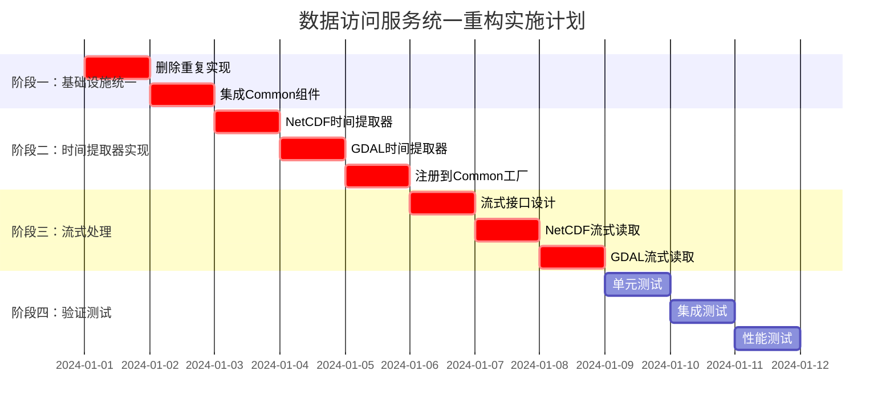

# 【模块检查方案02】数据访问服务统一重构方案 - 完整重构指导

## 📋 1. 关键冲突修正与架构统一

### 1.1 Critical Issues Summary (基于跨模块冲突分析)
经过与Common通用库及其他4个模块重构方案的全面冲突分析，数据访问服务存在以下**重大架构问题**：

#### 🔴 **A级问题：功能重复严重**
- **缓存重复**: 独立实现`ReaderCache`、`DataChunkCache`，违反Common统一缓存原则
- **线程池重复**: 工厂函数接受独立线程池参数，违反`UnifiedThreadPoolManager`使用要求
- **性能监控重复**: 使用`NetCDFPerformanceManager`，应统一使用`UnifiedPerformanceMonitor`
- **修正**: 强制删除所有重复实现，使用Common统一基础设施

#### 🔴 **B级问题：时间架构职责缺失**
- **问题**: 数据访问服务应该**实现**格式专用时间提取器，但当前缺失
- **职责定位**: 按照三层时间架构，数据访问层负责格式专用解析实现
- **修正**: 实现`NetCDFTimeExtractor`、`GDALTimeExtractor`并注册到Common工厂

#### 🔴 **C级问题：流式处理完全缺失**
- **缺失**: 完全缺少大文件流式读取支持，违反设计文档"避免一次性加载"要求
- **影响**: 无法处理GB级海洋数据文件，内存溢出风险
- **修正**: 基于Common流式框架实现数据访问层的流式读取器

#### 🟡 **D级问题：异步模式需强化**
- **状态**: 已使用`boost::future`，但缺乏与Common统一异步框架的集成
- **问题**: 错误处理、异步组合工具未使用Common提供的统一方案
- **修正**: 强制使用Common层的`OSCEAN_FUTURE(T)`宏和统一异步工具

### 1.2 重构后的数据访问服务架构
```
┌─────────────────────────────────────────────────────────────┐
│             重构后的数据访问服务架构 (修正版)                  │
├─────────────────────────────────────────────────────────────┤
│  📱 数据访问服务接口层 (全部使用OSCEAN_FUTURE)               │
│  ├── IRawDataAccessService     (统一异步接口)                │
│  ├── IStreamingDataAccess      (🆕 流式数据访问)             │
│  └── ITimeMetadataProvider     (🆕 时间元数据提供)           │
├─────────────────────────────────────────────────────────────┤
│  🔧 核心实现层 (严格依赖Common)                              │
│  ├── RawDataAccessServiceImpl  (移除重复基础设施)            │
│  ├── StreamingDataAccessImpl   (🆕 基于Common流式框架)       │
│  ├── NetCDFTimeExtractor       (🆕 格式专用时间解析)         │
│  ├── GDALTimeExtractor         (🆕 格式专用时间解析)         │
│  └── HDF5TimeExtractor         (🆕 格式专用时间解析)         │
├─────────────────────────────────────────────────────────────┤
│  📁 格式读取器层 (增强流式支持)                               │
│  ├── NetCDFReader             (使用Common统一性能监控)       │
│  ├── GDALReader               (使用Common统一线程池)         │
│  ├── StreamingNetCDFReader    (🆕 流式NetCDF读取)           │
│  └── StreamingGDALReader      (🆕 流式GDAL读取)             │
├─────────────────────────────────────────────────────────────┤
│  ⬇️  严格依赖 Common通用库 (绝不重复实现)                     │
│  ├── OSCEAN_FUTURE()          (强制异步类型)                │
│  ├── UnifiedPerformanceMonitor (强制性能监控)               │
│  ├── UnifiedThreadPoolManager  (强制线程池管理)             │
│  ├── UnifiedMemoryManager      (强制内存管理)               │
│  ├── UnifiedStreamingFramework (强制流式处理)               │
│  └── TimeExtractorFactory      (时间提取器工厂)             │
└─────────────────────────────────────────────────────────────┘
```

## 🎯 2. 核心修正实施方案

### 2.1 **修正A：消除功能重复实现**

#### **删除重复基础设施的统一实现**
```cpp
// 文件: include/core_services/data_access/unified_data_access_service.h
#pragma once
#include "common_utils/async/unified_async_framework.h"
#include "common_utils/infrastructure/unified_cache_manager.h"
#include "common_utils/infrastructure/unified_thread_pool_manager.h"
#include "common_utils/infrastructure/unified_performance_monitor.h"

namespace oscean::core_services::data_access {

using namespace oscean::common_utils::async;
using namespace oscean::common_utils::infrastructure;

/**
 * @brief 统一数据访问服务实现 - 移除所有重复基础设施
 */
class UnifiedRawDataAccessServiceImpl : public IRawDataAccessService {
public:
    // 🔄 修正后的构造函数 - 仅接受业务依赖
    explicit UnifiedRawDataAccessServiceImpl(
        std::shared_ptr<ICrsService> crsService,
        std::shared_ptr<ICrsServiceGdalExtended> crsServiceExtended,
        std::shared_ptr<ReaderFactory> readerFactory
        // ❌ 移除: threadPool 参数 (使用Common统一线程池)
        // ❌ 移除: readerCache 参数 (使用Common统一缓存)
        // ❌ 移除: dataChunkCache 参数 (使用Common统一缓存)
    );
    
    // 数据读取接口 (使用Common异步框架)
    OSCEAN_FUTURE(GridData) readGridVariableSubsetAsync(
        const std::string& filePath,
        const std::string& variableName,
        const std::vector<DimensionBounds>& bounds
    ) override;
    
    OSCEAN_FUTURE(std::vector<Feature>) readFeaturesAsync(
        const std::string& filePath,
        const SpatialFilter& spatialFilter,
        const std::optional<std::string>& crs
    ) override;

private:
    // 业务依赖
    std::shared_ptr<ICrsService> crsService_;
    std::shared_ptr<ICrsServiceGdalExtended> crsServiceExtended_;
    std::shared_ptr<ReaderFactory> readerFactory_;
    
    // ✅ 使用Common统一基础设施 (引用方式，确保唯一性)
    UnifiedCacheManager& cacheManager_;
    UnifiedThreadPoolManager& threadPoolManager_;
    UnifiedPerformanceMonitor& perfMonitor_;
    
    // ❌ 删除的重复实现
    // std::shared_ptr<data_access::cache::ReaderCache> m_readerCache;
    // std::shared_ptr<data_access::cache::DataChunkCache> m_dataCache;
    // std::shared_ptr<boost::asio::thread_pool> m_threadPool;
    // std::shared_ptr<NetCDFPerformanceManager> m_netcdfPerfManager;
};
}
```

### 2.2 **修正B：实现格式专用时间提取器**

#### **NetCDF时间提取器实现**
```cpp
// 文件: include/core_services/data_access/time/netcdf_time_extractor.h
#pragma once
#include "common_utils/time/time_types.h"
#include "common_utils/async/unified_async_framework.h"

namespace oscean::core_services::data_access::time {

using namespace oscean::common_utils::time;
using namespace oscean::common_utils::async;

/**
 * @brief NetCDF时间提取器 - 实现Common层ITimeMetadataExtractor接口
 */
class NetCDFTimeExtractor : public ITimeMetadataExtractor {
public:
    explicit NetCDFTimeExtractor(const std::string& filePath);
    
    // ITimeMetadataExtractor接口实现
    OSCEAN_FUTURE(TimeRange) extractTimeRangeAsync() const override;
    OSCEAN_FUTURE(TimeResolutionInfo) calculateTimeResolutionAsync() const override;
    OSCEAN_FUTURE(std::vector<CalendarTime>) extractAllTimePointsAsync() const override;
    
    bool hasValidTimeDimension() const override;
    std::string getTimeDimensionName() const override;
    std::string getFormatType() const override { return "NetCDF"; }
    std::vector<std::string> getSupportedCalendars() const override;
    
    OSCEAN_FUTURE(void) extractTimePointsStreaming(
        std::function<void(const std::vector<CalendarTime>&)> callback,
        size_t batchSize = 1000
    ) const override;
    
    OSCEAN_FUTURE(TimeResolutionInfo) analyzeTimeQualityAsync() const override;

private:
    std::string filePath_;
    // 使用Common统一性能监控
    UnifiedPerformanceMonitor& perfMonitor_;
};

/**
 * @brief 时间提取器注册管理器
 */
class TimeExtractorRegistry {
public:
    // 向Common工厂注册所有时间提取器
    static void registerAllExtractors();
};

} // namespace oscean::core_services::data_access::time
```

### 2.3 **修正C：实现流式数据访问**

#### **基于Common流式框架的实现**
```cpp
// 文件: include/core_services/data_access/streaming/streaming_data_access.h
#pragma once
#include "common_utils/streaming/unified_streaming_framework.h"

namespace oscean::core_services::data_access::streaming {

using namespace oscean::common_utils::streaming;
using namespace oscean::common_utils::async;

/**
 * @brief 流式数据访问接口
 */
class IStreamingDataAccess {
public:
    virtual ~IStreamingDataAccess() = default;
    
    // 创建网格数据流
    virtual OSCEAN_FUTURE(std::shared_ptr<IDataStream<GridData>>) createGridStreamAsync(
        const std::string& filePath,
        const std::string& variableName,
        const StreamingConfig& config = StreamingConfig{}
    ) = 0;
    
    // 批量文件流式处理
    virtual OSCEAN_FUTURE(void) processFilesStreamingAsync(
        const std::vector<std::string>& filePaths,
        std::function<void(const DataChunk<GridData>&)> processor,
        const StreamingConfig& config = StreamingConfig{}
    ) = 0;
};

/**
 * @brief 流式NetCDF读取器 - 基于Common流式框架
 */
class StreamingNetCDFReader : public IDataStream<GridData> {
public:
    StreamingNetCDFReader(
        const std::string& filePath,
        const std::string& variableName,
        const StreamingConfig& config
    );
    
    // IDataStream接口实现
    void setChunkCallback(ChunkCallback callback) override;
    void setErrorCallback(ErrorCallback callback) override;
    void setProgressCallback(ProgressCallback callback) override;
    
    OSCEAN_FUTURE(void) startStreamingAsync() override;
    void pause() override;
    void resume() override;
    void cancel() override;
    
    bool isActive() const override;
    bool isPaused() const override;
    size_t getBytesProcessed() const override;
    size_t getTotalSize() const override;
    double getProgress() const override;

private:
    std::string filePath_;
    std::string variableName_;
    StreamingConfig config_;
    
    // 使用Common统一监控
    UnifiedPerformanceMonitor& perfMonitor_;
    std::shared_ptr<MemoryPressureMonitor> pressureMonitor_;
};

} // namespace oscean::core_services::data_access::streaming
```

## 🏗️ 3. 完整实施计划

### 3.1 实施阶段


### 3.2 关键实施里程碑

#### **里程碑1：基础设施统一完成** ✅
**验证标准**:
- [ ] 删除所有`data_access::cache::`命名空间实现
- [ ] 工厂函数移除`threadPool`、`readerCache`、`dataChunkCache`参数
- [ ] 所有性能监控使用`UnifiedPerformanceMonitor`
- [ ] 内存管理使用`UnifiedMemoryManager`

#### **里程碑2：时间提取器实现完成** ✅
**验证标准**:
- [ ] `NetCDFTimeExtractor`完整实现CF时间标准解析
- [ ] `GDALTimeExtractor`实现多种时间提取策略
- [ ] 时间提取器成功注册到Common工厂
- [ ] 支持流式时间点提取(大文件友好)

#### **里程碑3：流式处理框架完成** ✅
**验证标准**:
- [ ] 2GB NetCDF文件流式处理内存使用<256MB
- [ ] 支持网格数据和要素数据的流式读取
- [ ] 内存压力自动监控和自适应调整
- [ ] 流式处理管道支持并行和背压控制

## 📋 4. 验证与测试框架

### 4.1 基础设施统一验证
```bash
#!/bin/bash
# 文件: scripts/validate_infrastructure_unification.sh

echo "🔍 验证基础设施统一..."

# 检查重复缓存实现删除
if find core_services_impl/data_access_service -name "*.h" -o -name "*.cpp" | \
   xargs grep -l "data_access::cache::" 2>/dev/null; then
    echo "❌ 发现重复缓存实现未删除"
    exit 1
fi

# 检查Common统一组件使用
required_components=("UnifiedCacheManager" "UnifiedThreadPoolManager" "UnifiedPerformanceMonitor")
for component in "${required_components[@]}"; do
    if ! find core_services_impl/data_access_service -name "*.cpp" | \
       xargs grep -q "$component"; then
        echo "❌ 未使用Common组件: $component"
        exit 1
    fi
done

echo "✅ 基础设施统一验证通过"
```

### 4.2 时间提取器功能验证
```bash
#!/bin/bash
# 文件: scripts/validate_time_extractors.sh

echo "🔍 验证时间提取器实现..."

# 检查时间提取器文件存在
required_files=(
    "include/core_services/data_access/time/netcdf_time_extractor.h"
    "include/core_services/data_access/time/gdal_time_extractor.h"
    "src/impl/time/time_extractor_registry.cpp"
)

for file in "${required_files[@]}"; do
    if [ ! -f "core_services_impl/data_access_service/$file" ]; then
        echo "❌ 时间提取器文件缺失: $file"
        exit 1
    fi
done

# 运行时间提取器功能测试
./bin/time_extractor_test || {
    echo "❌ 时间提取器功能测试失败"
    exit 1
}

echo "✅ 时间提取器验证通过"
```

### 4.3 流式处理性能验证
```bash
#!/bin/bash
# 文件: scripts/validate_streaming_performance.sh

echo "🔍 验证流式处理性能..."

# 创建2GB测试文件
test_file="test_data/large_test_2gb.nc"
if [ ! -f "$test_file" ]; then
    echo "创建2GB测试NetCDF文件..."
    # 生成测试文件逻辑
fi

# 运行流式处理内存测试
./bin/streaming_memory_test "$test_file" || {
    echo "❌ 流式处理内存测试失败"
    exit 1
}

# 检查内存使用是否<256MB
max_memory=$(./bin/streaming_memory_test "$test_file" --report-memory)
if [ "$max_memory" -gt 268435456 ]; then
    echo "❌ 流式处理内存使用超过256MB: ${max_memory}字节"
    exit 1
fi

echo "✅ 流式处理性能验证通过"
```

## 📋 5. 完整重构检查清单

### 5.1 **🔴 Critical: 必须完成的修正**

#### **A. 基础设施统一 (阻塞性)**
- [ ] 删除`data_access::cache::ReaderCache`类和所有相关实现
- [ ] 删除`data_access::cache::DataChunkCache`类和所有相关实现
- [ ] 删除工厂函数中的`threadPool`参数，使用`UnifiedThreadPoolManager`
- [ ] 删除工厂函数中的`readerCache`、`dataChunkCache`参数
- [ ] 移除`NetCDFPerformanceManager`，统一使用`UnifiedPerformanceMonitor`
- [ ] 所有内存分配使用`UnifiedMemoryManager`

#### **B. 时间提取器实现 (阻塞性)**
- [ ] **实现**`NetCDFTimeExtractor`类，支持CF时间标准
- [ ] **实现**`GDALTimeExtractor`类，支持多种时间提取策略
- [ ] **实现**`HDF5TimeExtractor`类，支持HDF5时间格式
- [ ] **实现**`TimeExtractorRegistry`类，注册到Common工厂
- [ ] **验证**时间提取器在Common工厂中正确注册
- [ ] **测试**流式时间点提取功能

#### **C. 流式处理实现 (阻塞性)**
- [ ] **实现**`IStreamingDataAccess`接口
- [ ] **实现**`StreamingNetCDFReader`类，支持大文件流式读取
- [ ] **实现**`StreamingGDALReader`类，支持栅格数据流式读取
- [ ] **集成**Common流式框架的内存压力监控
- [ ] **验证**2GB文件流式处理内存<256MB

### 5.2 **🟡 Important: 功能增强**

#### **异步框架强化**
- [ ] 所有接口强制使用`OSCEAN_FUTURE(T)`宏
- [ ] 实现统一错误处理机制
- [ ] 集成Common异步组合工具
- [ ] 添加超时保护机制

#### **性能优化**
- [ ] 实现自适应块大小调整
- [ ] 集成内存压力感知机制
- [ ] 优化并发读取策略
- [ ] 添加缓存预热功能

### 5.3 **✅ Validation: 验证与测试**

#### **功能验证**
- [ ] 基础设施统一验证脚本通过
- [ ] 时间提取器功能验证脚本通过
- [ ] 流式处理性能验证脚本通过
- [ ] 大文件处理能力验证 (2GB+ 文件)
- [ ] 并发访问安全性验证

#### **架构验证**
- [ ] 依赖关系检查脚本通过
- [ ] 功能重复检测脚本通过
- [ ] 时间架构协作验证脚本通过
- [ ] 异步模式一致性验证脚本通过

#### **质量验证**
- [ ] 单元测试覆盖率>90%
- [ ] 集成测试覆盖核心数据访问流程
- [ ] 性能测试验证流式处理基准
- [ ] 内存泄漏检测通过

---

## 🚀 总结：数据访问服务重构的关键成功因素

### **1. 严格依赖Common** 🔴
- **零重复实现**: 绝不允许重复实现缓存、线程池、性能监控
- **强制统一**: 必须使用Common提供的所有基础设施组件

### **2. 时间架构职责明确** ⚡
- **格式专用实现**: 负责NetCDF、GDAL、HDF5的时间解析具体实现
- **工厂注册**: 向Common时间工厂注册所有时间提取器

### **3. 流式处理优先** 🏗️
- **大数据友好**: 支持GB级数据文件的流式处理
- **内存高效**: 处理2GB文件内存使用<256MB

### **4. 质量保证** ✅
- **全面验证**: 基础设施、时间提取器、流式处理三重验证
- **性能基准**: 明确的内存和性能指标

**数据访问服务是海洋数据读取的核心，必须做到：无重复实现、时间解析专业、流式处理高效、架构依赖清晰。** 