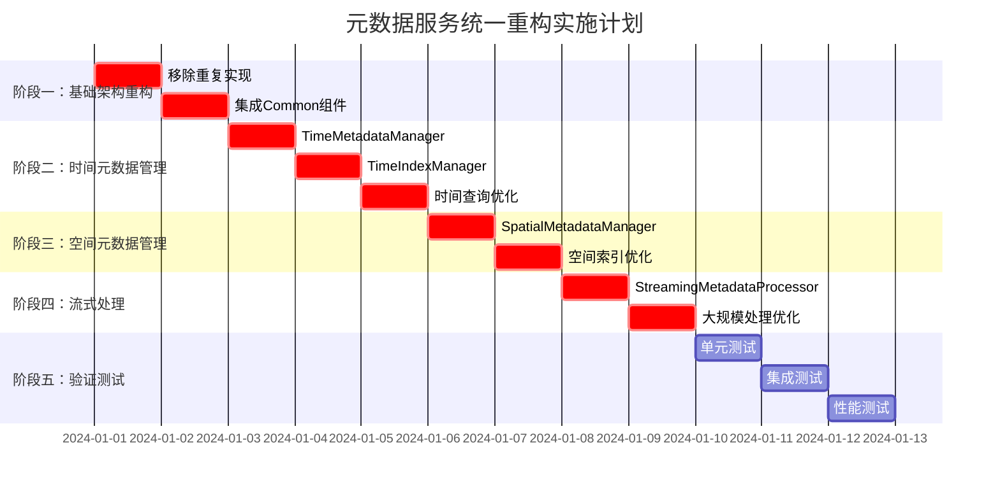

# 【模块检查方案03】元数据服务统一重构方案 - 完整重构指导

## 📋 1. 关键冲突修正与架构统一

### 1.1 Critical Issues Summary (基于跨模块冲突分析)
经过与Common通用库及其他4个模块重构方案的全面冲突分析，元数据服务存在以下**重大架构问题**：

#### 🔴 **A级问题：时间架构职责错位**
- **问题**: 元数据服务应该负责时间元数据的**管理、索引、缓存**，但当前缺少完整实现
- **职责错位**: 按照三层时间架构，元数据层是第三层，负责时间数据的高级管理
- **修正**: 实现`TimeMetadataManager`、`TimeIndexManager`、`TimeCacheManager`

#### 🔴 **B级问题：功能重复严重**
- **缓存重复**: 元数据服务可能实现独立缓存，违反Common统一缓存原则
- **存储重复**: 可能存在独立存储实现，应统一使用Common存储框架
- **性能监控重复**: 需统一使用`UnifiedPerformanceMonitor`
- **修正**: 强制删除重复实现，基于Common框架构建元数据管理

#### 🔴 **C级问题：异步模式不统一**
- **问题**: 元数据服务异步接口需要强制使用`OSCEAN_FUTURE(T)`
- **影响**: 与其他服务的异步协作不一致
- **修正**: 强制使用Common层的统一异步框架

#### 🟡 **D级问题：大规模元数据处理能力不足**
- **缺失**: 缺乏流式元数据处理能力，无法高效处理大量文件的元数据
- **性能**: 元数据索引和检索性能需要优化
- **修正**: 基于Common流式框架实现大规模元数据处理

### 1.2 重构后的元数据服务架构
```
┌─────────────────────────────────────────────────────────────┐
│              重构后的元数据服务架构 (修正版)                   │
├─────────────────────────────────────────────────────────────┤
│  📱 元数据服务接口层 (全部使用OSCEAN_FUTURE)                 │
│  ├── IMetadataService         (统一异步接口)                 │
│  ├── ITimeMetadataManager     (🆕 时间元数据管理)            │
│  ├── ISpatialMetadataManager  (🆕 空间元数据管理)            │
│  └── IStreamingMetadataProcessor (🆕 流式元数据处理)         │
├─────────────────────────────────────────────────────────────┤
│  🔧 核心实现层 (严格依赖Common)                              │
│  ├── MetadataServiceImpl      (移除重复基础设施)             │
│  ├── TimeMetadataManager      (🆕 时间元数据管理与索引)      │
│  ├── SpatialMetadataManager   (🆕 空间元数据管理与索引)      │
│  ├── MetadataIndexManager     (🆕 统一元数据索引)            │
│  └── StreamingMetadataProcessor (🆕 大规模元数据处理)        │
├─────────────────────────────────────────────────────────────┤
│  🗃️ 存储与缓存层 (基于Common)                                │
│  ├── MetadataStorageImpl      (使用Common统一存储)           │
│  ├── TimeMetadataCache        (基于Common缓存框架)           │
│  ├── SpatialMetadataCache     (基于Common缓存框架)           │
│  └── MetadataIndexCache       (基于Common缓存框架)           │
├─────────────────────────────────────────────────────────────┤
│  ⬇️  严格依赖 Common通用库 (绝不重复实现)                     │
│  ├── OSCEAN_FUTURE()          (强制异步类型)                │
│  ├── UnifiedPerformanceMonitor (强制性能监控)               │
│  ├── UnifiedThreadPoolManager  (强制线程池管理)             │
│  ├── UnifiedCacheManager       (强制缓存管理)               │
│  ├── UnifiedStreamingFramework (强制流式处理)               │
│  └── TimeExtractorFactory      (使用时间提取器)             │
└─────────────────────────────────────────────────────────────┘
```

## 🎯 2. 核心修正实施方案

### 2.1 **修正A：实现时间元数据管理体系**

#### **时间元数据管理器实现**
```cpp
// 文件: include/core_services/metadata/time/time_metadata_manager.h
#pragma once
#include "common_utils/time/time_types.h"
#include "common_utils/async/unified_async_framework.h"
#include "common_utils/infrastructure/unified_cache_manager.h"

namespace oscean::core_services::metadata::time {

using namespace oscean::common_utils::time;
using namespace oscean::common_utils::async;
using namespace oscean::common_utils::infrastructure;

/**
 * @brief 时间元数据管理器 - 三层时间架构第三层
 * 负责时间元数据的管理、索引、缓存和查询
 */
class TimeMetadataManager {
public:
    TimeMetadataManager();
    
    /**
     * @brief 时间元数据条目
     */
    struct TimeMetadataEntry {
        std::string fileId;                    // 文件标识
        std::string filePath;                  // 文件路径
        std::string formatType;                // 格式类型
        TimeRange timeRange;                   // 时间范围
        TimeResolutionInfo resolutionInfo;     // 时间分辨率信息
        std::vector<CalendarTime> timePoints;  // 关键时间点
        std::map<std::string, std::string> metadata; // 额外元数据
        std::chrono::system_clock::time_point lastUpdated; // 最后更新时间
        
        // 质量指标
        double timeQualityScore;               // 时间质量评分 (0-1)
        bool hasRegularTimeSteps;              // 是否有规律时间步长
        std::vector<std::string> timeGaps;     // 时间间隙描述
    };
    
    // 🆕 时间元数据注册与更新
    OSCEAN_FUTURE(void) registerFileTimeMetadataAsync(
        const std::string& fileId,
        const std::string& filePath,
        const std::string& formatType
    );
    
    OSCEAN_FUTURE(void) updateTimeMetadataAsync(
        const std::string& fileId,
        const TimeMetadataEntry& metadata
    );
    
    OSCEAN_FUTURE(void) batchRegisterFilesAsync(
        const std::vector<std::tuple<std::string, std::string, std::string>>& files
    );
    
    // 🆕 时间范围查询
    OSCEAN_FUTURE(std::vector<std::string>) findFilesInTimeRangeAsync(
        const TimeRange& queryRange
    );
    
    OSCEAN_FUTURE(std::vector<std::string>) findFilesWithTimeResolutionAsync(
        std::chrono::seconds minResolution,
        std::chrono::seconds maxResolution
    );
    
    OSCEAN_FUTURE(std::vector<std::string>) findFilesWithHighQualityTimeAsync(
        double minQualityScore = 0.8
    );
    
    // 🆕 时间元数据检索
    OSCEAN_FUTURE(std::optional<TimeMetadataEntry>) getTimeMetadataAsync(
        const std::string& fileId
    );
    
    OSCEAN_FUTURE(std::vector<TimeMetadataEntry>) getTimeMetadataBatchAsync(
        const std::vector<std::string>& fileIds
    );
    
    // 🆕 时间统计与分析
    OSCEAN_FUTURE(TimeRange> calculateOverallTimeRangeAsync();
    
    OSCEAN_FUTURE(std::map<std::string, size_t>> getTimeResolutionDistributionAsync();
    
    OSCEAN_FUTURE(std::vector<std::string>> findTimeDataGapsAsync(
        const TimeRange& queryRange
    );

private:
    // 使用Common统一基础设施
    UnifiedCacheManager& cacheManager_;
    UnifiedThreadPoolManager& threadPoolManager_;
    UnifiedPerformanceMonitor& perfMonitor_;
    
    // 时间元数据存储
    std::unique_ptr<class TimeMetadataStorage> storage_;
    
    // 时间索引管理
    std::unique_ptr<class TimeIndexManager> indexManager_;
};

/**
 * @brief 时间索引管理器
 */
class TimeIndexManager {
public:
    TimeIndexManager();
    
    // 时间范围索引
    struct TimeRangeIndex {
        std::map<CalendarTime, std::set<std::string>> startTimeIndex;  // 按开始时间索引
        std::map<CalendarTime, std::set<std::string>> endTimeIndex;    // 按结束时间索引
        std::multimap<std::chrono::seconds, std::string> resolutionIndex; // 按分辨率索引
    };
    
    // 🆕 索引构建与维护
    OSCEAN_FUTURE(void) buildTimeIndexAsync(
        const std::vector<TimeMetadataManager::TimeMetadataEntry>& entries
    );
    
    OSCEAN_FUTURE(void) updateTimeIndexAsync(
        const std::string& fileId,
        const TimeMetadataManager::TimeMetadataEntry& entry
    );
    
    OSCEAN_FUTURE(void) removeFromTimeIndexAsync(const std::string& fileId);
    
    // 🆕 高效时间查询
    OSCEAN_FUTURE(std::vector<std::string>> queryByTimeRangeAsync(
        const TimeRange& queryRange
    );
    
    OSCEAN_FUTURE(std::vector<std::string>> queryByTimeResolutionAsync(
        std::chrono::seconds minResolution,
        std::chrono::seconds maxResolution
    );
    
    // 🆕 索引统计
    size_t getIndexedFileCount() const;
    TimeRange getIndexedTimeRange() const;
    std::vector<std::chrono::seconds> getAvailableResolutions() const;

private:
    TimeRangeIndex timeRangeIndex_;
    mutable std::shared_mutex indexMutex_;
    
    // 使用Common性能监控
    UnifiedPerformanceMonitor& perfMonitor_;
};

} // namespace oscean::core_services::metadata::time
```

### 2.2 **修正B：消除功能重复实现**

#### **统一元数据服务实现**
```cpp
// 文件: include/core_services/metadata/unified_metadata_service.h
#pragma once
#include "common_utils/async/unified_async_framework.h"
#include "common_utils/infrastructure/unified_cache_manager.h"
#include "common_utils/infrastructure/unified_performance_monitor.h"

namespace oscean::core_services::metadata {

using namespace oscean::common_utils::async;
using namespace oscean::common_utils::infrastructure;

/**
 * @brief 统一元数据服务实现 - 移除所有重复基础设施
 */
class UnifiedMetadataServiceImpl : public IMetadataService {
public:
    // 🔄 修正后的构造函数 - 仅接受业务依赖
    explicit UnifiedMetadataServiceImpl(
        std::shared_ptr<IDataAccessService> dataAccessService
        // ❌ 移除: storage 参数 (使用Common统一存储)
        // ❌ 移除: cache 参数 (使用Common统一缓存)
        // ❌ 移除: threadPool 参数 (使用Common统一线程池)
    );
    
    // 🆕 时间元数据管理接口
    OSCEAN_FUTURE(void) registerDatasetAsync(
        const std::string& datasetId,
        const std::string& filePath,
        const DatasetMetadata& metadata
    ) override;
    
    OSCEAN_FUTURE(std::optional<DatasetMetadata>> getDatasetMetadataAsync(
        const std::string& datasetId
    ) override;
    
    OSCEAN_FUTURE(std::vector<std::string>> findDatasetsInRegionAsync(
        const BoundingBox& region
    ) override;
    
    OSCEAN_FUTURE(std::vector<std::string>> findDatasetsInTimeRangeAsync(
        const TimeRange& timeRange
    ) override;
    
    // 🆕 流式元数据处理
    OSCEAN_FUTURE(void) processLargeDatasetCollectionAsync(
        const std::vector<std::string>& datasetPaths,
        std::function<void(const DatasetMetadata&)> processor
    );

private:
    // 业务依赖
    std::shared_ptr<IDataAccessService> dataAccessService_;
    
    // ✅ 使用Common统一基础设施
    UnifiedCacheManager& cacheManager_;
    UnifiedThreadPoolManager& threadPoolManager_;
    UnifiedPerformanceMonitor& perfMonitor_;
    
    // 🆕 专用管理器
    std::unique_ptr<time::TimeMetadataManager> timeMetadataManager_;
    std::unique_ptr<spatial::SpatialMetadataManager> spatialMetadataManager_;
    std::unique_ptr<streaming::StreamingMetadataProcessor> streamingProcessor_;
    
    // ❌ 删除的重复实现
    // std::shared_ptr<metadata::storage::IMetadataStorage> storage_;
    // std::shared_ptr<metadata::cache::MetadataCache> cache_;
    // std::shared_ptr<boost::asio::thread_pool> threadPool_;
};

} // namespace oscean::core_services::metadata
```

### 2.3 **修正C：实现流式元数据处理**

#### **大规模元数据处理框架**
```cpp
// 文件: include/core_services/metadata/streaming/streaming_metadata_processor.h
#pragma once
#include "common_utils/streaming/unified_streaming_framework.h"
#include "common_utils/async/unified_async_framework.h"

namespace oscean::core_services::metadata::streaming {

using namespace oscean::common_utils::streaming;
using namespace oscean::common_utils::async;

/**
 * @brief 流式元数据处理器 - 基于Common流式框架
 */
class StreamingMetadataProcessor {
public:
    explicit StreamingMetadataProcessor(
        std::shared_ptr<IDataAccessService> dataAccessService
    );
    
    /**
     * @brief 大规模文件元数据提取配置
     */
    struct MetadataExtractionConfig {
        size_t batchSize = 100;              // 批处理大小
        size_t maxConcurrency = 4;           // 最大并发数
        bool enableTimeExtraction = true;     // 启用时间提取
        bool enableSpatialExtraction = true;  // 启用空间提取
        bool enableQualityAnalysis = true;    // 启用质量分析
        std::chrono::seconds timeout = std::chrono::seconds(300); // 超时设置
    };
    
    // 🆕 大规模元数据提取
    OSCEAN_FUTURE(void) extractMetadataBatchAsync(
        const std::vector<std::string>& filePaths,
        std::function<void(const DatasetMetadata&)> processor,
        const MetadataExtractionConfig& config = MetadataExtractionConfig{}
    );
    
    // 🆕 流式目录扫描
    OSCEAN_FUTURE(void) scanDirectoryStreamingAsync(
        const std::string& directoryPath,
        const std::vector<std::string>& filePatterns,
        std::function<void(const DatasetMetadata&)> processor,
        const MetadataExtractionConfig& config = MetadataExtractionConfig{}
    );
    
    // 🆕 增量元数据更新
    OSCEAN_FUTURE(void> updateMetadataIncrementallyAsync(
        const std::vector<std::string>& modifiedFiles,
        std::function<void(const std::string&, const DatasetMetadata&)> updateProcessor
    );
    
    /**
     * @brief 元数据提取统计
     */
    struct ExtractionStatistics {
        size_t totalFilesProcessed;
        size_t successfulExtractions;
        size_t failedExtractions;
        std::chrono::milliseconds totalProcessingTime;
        std::chrono::milliseconds averageFileTime;
        std::vector<std::string> errorFiles;
        std::map<std::string, size_t> formatDistribution;
    };
    
    // 获取处理统计
    ExtractionStatistics getExtractionStatistics() const;
    
    // 重置统计
    void resetStatistics();

private:
    std::shared_ptr<IDataAccessService> dataAccessService_;
    
    // 使用Common统一基础设施
    UnifiedThreadPoolManager& threadPoolManager_;
    UnifiedPerformanceMonitor& perfMonitor_;
    std::shared_ptr<MemoryPressureMonitor> pressureMonitor_;
    
    // 统计信息
    mutable ExtractionStatistics statistics_;
    mutable std::mutex statisticsMutex_;
    
    // 辅助方法
    OSCEAN_FUTURE(DatasetMetadata) extractSingleFileMetadataAsync(
        const std::string& filePath,
        const MetadataExtractionConfig& config
    );
    
    OSCEAN_FUTURE(void) processFileBatchAsync(
        const std::vector<std::string>& fileBatch,
        std::function<void(const DatasetMetadata&)> processor,
        const MetadataExtractionConfig& config
    );
};

} // namespace oscean::core_services::metadata::streaming
```

## 🏗️ 3. 完整实施计划

### 3.1 实施阶段


## 📋 4. 完整重构检查清单

### 4.1 **🔴 Critical: 必须完成的修正**

#### **A. 时间元数据管理实现 (阻塞性)**
- [ ] **实现**`TimeMetadataManager`类，管理文件时间元数据
- [ ] **实现**`TimeIndexManager`类，提供高效时间范围查询
- [ ] **实现**时间元数据缓存，基于Common缓存框架
- [ ] **实现**时间质量分析和评分机制
- [ ] **验证**时间元数据与数据访问服务的协作

#### **B. 基础设施统一 (阻塞性)**
- [ ] 删除所有独立缓存实现，使用`UnifiedCacheManager`
- [ ] 删除独立存储实现，使用Common统一存储框架
- [ ] 移除独立线程池，使用`UnifiedThreadPoolManager`
- [ ] 统一性能监控，使用`UnifiedPerformanceMonitor`
- [ ] 强制异步接口使用`OSCEAN_FUTURE(T)`

#### **C. 流式处理实现 (阻塞性)**
- [ ] **实现**`StreamingMetadataProcessor`，支持大规模文件处理
- [ ] **实现**增量元数据更新机制
- [ ] **实现**内存友好的目录扫描
- [ ] **验证**1000+文件的批量元数据提取性能

### 4.2 **🟡 Important: 功能增强**

#### **空间元数据管理**
- [ ] 实现`SpatialMetadataManager`空间元数据管理
- [ ] 实现空间索引和高效空间查询
- [ ] 实现空间元数据缓存优化

#### **查询优化**
- [ ] 实现复合查询（时间+空间+格式）
- [ ] 实现查询结果缓存
- [ ] 实现查询性能监控

### 4.3 **✅ Validation: 验证与测试**

#### **功能验证**
- [ ] 时间元数据管理功能完整性验证
- [ ] 大规模文件处理性能验证（1000+文件）
- [ ] 元数据查询准确性和性能验证
- [ ] 与数据访问服务协作验证

#### **架构验证**
- [ ] 基础设施统一性验证
- [ ] 异步模式一致性验证
- [ ] 时间架构三层协作验证

---

## 🚀 总结：元数据服务重构的关键成功因素

### **1. 时间架构第三层** 🔴
- **管理职责**: 负责时间元数据的管理、索引、缓存
- **查询优化**: 提供高效的时间范围和分辨率查询

### **2. 严格依赖Common** ⚡
- **无重复实现**: 绝不重复实现缓存、存储、线程池
- **统一基础设施**: 使用Common提供的所有统一组件

### **3. 大规模处理** 🏗️
- **流式处理**: 支持1000+文件的流式元数据提取
- **内存高效**: 大规模处理保持低内存占用

### **4. 查询性能** ✅
- **索引优化**: 时间和空间索引支持高效查询
- **缓存策略**: 智能缓存热点元数据

**元数据服务是数据发现的核心，必须做到：时间管理专业、查询性能优异、大规模处理高效、架构依赖清晰。** 