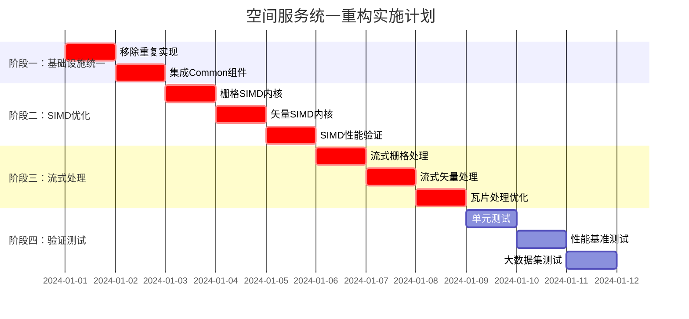

# 【模块检查方案04】空间服务统一重构方案 - 完整重构指导

## 📋 1. 关键冲突修正与架构统一

### 1.1 Critical Issues Summary (基于跨模块冲突分析)
经过与Common通用库及其他4个模块重构方案的全面冲突分析，空间服务存在以下**重大架构问题**：

#### 🔴 **A级问题：功能重复严重**
- **性能监控重复**: 空间服务实现独立的性能监控，违反Common统一性能监控原则
- **线程池重复**: 可能存在独立线程池实现，应使用`UnifiedThreadPoolManager`
- **内存管理重复**: 空间计算密集，可能重复实现内存管理，应使用`UnifiedMemoryManager`
- **修正**: 强制删除所有重复实现，使用Common统一基础设施

#### 🔴 **B级问题：异步模式不统一**
- **问题**: 空间服务异步接口需要强制使用`OSCEAN_FUTURE(T)`
- **影响**: 空间操作通常计算密集，异步模式统一对性能至关重要
- **修正**: 强制使用Common层的统一异步框架和异步工具

#### 🔴 **C级问题：SIMD优化缺失**
- **缺失**: 空间计算密集型操作缺乏SIMD优化，性能严重不足
- **影响**: 大规模空间数据处理性能低下
- **修正**: 集成Common层的SIMD优化框架，实现高性能空间计算

#### 🟡 **D级问题：流式空间处理能力不足**
- **缺失**: 缺乏大规模空间数据的流式处理能力
- **性能**: 无法高效处理GB级空间数据文件
- **修正**: 基于Common流式框架实现空间数据的流式处理

### 1.2 重构后的空间服务架构
```
┌─────────────────────────────────────────────────────────────┐
│               重构后的空间服务架构 (修正版)                    │
├─────────────────────────────────────────────────────────────┤
│  📱 空间服务接口层 (全部使用OSCEAN_FUTURE)                   │
│  ├── ISpatialOperationsService  (统一异步接口)               │
│  ├── IStreamingSpatialProcessor (🆕 流式空间处理)            │
│  ├── IRasterOperations         (🆕 栅格操作优化)             │
│  └── IVectorOperations         (🆕 矢量操作优化)             │
├─────────────────────────────────────────────────────────────┤
│  🔧 核心实现层 (严格依赖Common + SIMD优化)                   │
│  ├── SpatialOperationsServiceImpl (移除重复基础设施)         │
│  ├── StreamingSpatialProcessor    (🆕 基于Common流式框架)    │
│  ├── OptimizedRasterProcessor     (🆕 SIMD优化栅格处理)     │
│  ├── OptimizedVectorProcessor     (🆕 SIMD优化矢量处理)     │
│  └── SpatialIndexManager          (🆕 高性能空间索引)       │
├─────────────────────────────────────────────────────────────┤
│  🧮 算法实现层 (SIMD优化)                                    │
│  ├── RasterAlgorithms           (使用Common SIMD框架)       │
│  ├── VectorAlgorithms           (使用Common SIMD框架)       │
│  ├── InterpolationKernels       (SIMD优化插值内核)          │
│  └── SpatialAnalysisKernels     (SIMD优化分析内核)          │
├─────────────────────────────────────────────────────────────┤
│  ⬇️  严格依赖 Common通用库 (绝不重复实现)                     │
│  ├── OSCEAN_FUTURE()           (强制异步类型)               │
│  ├── UnifiedPerformanceMonitor (强制性能监控)               │
│  ├── UnifiedThreadPoolManager  (强制线程池管理)             │
│  ├── UnifiedMemoryManager      (强制内存管理)               │
│  ├── UnifiedStreamingFramework (强制流式处理)               │
│  └── SIMDOptimizationFramework (强制SIMD优化)               │
└─────────────────────────────────────────────────────────────┘
```

## 🎯 2. 核心修正实施方案

### 2.1 **修正A：消除功能重复实现**

#### **统一空间服务实现**
```cpp
// 文件: include/core_services/spatial_ops/unified_spatial_service.h
#pragma once
#include "common_utils/async/unified_async_framework.h"
#include "common_utils/infrastructure/unified_performance_monitor.h"
#include "common_utils/infrastructure/unified_thread_pool_manager.h"
#include "common_utils/infrastructure/unified_memory_manager.h"
#include "common_utils/simd/simd_optimization_framework.h"

namespace oscean::core_services::spatial_ops {

using namespace oscean::common_utils::async;
using namespace oscean::common_utils::infrastructure;
using namespace oscean::common_utils::simd;

/**
 * @brief 统一空间服务实现 - 移除所有重复基础设施
 */
class UnifiedSpatialOperationsServiceImpl : public ISpatialOperationsService {
public:
    // 🔄 修正后的构造函数 - 仅接受业务依赖
    explicit UnifiedSpatialOperationsServiceImpl(
        std::shared_ptr<ICrsService> crsService
        // ❌ 移除: threadPool 参数 (使用Common统一线程池)
        // ❌ 移除: performanceMonitor 参数 (使用Common统一监控)
        // ❌ 移除: memoryManager 参数 (使用Common统一内存管理)
    );
    
    // 🔄 栅格操作接口 (使用Common异步框架 + SIMD优化)
    OSCEAN_FUTURE(RasterData) reprojectRasterAsync(
        const RasterData& inputRaster,
        const std::string& targetCRS,
        const ResamplingMethod& method = ResamplingMethod::BILINEAR
    ) override;
    
    OSCEAN_FUTURE(RasterData) resampleRasterAsync(
        const RasterData& inputRaster,
        double targetResolution,
        const ResamplingMethod& method = ResamplingMethod::BILINEAR
    ) override;
    
    OSCEAN_FUTURE(RasterData> clipRasterByBoundsAsync(
        const RasterData& inputRaster,
        const BoundingBox& clipBounds
    ) override;
    
    // 🔄 矢量操作接口 (使用Common异步框架 + SIMD优化)
    OSCEAN_FUTURE(std::vector<Feature>) reprojectFeaturesAsync(
        const std::vector<Feature>& features,
        const std::string& sourceCRS,
        const std::string& targetCRS
    ) override;
    
    OSCEAN_FUTURE(std::vector<Feature>) clipFeaturesByBoundsAsync(
        const std::vector<Feature>& features,
        const BoundingBox& clipBounds
    ) override;
    
    // 🆕 流式空间处理接口
    OSCEAN_FUTURE(std::shared_ptr<streaming::IDataStream<RasterData>>) createRasterStreamAsync(
        const std::string& filePath,
        const streaming::StreamingConfig& config = streaming::StreamingConfig{}
    );
    
    OSCEAN_FUTURE(void) processLargeRasterStreamingAsync(
        const std::string& inputPath,
        const std::string& outputPath,
        std::function<RasterData(const RasterData&)> processor
    );

private:
    // 业务依赖
    std::shared_ptr<ICrsService> crsService_;
    
    // ✅ 使用Common统一基础设施 (引用方式，确保唯一性)
    UnifiedPerformanceMonitor& perfMonitor_;
    UnifiedThreadPoolManager& threadPoolManager_;
    UnifiedMemoryManager& memoryManager_;
    SIMDOptimizationFramework& simdFramework_;
    
    // 🆕 专用处理器
    std::unique_ptr<streaming::StreamingSpatialProcessor> streamingProcessor_;
    std::unique_ptr<OptimizedRasterProcessor> rasterProcessor_;
    std::unique_ptr<OptimizedVectorProcessor> vectorProcessor_;
    
    // ❌ 删除的重复实现
    // std::shared_ptr<spatial_ops::performance::SpatialPerformanceMonitor> spatialPerfMonitor_;
    // std::shared_ptr<boost::asio::thread_pool> spatialThreadPool_;
    // std::shared_ptr<spatial_ops::memory::SpatialMemoryManager> spatialMemoryManager_;
};

} // namespace oscean::core_services::spatial_ops
```

### 2.2 **修正B：SIMD优化空间计算**

#### **SIMD优化的栅格处理器**
```cpp
// 文件: include/core_services/spatial_ops/optimized_raster_processor.h
#pragma once
#include "common_utils/simd/simd_optimization_framework.h"
#include "common_utils/async/unified_async_framework.h"

namespace oscean::core_services::spatial_ops {

using namespace oscean::common_utils::simd;
using namespace oscean::common_utils::async;

/**
 * @brief SIMD优化的栅格处理器 - 基于Common SIMD框架
 */
class OptimizedRasterProcessor {
public:
    OptimizedRasterProcessor();
    
    // 🆕 SIMD优化的栅格重投影
    OSCEAN_FUTURE(RasterData) reprojectWithSIMDAsync(
        const RasterData& inputRaster,
        const TransformationMatrix& transform,
        const ResamplingMethod& method
    );
    
    // 🆕 SIMD优化的栅格重采样
    OSCEAN_FUTURE(RasterData) resampleWithSIMDAsync(
        const RasterData& inputRaster,
        double scaleX,
        double scaleY,
        const ResamplingMethod& method
    );
    
    // 🆕 SIMD优化的栅格运算
    OSCEAN_FUTURE(RasterData) rasterCalculatorSIMDAsync(
        const std::vector<RasterData>& inputRasters,
        const std::string& expression
    );
    
    // 🆕 SIMD优化的栅格统计
    struct RasterStatistics {
        double min, max, mean, stddev;
        size_t validPixels, noDataPixels;
        std::vector<double> histogram;
    };
    
    OSCEAN_FUTURE(RasterStatistics) calculateStatisticsSIMDAsync(
        const RasterData& raster,
        size_t histogramBins = 256
    );

private:
    // 使用Common SIMD框架
    SIMDOptimizationFramework& simdFramework_;
    UnifiedPerformanceMonitor& perfMonitor_;
    
    // SIMD优化的核心算法
    class SIMDRasterKernels {
    public:
        // 双线性插值 SIMD内核
        static void bilinearInterpolationSIMD(
            const float* inputData,
            float* outputData,
            const TransformationMatrix& transform,
            size_t width,
            size_t height
        );
        
        // 最邻近插值 SIMD内核
        static void nearestNeighborSIMD(
            const float* inputData,
            float* outputData,
            const TransformationMatrix& transform,
            size_t width,
            size_t height
        );
        
        // 栅格运算 SIMD内核
        static void rasterArithmeticSIMD(
            const std::vector<const float*>& inputs,
            float* output,
            const std::function<float(const std::vector<float>&)>& operation,
            size_t pixelCount
        );
        
        // 统计计算 SIMD内核
        static RasterStatistics calculateStatisticsSIMD(
            const float* data,
            size_t pixelCount,
            float noDataValue,
            size_t histogramBins
        );
    };
};

/**
 * @brief SIMD优化的矢量处理器
 */
class OptimizedVectorProcessor {
public:
    OptimizedVectorProcessor();
    
    // 🆕 SIMD优化的坐标变换
    OSCEAN_FUTURE(std::vector<Feature>) transformCoordinatesSIMDAsync(
        const std::vector<Feature>& features,
        const TransformationMatrix& transform
    );
    
    // 🆕 SIMD优化的空间查询
    OSCEAN_FUTURE(std::vector<size_t>) spatialQuerySIMDAsync(
        const std::vector<Feature>& features,
        const BoundingBox& queryBounds
    );
    
    // 🆕 SIMD优化的几何计算
    OSCEAN_FUTURE(std::vector<double>) calculateAreasSIMDAsync(
        const std::vector<Feature>& polygonFeatures
    );
    
    OSCEAN_FUTURE(std::vector<double>) calculateDistancesSIMDAsync(
        const std::vector<Feature>& fromFeatures,
        const std::vector<Feature>& toFeatures
    );

private:
    // 使用Common SIMD框架
    SIMDOptimizationFramework& simdFramework_;
    UnifiedPerformanceMonitor& perfMonitor_;
    
    // SIMD优化的矢量算法
    class SIMDVectorKernels {
    public:
        // 坐标变换 SIMD内核
        static void transformCoordinatesSIMD(
            const double* inputX,
            const double* inputY,
            double* outputX,
            double* outputY,
            const TransformationMatrix& transform,
            size_t pointCount
        );
        
        // 点在多边形判断 SIMD内核
        static void pointInPolygonSIMD(
            const double* pointX,
            const double* pointY,
            const double* polygonX,
            const double* polygonY,
            bool* results,
            size_t pointCount,
            size_t polygonVertexCount
        );
        
        // 距离计算 SIMD内核
        static void calculateDistancesSIMD(
            const double* x1,
            const double* y1,
            const double* x2,
            const double* y2,
            double* distances,
            size_t pointCount
        );
        
        // 面积计算 SIMD内核
        static void calculatePolygonAreasSIMD(
            const std::vector<std::vector<double>>& polygonX,
            const std::vector<std::vector<double>>& polygonY,
            double* areas,
            size_t polygonCount
        );
    };
};

} // namespace oscean::core_services::spatial_ops
```

### 2.3 **修正C：实现流式空间处理**

#### **大规模空间数据流式处理**
```cpp
// 文件: include/core_services/spatial_ops/streaming/streaming_spatial_processor.h
#pragma once
#include "common_utils/streaming/unified_streaming_framework.h"
#include "common_utils/async/unified_async_framework.h"

namespace oscean::core_services::spatial_ops::streaming {

using namespace oscean::common_utils::streaming;
using namespace oscean::common_utils::async;

/**
 * @brief 流式空间处理器 - 基于Common流式框架
 */
class StreamingSpatialProcessor {
public:
    explicit StreamingSpatialProcessor();
    
    /**
     * @brief 流式空间处理配置
     */
    struct SpatialStreamingConfig : public StreamingConfig {
        size_t tileSize = 1024;              // 瓦片大小
        size_t overlapPixels = 64;           // 重叠像素数
        bool enableSIMDOptimization = true;   // 启用SIMD优化
        bool enableGPUAcceleration = false;  // 启用GPU加速（未来扩展）
        ResamplingMethod defaultResampling = ResamplingMethod::BILINEAR;
    };
    
    // 🆕 流式栅格重投影
    OSCEAN_FUTURE(void) reprojectRasterStreamingAsync(
        const std::string& inputPath,
        const std::string& outputPath,
        const std::string& targetCRS,
        const SpatialStreamingConfig& config = SpatialStreamingConfig{}
    );
    
    // 🆕 流式栅格重采样
    OSCEAN_FUTURE(void) resampleRasterStreamingAsync(
        const std::string& inputPath,
        const std::string& outputPath,
        double targetResolution,
        const SpatialStreamingConfig& config = SpatialStreamingConfig{}
    );
    
    // 🆕 流式栅格裁剪
    OSCEAN_FUTURE(void) clipRasterStreamingAsync(
        const std::string& inputPath,
        const std::string& outputPath,
        const BoundingBox& clipBounds,
        const SpatialStreamingConfig& config = SpatialStreamingConfig{}
    );
    
    // 🆕 流式矢量处理
    OSCEAN_FUTURE(void) processVectorStreamingAsync(
        const std::string& inputPath,
        const std::string& outputPath,
        std::function<Feature(const Feature&)> processor,
        const SpatialStreamingConfig& config = SpatialStreamingConfig{}
    );
    
    // 🆕 流式空间分析
    OSCEAN_FUTURE(void) spatialAnalysisStreamingAsync(
        const std::vector<std::string>& inputPaths,
        const std::string& outputPath,
        const std::string& analysisType,
        const std::map<std::string, std::string>& parameters
    );

private:
    // 使用Common统一基础设施
    UnifiedThreadPoolManager& threadPoolManager_;
    UnifiedPerformanceMonitor& perfMonitor_;
    UnifiedMemoryManager& memoryManager_;
    std::shared_ptr<MemoryPressureMonitor> pressureMonitor_;
    
    // 流式处理组件
    std::unique_ptr<class StreamingRasterReader> rasterReader_;
    std::unique_ptr<class StreamingRasterWriter> rasterWriter_;
    std::unique_ptr<class StreamingVectorReader> vectorReader_;
    std::unique_ptr<class StreamingVectorWriter> vectorWriter_;
    
    // 瓦片处理管理
    class TileProcessor {
    public:
        struct TileInfo {
            size_t tileX, tileY;
            size_t tileWidth, tileHeight;
            BoundingBox bounds;
            size_t overlapLeft, overlapTop, overlapRight, overlapBottom;
        };
        
        // 生成瓦片方案
        static std::vector<TileInfo> generateTilingScheme(
            const BoundingBox& fullBounds,
            size_t fullWidth,
            size_t fullHeight,
            size_t tileSize,
            size_t overlapPixels
        );
        
        // 处理单个瓦片
        template<typename ProcessorFunc>
        static OSCEAN_FUTURE(void) processTileAsync(
            const TileInfo& tile,
            ProcessorFunc processor,
            const SpatialStreamingConfig& config
        );
    };
};

/**
 * @brief 流式栅格读取器
 */
class StreamingRasterReader : public IDataStream<RasterTile> {
public:
    struct RasterTile {
        size_t tileX, tileY;
        size_t width, height;
        BoundingBox bounds;
        std::vector<float> data;
        std::string crs;
        double pixelSizeX, pixelSizeY;
        float noDataValue;
    };
    
    StreamingRasterReader(
        const std::string& filePath,
        const streaming::SpatialStreamingConfig& config
    );
    
    // IDataStream接口实现
    void setChunkCallback(ChunkCallback callback) override;
    void setErrorCallback(ErrorCallback callback) override;
    void setProgressCallback(ProgressCallback callback) override;
    
    OSCEAN_FUTURE(void) startStreamingAsync() override;
    void pause() override;
    void resume() override;
    void cancel() override;
    
    bool isActive() const override;
    bool isPaused() const override;
    size_t getBytesProcessed() const override;
    size_t getTotalSize() const override;
    double getProgress() const override;

private:
    std::string filePath_;
    streaming::SpatialStreamingConfig config_;
    
    // 栅格元信息
    size_t fullWidth_, fullHeight_;
    BoundingBox fullBounds_;
    std::string crs_;
    double pixelSizeX_, pixelSizeY_;
    
    // 瓦片生成
    std::vector<StreamingSpatialProcessor::TileProcessor::TileInfo> tiles_;
    std::atomic<size_t> currentTile_{0};
    
    // 使用Common统一监控
    UnifiedPerformanceMonitor& perfMonitor_;
    std::shared_ptr<MemoryPressureMonitor> pressureMonitor_;
};

} // namespace oscean::core_services::spatial_ops::streaming
```

## 🏗️ 3. 完整实施计划

### 3.1 实施阶段


## 📋 4. 完整重构检查清单

### 4.1 **🔴 Critical: 必须完成的修正**

#### **A. 基础设施统一 (阻塞性)**
- [ ] 删除独立性能监控实现，使用`UnifiedPerformanceMonitor`
- [ ] 删除独立线程池实现，使用`UnifiedThreadPoolManager`
- [ ] 删除独立内存管理实现，使用`UnifiedMemoryManager`
- [ ] 强制异步接口使用`OSCEAN_FUTURE(T)`
- [ ] 移除所有重复基础设施参数

#### **B. SIMD优化实现 (阻塞性)**
- [ ] **实现**栅格处理的SIMD优化内核
- [ ] **实现**矢量操作的SIMD优化内核
- [ ] **实现**空间统计计算的SIMD优化
- [ ] **验证**SIMD优化的性能提升（目标：3-8倍加速）
- [ ] **集成**Common SIMD优化框架

#### **C. 流式处理实现 (阻塞性)**
- [ ] **实现**`StreamingSpatialProcessor`大规模空间数据处理
- [ ] **实现**瓦片化处理机制，支持超大栅格数据
- [ ] **实现**流式矢量处理，支持大型矢量数据集
- [ ] **验证**2GB+栅格文件流式处理内存<512MB
- [ ] **实现**内存压力感知的自适应处理

### 4.2 **🟡 Important: 功能增强**

#### **性能优化**
- [ ] 实现空间索引优化（R-tree, Quad-tree）
- [ ] 实现缓存策略优化
- [ ] 实现并行处理优化
- [ ] 实现GPU加速准备（接口设计）

#### **算法增强**
- [ ] 实现高级重采样算法（立方卷积、Lanczos）
- [ ] 实现复杂空间分析算法
- [ ] 实现矢量拓扑运算
- [ ] 实现栅格矢量融合算法

### 4.3 **✅ Validation: 验证与测试**

#### **性能验证**
- [ ] SIMD优化性能基准测试（3-8倍加速验证）
- [ ] 大规模数据处理性能测试（2GB+文件）
- [ ] 内存使用效率验证（流式处理<512MB）
- [ ] 并发处理性能验证

#### **功能验证**
- [ ] 空间操作正确性验证
- [ ] 流式处理数据完整性验证
- [ ] 瓦片处理接缝质量验证
- [ ] 坐标系转换精度验证

#### **架构验证**
- [ ] 基础设施统一性验证
- [ ] 异步模式一致性验证
- [ ] SIMD优化效果验证
- [ ] 流式处理稳定性验证

---

## 🚀 总结：空间服务重构的关键成功因素

### **1. 严格依赖Common** 🔴
- **无重复实现**: 绝不重复实现性能监控、线程池、内存管理
- **统一基础设施**: 使用Common提供的所有统一组件

### **2. SIMD性能优化** ⚡
- **计算密集优化**: 栅格和矢量操作实现SIMD加速
- **性能目标**: 3-8倍计算性能提升

### **3. 流式大数据处理** 🏗️
- **内存高效**: 2GB+栅格文件处理内存<512MB
- **瓦片化处理**: 支持任意大小的空间数据文件

### **4. 算法专业性** ✅
- **空间专业**: 高质量的空间算法实现
- **精度保证**: 坐标转换和几何计算精度保证

**空间服务是地理计算的核心，必须做到：SIMD高性能、流式大数据、算法专业性、架构依赖清晰。** 