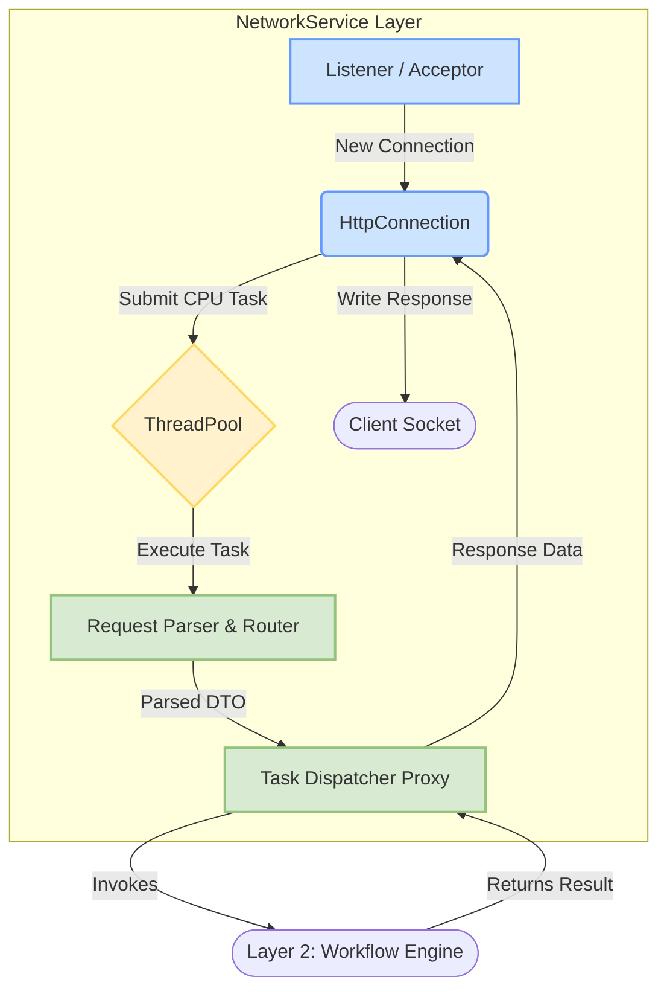

# 网络服务层设计方案

本文档详细描述了 OSCEAN 项目后端框架中第一层——网络服务层 (Web Service Layer) 的设计与实现方案。

## 1. 核心目标与设计原则

网络服务层是整个后端应用的入口，负责监听网络端口、接收客户端（如 Cesium 前端）的 HTTP/WebSocket 请求，并将解析后的请求分发给下一层（任务调度与工作流引擎）。其设计遵循以下核心原则：

-   **高性能**: 采用异步 I/O 模型处理大量并发连接，最小化资源消耗和延迟。
-   **高并发**: 利用非阻塞 I/O 和高效的线程模型，确保少数线程能管理海量网络连接。
-   **可伸缩性**: 架构应能通过增加 CPU 核心数进行垂直扩展。
-   **解耦**: 与业务逻辑层（工作流引擎）完全分离，通过定义清晰的数据传输对象 (DTO) 进行通信。
-   **健壮性**: 包含完善的错误处理、连接管理和超时机制。

## 2. 技术栈选型

为实现上述目标并最大限度地利用成熟库，我们选择以下技术栈：

-   **核心异步 I/O**: **Boost.Asio**
    -   **理由**: 成熟稳定、功能强大、跨平台，是 C++ 异步网络编程的事实标准。与 C++ 标准库风格一致，提供了优秀的 Proactor/Reactor 模型。
-   **HTTP/WebSocket 协议**: **Boost.Beast**
    -   **理由**: 基于 Boost.Asio 构建，无缝集成。提供了底层的、高性能的 HTTP 和 WebSocket 协议实现，给予开发者完全的控制权。
-   **JSON 处理**: **nlohmann/json**
    -   **理由**: 现代 C++ 风格，极其易用，Header-only。与 STL 容器无缝集成，在开发效率和性能之间取得了极佳的平衡。
-   **线程管理**: **自定义线程池 (基于 `std::thread` 或复用 `boost::asio::thread_pool`)**
    -   **理由**: 明确区分 I/O 线程和工作线程，避免耗时任务阻塞 I/O 循环。`common_utilities` 模块已提供线程池实现。
-   **日志**: **spdlog**
    -   **理由**: 由 `common_utilities` 模块提供，高性能、易于配置。

## 3. 功能架构设计

网络服务层内部由多个协同工作的组件构成，形成一个高效的事件驱动架构。



-   **Listener (Acceptor)**: 监听指定端口，接收新的 TCP 连接。每当有新连接时，它会创建一个 `HttpConnection` 实例来处理该连接，然后继续监听，自身不参与任何数据读写。
-   **HttpConnection**: 每个客户端连接对应一个 `HttpConnection` 实例。它负责管理单个连接的完整生命周期，包括：
    -   异步读取套接字数据。
    -   将解析任务提交给工作线程池。
    -   接收处理结果。
    -   异步将响应数据写回套接字。
    -   处理连接超时和关闭。
-   **ThreadPool (工作线程池)**: 执行 CPU 密集型任务，主要是 HTTP 请求的解析、业务逻辑分发和响应格式化。这确保了 I/O 线程不会被阻塞，保持高响应性。此组件由 `common_utilities` 提供。
-   **RequestParser / RequestRouter**: 运行在工作线程上。`RequestParser` 解析原始的 HTTP 报文，`RequestRouter` 则根据请求的方法和 URL 路径，将其匹配到预先注册的处理逻辑（即调用下一层的 `TaskDispatcher`）。
-   **Task Dispatcher Proxy**: `RequestRouter` 调用的目标，是通往第二层 **任务调度与工作流引擎** 的网关。它将网络请求 DTO 传递给工作流引擎，并通过回调或 `future` 接收处理结果。

## 4. 核心类与接口设计

以下是网络服务层核心类的设计概览。

### 4.1. 数据传输对象 (DTO)

```cpp
// Represents a parsed client request for the workflow engine
struct RequestDTO {
    beast::http::verb method;
    std::string target; // URL path + query string
    unsigned http_version;
    std::map<std::string, std::string> headers;
    nlohmann::json body; // Parsed JSON body
    // ... other fields like a map of query parameters ...
};

// Represents data needed to build an HTTP response
struct ResponseData {
    beast::http::status status = beast::http::status::ok;
    std::map<std::string, std::string> headers;
    // Body can be a JSON string, a binary blob, or a stream for large data
    std::variant<std::string, std::vector<unsigned char>, std::shared_ptr<IDataSourceStream>> body;

    static ResponseData create_json_response(beast::http::status s, const nlohmann::json& j);
    static ResponseData create_error_response(beast::http::status s, const std::string& msg);
    static ResponseData create_binary_response(beast::http::status s, std::vector<unsigned char> data, const std::string& content_type);
    static ResponseData create_stream_response(beast::http::status s, std::shared_ptr<IDataSourceStream> stream, const std::string& content_type);
};
```

### 4.2. 核心服务类

```cpp
namespace network_service {

// Forward Declarations
class RequestRouter;
class ThreadPool; // from common_utils

// Handles a single HTTP connection
class HttpConnection : public std::enable_shared_from_this<HttpConnection> {
public:
    HttpConnection(asio::ip::tcp::socket&& socket,
                   std::shared_ptr<RequestRouter> router,
                   std::shared_ptr<ThreadPool> thread_pool);
    void start();
private:
    void do_read();
    void on_read(beast::error_code ec, std::size_t bytes_transferred);
    void process_request(beast::http::request<beast::http::string_body> req);
    void send_response(ResponseData resp_data);
    void do_write(bool keep_alive);
    // ... methods for streaming write and closing ...

    beast::tcp_stream stream_;
    beast::flat_buffer buffer_;
    std::shared_ptr<RequestRouter> router_;
    std::shared_ptr<ThreadPool> thread_pool_;
    std::optional<beast::http::request_parser<beast::http::string_body>> parser_;
    // ...
};

// Routes requests based on method and target
class RequestRouter {
public:
    // A handler takes a request and a callback to send the response
    using HandlerFunc = std::function<void(RequestDTO, std::function<void(ResponseData)>)>;

    void add_route(beast::http::verb method, const std::string& path_pattern, HandlerFunc handler);
    void route_request(beast::http::request<beast::http::string_body>& http_req,
                       std::function<void(ResponseData)> response_callback);
private:
    // ... route storage and not_found_handler ...
    std::shared_ptr<IServiceManager> service_manager_; // Interface to Layer 2
};

// Listens for incoming connections
class Listener : public std::enable_shared_from_this<Listener> {
public:
    Listener(asio::io_context& ioc,
             tcp::endpoint endpoint,
             std::shared_ptr<RequestRouter> router,
             std::shared_ptr<ThreadPool> thread_pool);
    void run();
private:
    void do_accept();
    void on_accept(beast::error_code ec, tcp::socket socket);
    // ...
};

// Main server class to orchestrate everything
class NetworkServer {
public:
    NetworkServer(const AppConfig& config, std::shared_ptr<IServiceManager> service_manager);
    void run();
    void stop();
private:
    AppConfig config_;
    asio::io_context ioc_;
    std::vector<std::thread> io_threads_;
    std::shared_ptr<ThreadPool> thread_pool_;
    std::shared_ptr<RequestRouter> router_;
    std::shared_ptr<Listener> listener_;
    // ...
};

} // namespace network_service
```

## 5. 请求处理流程

1.  `NetworkServer` 初始化，创建 `io_context`、`ThreadPool`、`RequestRouter` 和 `Listener`。并启动多个 I/O 线程，每个线程都在运行 `ioc_.run()`。
2.  `Listener` 开始异步接受 (`async_accept`) 新连接。
3.  当一个客户端连接成功，`on_accept` 回调（在某个 I/O 线程上）被触发。它会创建一个 `HttpConnection` 的 `shared_ptr`，将 `socket` 移交给它，并立即调用 `start()` 方法，然后继续等待下一个连接。
4.  `HttpConnection::start()` 调用 `do_read()` 发起一个 `async_read` 操作。
5.  当数据到达时，`on_read` 回调（在 I/O 线程上）被触发。它将收到的数据和 `process_request` 任务提交给 `ThreadPool`。
6.  `ThreadPool` 中的一个工作线程执行 `process_request`：
    a.  从 Beast 的请求对象中解析并填充 `RequestDTO`，包括使用 `nlohmann/json` 解析请求体。
    b.  调用 `_router->route_request()`，并将 `send_response` 方法包装成一个回调函数传递过去。
7.  `RequestRouter`（在工作线程上）匹配路由规则，并调用对应的 `HandlerFunc`。这个 Handler 通常会调用 `IServiceManager` 的方法，并将响应回调函数层层传递下去。
8.  工作流引擎（Layer 2）异步处理业务逻辑，完成后调用响应回调函数，并传入 `ResponseData`。
9.  `HttpConnection::send_response` 被回调触发（在工作流引擎的线程或工作线程上）。它将写操作通过 `asio::post` 调度回此连接所属的 I/O 线程执行。
10. I/O 线程执行 `do_write`，调用 `async_write` 将响应数据发送给客户端。
11. 写入完成后，根据 HTTP Keep-Alive 决定是继续读取下一个请求 (`do_read`) 还是关闭连接。

## 6. 关键特性实现方案

### 6.1. 大数据流传输

对于大规模数据（如三维流场、高分辨率栅格），一次性读入内存再发送是不可行的。必须采用流式传输。

-   **HTTP Chunked Transfer Encoding**:
    -   当响应体大小未知或非常大时，这是标准方案。
    -   在响应头中设置 `Transfer-Encoding: chunked`。
    -   `HttpConnection` 将实现一个流式写入循环：从 `IDataSourceStream` 读取一个数据块 -> `async_write` 发送 -> 在完成回调中读取下一个数据块 -> `async_write`... 直到数据源耗尽。
    -   Boost.Beast 提供了 `http::serializer` 和 `http::chunk_body` 来简化此过程。

### 6.2. 线程模型与安全

-   **I/O 线程**: 数量固定（通常等于 CPU 核心数或略多），运行 `asio::io_context::run()`。它们只负责非阻塞的 I/O 操作，绝对不执行耗时任务。
-   **工作线程池**: 数量可配置，用于执行所有可能阻塞的操作（请求解析、业务逻辑分发、响应格式化）。
-   **线程安全**:
    -   `HttpConnection` 的成员变量（socket, buffer 等）由其所属的 I/O 线程通过 Asio 的事件循环（strand/executor）串行访问，天然是线程安全的。
    -   从工作线程到 I/O 线程的操作必须通过 `asio::post` 或 `asio::dispatch` 进行调度。
    -   共享组件如 `RequestRouter` 的路由表在启动时填充，运行时是只读的，因此是线程安全的。

### 6.3. 健壮性设计

-   **连接超时**: 为每个 `HttpConnection` 设置一个 `asio::steady_timer`。在每次 I/O 操作成功后重置定时器。如果定时器触发，说明连接空闲超时，服务器将主动关闭连接。
-   **错误处理**: 所有 Boost.Asio/Beast 的异步操作都会传递 `error_code`。必须在回调函数中检查此 `error_code`，如果发生错误（如连接被对方重置），则记录日志并优雅地关闭连接，回收资源。
-   **优雅关闭**: `NetworkServer::stop()` 方法将首先停止 `Listener` 接受新连接，然后等待所有现有连接处理完成（或超时），最后关闭 `io_context` 并 `join` 所有线程。

## 7. 与服务管理器的集成

网络服务层作为所有请求的入口，它并不直接与任何具体的核心服务或工作流引擎交互，而是通过一个统一的接口——`IServiceManager`——来访问整个后端的功能。这种设计确保了网络层与业务逻辑层的完全解耦。

-   **依赖注入**: 在主应用程序 (`main.cpp`) 中，`IServiceManager` 的实例将被创建并作为依赖项注入到 `NetworkServer` 的构造函数中。
-   **请求处理**:
    1.  `RequestRouter` 持有 `IServiceManager` 的 `shared_ptr`。
    2.  当一个请求被路由到对应的处理函数 (`HandlerFunc`) 时，该函数会构建一个业务逻辑任务。
    3.  此任务（通常是一个 lambda 表达式）会捕获必要的请求参数。在 lambda 内部，它将使用 `IServiceManager` 的 `getService<T>()` 方法来获取一个或多个所需的核心服务实例。
    4.  lambda 内部调用这些服务的方法来执行业务逻辑，并最终构建一个 `ResponseData` 对象。
-   **异步执行**: 整个业务逻辑任务将通过 `IServiceManager::submitAsyncTask()` 提交给后端的统一异步框架执行。这将返回一个 `boost::future`。
-   **响应返回**: 网络层会使用 `.then()` 链接到返回的 `boost::future` 上。当业务逻辑完成时，`.then()` 中的回调会被触发，从而调用 `HttpConnection::send_response` 将最终结果发送给客户端。

**集成示例**:

```cpp
// 在 RequestRouter 中添加路由的示例
// 假设 iServiceManager 是已注入的 IServiceManager 实例
router->add_route(verb::post, "/api/v1/metadata/query",
    [this, iServiceManager](RequestDTO dto, std::function<void(ResponseData)> cb) {
        
        // 提交一个异步任务
        auto future = iServiceManager->submitAsyncTask("QueryMetadata", [iServiceManager, dto] {
            // 在异步任务中，获取元数据服务
            auto metadataService = iServiceManager->getService<core_services::IMetadataService>();
            
            // 根据 dto 构建查询条件
            core_services::QueryCriteria criteria = buildCriteriaFromDTO(dto); // 这是一个需要实现的辅助函数
            
            // 调用服务方法 (注意：服务接口也应是异步的，返回 future)
            auto resultFuture = metadataService->findFilesAsync(criteria);
            
            // 等待并处理结果
            auto fileInfos = resultFuture.get(); // .get() 会阻塞当前异步任务线程，直到结果返回
            
            // 构建响应
            return ResponseData::create_json_response(status::ok, toJson(fileInfos));
        });

        // 当任务完成时，通过回调发送响应
        future.then([cb](auto f) {
            try {
                cb(f.get());
            } catch (const std::exception& e) {
                cb(ResponseData::create_error_response(status::internal_server_error, e.what()));
            }
        });
    }
);
```

这种方式确保了网络层只负责网络通信和任务分发，而所有业务逻辑都在后端的异步框架中执行，实现了完美的关注点分离。

## 8. 代码实现与文件结构

为实现上述设计，我们将代码实现在独立的 `network_service` 模块中。该模块将被编译为一个独立的静态库或动态库，供主应用程序 (`application` 模块) 链接和使用。

### 8.1. 目录结构

```
network_service/
├── include/
│   └── network_service/              # 公共头文件，命名空间: network_service
│       ├── dto.h                     # 定义公共数据传输对象 (RequestDTO, ResponseData)
│       └── network_server.h          # NetworkServer 类的公共接口声明
│
├── src/                              # 源代码实现 (内部细节)
│   ├── http_connection.h             # HttpConnection 类的声明 (内部类)
│   ├── http_connection.cpp           # HttpConnection 类的实现
│   │
│   ├── listener.h                    # Listener 类的声明 (内部类)
│   ├── listener.cpp                  # Listener 类的实现
│   │
│   ├── request_router.h              # RequestRouter 类的声明 (内部类)
│   ├── request_router.cpp            # RequestRouter 类的实现
│   │
│   ├── network_server.cpp            # NetworkServer 类的实现
│   └── dto.cpp                       # DTO 辅助方法的实现
│
└── CMakeLists.txt                    # 构建脚本 (将 network_service 编译成库)

application/
├── src/
│   └── main.cpp                      # 应用程序入口
└── CMakeLists.txt                    # 构建脚本 (链接 network_service 库)
```

### 8.2. 文件职责说明

-   **`network_service/include/network_service/`**:
    -   **`dto.h`**: **(公共)** 定义 `RequestDTO` 和 `ResponseData`。这些是网络服务与外部世界（即工作流引擎）通信的契约，必须是公开的。
    -   **`network_server.h`**: **(公共)** 声明 `NetworkServer` 类的公共接口，主要是构造函数、`run()` 和 `stop()` 方法。主应用程序将通过这个头文件来实例化和控制网络服务。

-   **`network_service/src/`**:
    -   **`network_server.cpp`**: 实现 `NetworkServer` 类的具体逻辑，包括初始化、创建内部组件 (`Listener`, `RequestRouter`) 等。
    -   **`listener.h / .cpp`**: 声明和实现 `Listener` 类。这是服务器的内部实现细节，头文件放在 `src` 目录中。
    -   **`http_connection.h / .cpp`**: 声明和实现 `HttpConnection` 类，处理单个连接。这也是内部实现细节。
    -   **`request_router.h / .cpp`**: 声明和实现 `RequestRouter` 类，负责请求分发。这也是内部实现细节。
    -   **`dto.cpp`**: 实现 `ResponseData` 的静态工厂方法等辅助功能。

-   **`network_service/CMakeLists.txt`**:
    -   **职责**: 将 `network_service` 模块编译成一个库 (例如 `network_service.lib` 或 `libnetwork_service.a`)。
    -   处理 Boost, spdlog 等依赖项。
    -   定义公共头文件的包含目录。

-   **`application/src/main.cpp`**:
    -   **职责**: 应用程序的入口点和组装车间。
    -   `#include <network_service/network_server.h>`。
    -   初始化所有核心服务（Layer 3）和工作流引擎（Layer 2）。
    -   创建 `NetworkServer` 实例，将工作流引擎的入口 (`IServiceManager`) 作为依赖注入。
    -   调用 `networkServer.run()` 启动服务。

-   **`application/CMakeLists.txt`**:
    -   **职责**: 编译主应用程序可执行文件。
    -   必须链接由 `network_service` 模块生成的库。

## 9. 系统性能评估

基于当前确定的架构设计，我们对整个系统的性能做如下评估。

### 9.1. 优势与高性能潜力

-   **原生 C++ 与高效库**: 核心代码由 C++ 实现，并大量使用 Eigen, GDAL, spdlog, Boost.Asio 等高性能库，为系统提供了高执行效率的基础。
-   **异步 I/O 模型**: 网络层和文件 I/O 都采用异步模型，能以少量线程高效处理大量并发请求，最大限度减少阻塞等待，提升系统吞吐量。
-   **多线程并行计算**: 线程池的引入使得 CPU 密集型任务（如插值、模型计算、图像渲染、数据重投影）能够被并行处理，充分利用现代多核 CPU 的计算能力。
-   **精细的内存控制**: C++ 精细的内存管理能力，结合设计中对零拷贝和智能指针的强调，有利于降低内存占用，提高 CPU 缓存效率。
-   **多级缓存机制**: 设计中包含了多层缓存（CRS 转换对象缓存、瓦片缓存、元数据索引缓存、工作流结果缓存），能显著加速重复请求的响应。

### 9.2. 潜在瓶颈与挑战

-   **I/O 限制**: 磁盘 I/O 速度和网络带宽将是大规模数据读写和传输的物理瓶颈。
-   **CPU 密集型计算**: 复杂模型的计算、高分辨率的插值、尤其是瓦片服务中的实时重投影 (GDAL Warp)，将是主要的 CPU 消耗点，需要重点优化。
-   **内存占用**: 加载超大规模数据集、缓存策略不当或内存泄漏都可能导致内存压力。
-   **锁竞争**: 在高并发场景下，对共享资源（如缓存、任务队列）的锁设计不当可能会成为性能瓶颈。

### 9.3. 伸缩性（Scalability）

-   **垂直扩展 (Scale Up)**: **良好**。由于框架充分考虑了并行计算和异步 I/O，增加服务器的 CPU 核心数、内存和磁盘性能，系统性能应该能相应提升。
-   **水平扩展 (Scale Out)**: **可行但复杂**。将系统扩展到多个节点需要额外的工作，包括：使用外部共享缓存（如 Redis）来管理任务状态和瓦片缓存；所有节点需要访问共享文件系统；在前端设置负载均衡器。

## 10. 分阶段开发计划

我们将采用增量、迭代的开发方式，优先构建核心骨架和关键路径，然后逐步添加功能并持续测试。

-   **Phase 0: 环境搭建与基础**
    1.  **项目结构**: 创建所有模块的目录结构和 `CMakeLists.txt` 文件。
    2.  **依赖管理**: 使用 vcpkg 或其他方式确保所有第三方依赖 (Boost, GDAL, Eigen, spdlog 等) 能够被 CMake 正确找到和链接。
    3.  **编译骨架**: 确保一个最小化的、包含所有模块但实现为空的骨架能够成功编译链接。

-   **Phase 1: 奠定基础 - 通用库与接口**
    1.  **实现 Common Utilities (第 5 层)**: 实现日志、配置管理、异常基类和线程池。编写单元测试确保其功能正常。
    2.  **定义 Core Service Interfaces (接口库)**: 创建所有 `I<ServiceName>.h` 接口文件和 `common_data_types.h`。确保接口定义稳定。

-   **Phase 2: 核心数据流 - 数据访问与坐标转换**
    1.  **实现核心服务 (基础)**: 优先实现 `CrsEngine` (坐标转换) 和 `RawDataAccessService` (数据访问)。编写单元测试验证其准确性，特别是对极区数据的处理。
    2.  **实现简单工作流引擎 (第 2 层)**: 实现一个能按顺序执行简单步骤的执行器和 `CoreServiceProxy`。
    3.  **实现基础网络层 (第 1 层)**: 实现一个能接收请求、调用工作流并返回简单 JSON 响应的 HTTP 服务器，打通端到端流程。

-   **Phase 3: 核心计算与处理**
    1.  **实现核心服务 (计算)**: 逐步实现 `MetadataService`, `SpatialOpsService`, 和 `InterpolationService`。
    2.  **增强工作流引擎**: 支持异步步骤处理 (`std::future`) 和更复杂的依赖关系。

-   **Phase 4: 模型集成与输出**
    1.  **实现 Modeling Service (第 3e 层)**: 集成现有插件系统，实现插件的加载、注册和执行。
    2.  **实现 Output Generation (第 4 层)**: 实现文件生成器和图像生成器。
    3.  **端到端测试**: 实现完整的工作流，模拟从请求到生成最终产物（文件或图像）的用户场景。

-   **Phase 5: 瓦片服务与优化**
    1.  **实现 Tile Service (第 4c 层)**: 这是最复杂的部分。重点实现缓存逻辑、数据获取、重投影 (封装 GDAL Warp) 和渲染逻辑。
    2.  **性能优化**: 根据测试中发现的瓶颈进行性能调优。
    3.  **健壮性**: 完善错误处理、超时和重试逻辑，并进行压力测试。

## 11. 测试与调试策略

测试将贯穿整个开发过程，以确保代码质量和系统稳定性。

-   **单元测试**:
    -   **目标**: 对每个类或模块的核心逻辑进行独立验证。
    -   **工具**: 使用 Google Test (GTest) 和 Google Mock (GMock)。
    -   **实践**: 为工具类、算法、服务实现等编写单元测试。使用 Mock 框架隔离被测单元的外部依赖（例如，测试工作流时 Mock 核心服务接口）。

-   **集成测试**:
    -   **目标**: 测试模块之间的交互是否正确。
    -   **实践**: 编写测试用例验证工作流引擎能否正确调用核心服务，以及核心服务之间的相互调用。

-   **端到端测试 (E2E Test)**:
    -   **目标**: 模拟真实用户场景，验证从网络请求到最终响应的完整流程。
    -   **实践**: 编写脚本或使用工具 (如 Postman, curl) 发送 HTTP 请求，并验证返回的响应（文件内容、图像、JSON 数据、瓦片）是否符合预期。

-   **调试工具与策略**:
    -   **日志**: 在关键路径和错误处理中添加详细的结构化日志。
    -   **调试器**: 使用 GDB, LLDB 或 Visual Studio Debugger 进行断点调试。
    -   **性能剖析**: 使用 Perf, Valgrind/Callgrind, VTune 等工具识别性能瓶颈。
    -   **静态分析**: 使用 Clang-Tidy, Cppcheck 等工具在编译阶段发现潜在的代码问题。
    -   **测试数据**: 准备覆盖不同情况（不同 CRS、数据格式、边界条件、错误数据）的测试数据集至关重要。

## 12. 网络服务层开发实施计划

本章节提供一个分阶段的、可执行的开发计划，以指导 `network_service` 模块的具体编码实现。

### Phase 1: 核心数据结构与路由

此阶段的目标是定义网络层内部的数据交换格式和请求分发逻辑。

1.  **创建 `dto.h` (`network_service/include/network_service/dto.h`)**
    *   **目标**: 定义网络层与内部逻辑交互的数据传输对象(DTO)。
    *   **内容**:
        *   定义 `RequestDTO` 结构体，包含 `boost::beast::http::verb`、`std::string target`、头部 `map` 和 `std::string body`。
        *   定义 `ResponseData` 结构体，包含 `boost::beast::http::status`、头部 `map` 和 `boost::variant<std::string, std::vector<unsigned char>> body`。
        *   提供静态辅助函数，如 `ResponseData::create_json_response(...)` 和 `ResponseData::create_error_response(...)`。

2.  **创建 `request_router.h` 和 `request_router.cpp` (`network_service/src/`)**
    *   **目标**: 实现请求分发器。
    *   **`request_router.h`**:
        *   定义 `RequestRouter` 类。
        *   **构造函数**: `RequestRouter(std::shared_ptr<oscean::workflow_engine::service_management::IServiceManager> serviceManager)`。
        *   **公共方法**: `add_route(...)` 和 `route_request(...)`。
        *   **私有成员**: `std::map` 用于存储路由规则，以及 `IServiceManager` 的共享指针。
    *   **`request_router.cpp`**:
        *   实现路由的添加和查找逻辑。`route_request` 负责查找并调用对应的处理函数，或在未找到时生成 404 响应。

### Phase 2: 连接处理

此阶段的目标是实现对单个 HTTP 连接生命周期的管理。

1.  **创建 `http_connection.h` 和 `http_connection.cpp` (`network_service/src/`)**
    *   **目标**: 实现处理单个 HTTP 连接的类。
    *   **`http_connection.h`**:
        *   定义 `HttpConnection` 类，继承自 `std::enable_shared_from_this<HttpConnection>`。
        *   **构造函数**: 接收 `socket` 和 `RequestRouter` 的共享指针。
        *   **公共方法**: `void start();`。
        *   **私有方法**: 声明 `do_read`, `on_read`, `process_request`, `send_response`, `do_write`, `on_write`, `do_close` 等异步链方法。
        *   **私有成员**: `boost::beast::tcp_stream`, `flat_buffer`, `RequestRouter` 指针, `boost::optional` 的请求解析器和响应数据。
    *   **`http_connection.cpp`**:
        *   实现完整的异步处理链：读取请求 -> 解析 -> 路由 -> 写回响应。
        *   `process_request` 调用 `RequestRouter`，并传递 `send_response` 作为回调。
        *   `send_response` 需通过 `asio::post` 将写操作调度回连接自身的 I/O 线程执行。

### Phase 3: 服务器主体与监听器

此阶段的目标是组装所有组件，创建可运行的服务器。

1.  **创建 `listener.h` 和 `listener.cpp` (`network_service/src/`)**
    *   **目标**: 实现监听端口、接受新连接。
    *   **`listener.h`**: 定义 `Listener` 类，构造时接收 `io_context`、`endpoint` 和 `RequestRouter`。
    *   **`listener.cpp`**: 实现 `run()`, `do_accept()`, `on_accept()`。在 `on_accept` 中创建并启动 `HttpConnection` 实例，然后继续监听。

2.  **创建 `network_server.h` 和 `network_server.cpp` (`network_service/include/network_service/` 和 `network_service/src/`)**
    *   **目标**: 创建服务器总控类。
    *   **`network_server.h`**: 定义 `NetworkServer` 类，构造函数接收配置对象和 `IServiceManager` 的共享指针。
    *   **`network_server.cpp`**: 在构造函数中组装 `io_context`, `RequestRouter` 和 `Listener`。在 `run()` 方法中创建并启动 I/O 线程池。实现 `stop()` 方法以支持优雅停机。

### Phase 4: 构建与集成

此阶段的目标是确保网络服务模块能被正确编译并集成到主应用程序中。

1.  **更新 `network_service/CMakeLists.txt`**
    *   **目标**: 配置模块的编译规则和依赖。
    *   **内容**:
        *   添加所有新建的 `.cpp` 文件。
        *   链接 `Boost` (system, thread, beast) 等外部库。
        *   链接 `common_utilities`, `core_service_interfaces`, `workflow_engine` 等项目内部库。
        *   正确设置 `target_include_directories`。

2.  **更新 `application/data_workflow_app/src/main.cpp`**
    *   **目标**: 在主程序入口实例化并启动网络服务。
    *   **内容**:
        *   包含 `network_service/network_server.h`。
        *   在 `main` 函数中，初始化 `IServiceManager` 的实例。
        *   创建 `NetworkServer` 的实例，将 `IServiceManager` 作为依赖注入。
        *   调用 `networkServer.run()` 启动整个服务。

## 13. 压力测试与端到端场景测试

-   **压力测试**: 使用 `wrk`, `ab` 等工具模拟高并发请求，测试服务器的吞吐量、延迟和稳定性，识别性能瓶颈。
-   **端到端场景测试**: 覆盖从 API 请求到获取最终结果（文件、图像、瓦片）的完整用户场景。 