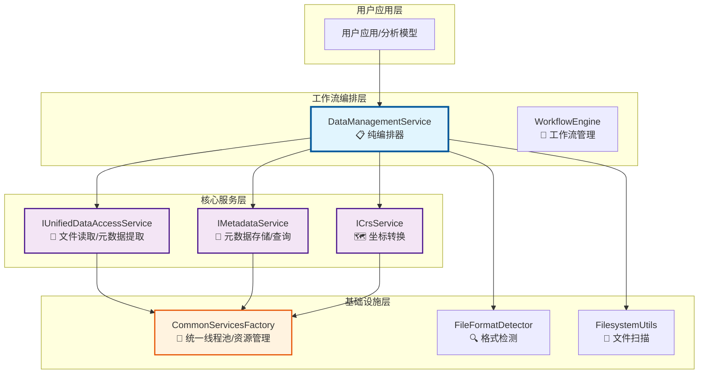
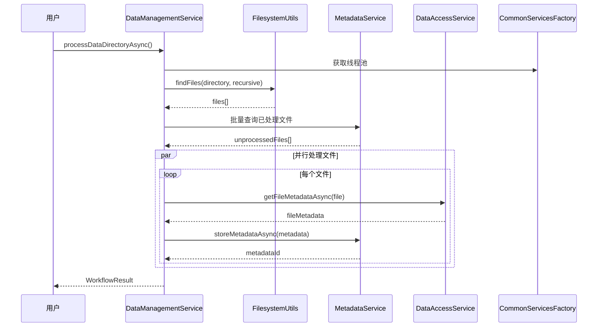
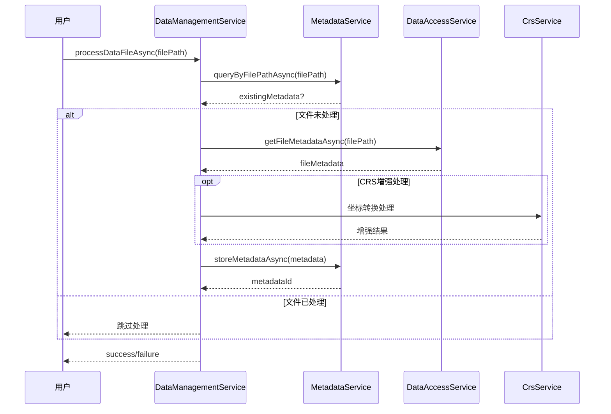

# 数据管理工作流 - 架构设计说明

## 核心设计原则

### 🎯 工作流引擎 = 服务编排器，不是功能实现者

本项目的数据管理工作流严格遵循 **编排不实现** 的设计原则：

#### ✅ 正确做法：
- **调用现有服务**：所有具体功能调用已实现的核心服务
- **协调服务调用**：负责多个服务之间的调用顺序和数据传递
- **统一接口**：为用户提供简化的工作流接口
- **异步编排**：使用统一线程池管理并发
- **错误处理**：处理服务间的协调和错误传播

#### ❌ 严格禁止：
- **重新实现功能**：不重复实现已有的业务逻辑
- **直接操作数据**：不直接读取文件或操作数据库
- **重复缓存逻辑**：不重新实现缓存机制
- **重复并发管理**：不创建独立的线程池

## 项目架构层次



## 数据管理工作流职责

### 📋 编排层（DataManagementService）

**只负责服务调用和协调：**

1. **文件扫描编排**
   ```cpp
   // 调用 FilesystemUtils，不自己实现扫描
   auto files = FilesystemUtils::findFiles(directory, patterns, recursive);
   ```

2. **已处理文件检查编排**
   ```cpp
   // 调用 MetadataService，不自己维护状态
   auto unprocessed = metadataService_->queryByFilePathAsync(filePath);
   ```

3. **元数据提取编排**
   ```cpp
   // 调用 DataAccessService，不自己解析文件
   auto metadata = dataAccessService_->getFileMetadataAsync(filePath);
   ```

4. **元数据存储编排**
   ```cpp
   // 调用 MetadataService，不自己操作数据库
   auto id = metadataService_->storeMetadataAsync(extractedMetadata);
   ```

5. **异步任务管理**
   ```cpp
   // 使用 CommonServicesFactory 的统一线程池
   return commonServicesFactory_->getThreadPool()->submit(task);
   ```

### 🔧 核心服务层（已实现功能）

| 服务 | 职责 | 接口 |
|------|------|------|
| **IUnifiedDataAccessService** | 文件读取、元数据提取、格式解析 | `getFileMetadataAsync()` |
| **IMetadataService** | 元数据存储、查询、分类、索引 | `storeMetadataAsync()`, `queryMetadataAsync()` |
| **ICrsService** | 坐标转换、CRS处理、SIMD优化 | 坐标转换相关接口 |
| **CommonServicesFactory** | 统一线程池、内存管理、SIMD | `getThreadPool()`, `getMemoryManager()` |

## 工作流执行流程

### 📁 目录处理工作流



### 📄 单文件处理工作流



## 关键设计特性

### 🧵 统一线程池管理

```cpp
// ✅ 正确：使用统一线程池
template<typename T>
boost::future<T> DataManagementService::createAsyncTask(std::function<T()> task) const {
    return boost::async(boost::launch::async, std::move(task));
}

// ❌ 错误：创建独立线程池
// std::thread_pool localPool; // 禁止！
```

### 🔍 数据库预优化

```cpp
// ✅ 正确：调用MetadataService查询
boost::future<std::vector<std::string>> filterUnprocessedFilesAsync(
    const std::vector<std::string>& filePaths) {
    // 调用现有服务，不重复实现
    return metadataService_->queryByFilePathAsync(filePath);
}

// ❌ 错误：直接操作数据库
// sqlite3* db = ...; // 禁止！
```

### 🚫 避免功能重复实现

```cpp
// ✅ 正确：委托给现有服务
boost::future<std::vector<std::string>> queryByTimeRangeAsync(...) {
    // 直接委托，不重新实现查询逻辑
    return metadataService_->queryMetadataAsync(criteria);
}

// ❌ 错误：重新实现查询
// auto results = database.query("SELECT ..."); // 禁止！
```

## 测试验证

### 单元测试原则

```cpp
// ✅ 正确：测试服务编排逻辑
TEST(DataManagementServiceTest, ProcessFileCallsCorrectServices) {
    // 使用Mock服务验证调用顺序和参数
    auto mockDataAccess = std::make_shared<MockDataAccessService>();
    auto mockMetadata = std::make_shared<MockMetadataService>();
    
    // 验证是否按正确顺序调用了服务
    EXPECT_CALL(*mockDataAccess, getFileMetadataAsync(_));
    EXPECT_CALL(*mockMetadata, storeMetadataAsync(_));
}

// ❌ 错误：测试业务逻辑实现
// TEST(DataManagementServiceTest, ParseNetCDFFile) // 禁止！
```

## 扩展和维护

### 添加新功能

1. **在核心服务层实现功能**
2. **在工作流层添加编排调用**
3. **不在工作流层实现业务逻辑**

### 性能优化

1. **在核心服务层优化算法**
2. **在工作流层优化调用顺序**
3. **使用统一线程池管理并发**

### 错误处理

1. **捕获服务调用异常**
2. **提供统一的错误转换**
3. **不重新实现错误处理逻辑**

## 总结

这个架构确保了：

- **单一职责**：每层只做自己的事
- **依赖清晰**：工作流依赖服务，不是相反
- **易于测试**：Mock服务即可测试编排逻辑
- **易于维护**：功能修改在核心服务层
- **性能统一**：使用统一的线程池和资源管理

**记住：工作流引擎是指挥官，不是士兵！** 