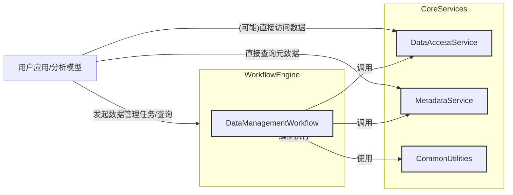

# 数据管理引擎开发设计方案

## 1. 引言 (Introduction)

### 1.1 目的 (Purpose)
本文档旨在详细阐述数据管理引擎（Data Management Engine）的设计方案。该引擎作为工作流引擎（Workflow Engine）的核心组成部分（或紧密协作的模块），负责对各类海洋环境相关的科学数据进行高效、规范、自动化的管理。其主要目标是支持数据的全生命周期管理，包括数据接入、分类、验证、元数据提取与丰富、质量评估、存储注册、索引构建以及最终服务于上层分析计算模型的快速数据定位与检索。

### 1.2 范围 (Scope)
本设计方案覆盖数据管理引擎的架构设计、模块划分、核心功能、接口定义、数据模型、关键技术选型以及与外部系统（特别是 `common_utilities`、`data_access_service` 和 `metadata_service`）的交互方式。

管理的数据类型主要包括但不限于：
*   海洋环境数据（如温盐深、海流、声速剖面等）
*   声传播损失数据
*   地形底质数据
*   边界约束数据
*   其他与海洋声学及环境分析相关的地理空间和时间序列数据。

### 1.3 定义、首字母缩写和缩略语 (Definitions, Acronyms, and Abbreviations)
*   **DME:** Data Management Engine (数据管理引擎)
*   **WE:** Workflow Engine (工作流引擎)
*   **DAS:** Data Access Service (数据接入服务)
*   **MDS:** Metadata Service (元数据服务)
*   **CU:** Common Utilities (通用工具库)
*   **API:** Application Programming Interface (应用程序编程接口)
*   **CRS:** Coordinate Reference System (坐标参考系统)
*   **ETL:** Extract, Transform, Load (抽取、转换、加载)
*   **JSON:** JavaScript Object Notation
*   **YAML:** YAML Ain't Markup Language
*   **UUID:** Universally Unique Identifier (通用唯一标识符)

### 1.4 参考资料 (References)
*   `数据管理AI交互设计.md` (本文档的主要设计输入来源)
*   `common_utilities` 模块接口文档
*   `data_access_service` 模块接口文档
*   `metadata_service` 模块接口文档
*   C++ AI 编程指南 (项目编码规范)

### 1.5 概述 (Overview)
数据管理引擎旨在构建一个强大、灵活且可扩展的数据处理与管理流水线。它将作为 `workflow_engine` 中的一个或一组高度协同的工作流实现，通过编排一系列定义明确的处理阶段（Stage Handlers），实现对输入数据的自动化处理。引擎强调模块化设计，将核心功能（如数据发现、验证、分类、元数据提取、注册、索引）解耦，并通过配置驱动，以适应不断变化的数据类型和业务需求。与底层核心服务（DAS, MDS）的紧密集成是本方案的关键，确保了数据操作的专业性和高效性。

## 2. 系统架构 (System Architecture)

### 2.1 架构设计目标 (Architectural Design Goals)
*   **模块化与高内聚低耦合:** 将复杂的数据管理流程分解为独立的、可重用的模块，每个模块聚焦特定职责。
*   **可配置性与可扩展性:** 核心处理逻辑、数据类型定义、分类规则、元数据提取策略等应尽可能通过外部配置进行管理和扩展，以适应新的数据源和分析需求。
*   **强大的元数据驱动能力:** 构建全面、标准化的元数据体系，并与 `metadata_service` 深度集成，实现高效的数据检索和定位。
*   **清晰的服务职责划分:** 明确数据管理引擎自身、`workflow_engine` 以及依赖的核心服务（DAS, MDS, CU）之间的职责边界。
*   **异步与高性能:** 充分利用异步处理模式（如 `boost::future`）和并行化技术，提升数据处理效率。
*   **健壮性与容错性:** 提供完善的错误处理、重试机制和日志监控。
*   **易用性与可维护性:** 提供清晰的API接口和文档，代码结构清晰，易于理解、测试和维护。

### 2.2 整体架构 (Overall Architecture)
数据管理引擎的核心功能将作为 `workflow_engine` 内的一个复杂工作流（例如 `DataManagementWorkflow`）来实现，或者是一系列协同工作的工作流。它不直接拥有数据存储或元数据存储，而是依赖 `data_access_service` 进行原始数据操作，依赖 `metadata_service` 进行元数据持久化、索引和查询。



**核心交互流程:**
1.  **任务触发:** 用户应用或外部系统通过 `workflow_engine` 的API触发数据管理任务（如新数据批处理）。
2.  **工作流实例化:** `workflow_engine` 根据请求实例化并执行 `DataManagementWorkflow`。
3.  **上下文与配置:** `DataManagementWorkflow` 初始化时加载必要的配置，并维护一个 `WorkflowContext` 在各处理阶段间传递数据和状态。
4.  **阶段化处理:** `DataManagementWorkflow` 按照预定义的顺序执行一系列处理阶段（Handlers），例如：
    *   数据发现 (调用 DAS)
    *   数据验证 (调用 DAS)
    *   数据分类
    *   元数据提取 (调用 DAS 获取基础信息，结合自身逻辑和MDS进行丰富)
    *   质量评估
    *   数据注册 (调用 MDS)
    *   索引构建 (触发 MDS)
5.  **服务调用:** 各处理阶段通过统一的服务代理（如 `CoreServiceProxy`）与 `DAS` 和 `MDS` 进行异步交互。
6.  **结果反馈:** 工作流执行结果和状态通过 `workflow_engine` 返回给调用方。
7.  **数据查询:** 分析模型或用户应用可以通过 `MDS` 提供的查询接口，根据丰富的元数据快速定位所需数据。

### 2.3 模块划分 (Module Breakdown)
数据管理引擎（主要体现为 `DataManagementWorkflow` 及其辅助组件）内部将包含以下核心逻辑模块/组件：

*   **`DataManagementWorkflow` (核心编排器):**
    *   负责整个数据管理流程的编排和驱动。
    *   管理一系列 `IWorkflowStageHandler` 的执行顺序和依赖关系。
    *   维护 `WorkflowContext`。
    *   与 `workflow_engine` 主体进行交互（状态上报、进度更新等）。

*   **`IWorkflowStageHandler` (接口):**
    *   定义数据处理阶段的标准接口（如 `process(WorkflowContext& context)` 和 `configure(config)`）。
    *   **具体实现类 (Concrete Handlers):**
        *   `DataDiscoveryHandler`: 负责发现待处理的数据文件/集，调用 `DAS`。
        *   `DataValidationHandler`: 负责验证数据的完整性、格式合规性，调用 `DAS`。
        *   `DataTypeClassifierHandler` (或作为服务类): 负责根据规则（文件名、路径、内容特征、配置）识别数据类型。
        *   `MetadataExtractionHandler`: 负责从数据中提取元数据，可能调用 `DAS` 获取基础信息，并结合分类结果和配置规则生成详细元数据。
        *   `QualityAssessmentHandler`: 负责评估数据质量。
        *   `DataRegistrationHandler`: 负责将提取和处理后的元数据注册到 `MDS`。
        *   `IndexBuildingHandler`: 负责触发 `MDS` 对新注册或更新的元数据进行索引。
        *   (其他可能的处理器，如数据转换、预处理等)

*   **`IMetadataExtractor` (接口):**
    *   定义元数据提取器的标准接口。
    *   **具体实现类 (Concrete Extractors):**
        *   `CoreServiceMetadataExtractor`: 封装对 `DAS` 和 `MDS` 的调用，提取和转换元数据。
        *   `SpecificFormatMetadataExtractor`: 针对特定复杂数据格式（如特定声学模型输出）的专用提取器。

*   **`WorkflowConfigManager` (配置管理器):**
    *   负责加载和管理数据管理工作流的配置（如数据路径、处理参数、分类规则、元数据映射规则等）。配置源可以是 JSON/YAML 文件。

*   **`CoreServiceProxy` (核心服务代理):**
    *   (已存在或需进一步完善) 统一封装对 `DAS`, `MDS`, `CU` 等外部服务的调用接口，处理异步逻辑、错误处理、服务发现和依赖注入。

*   **`WorkflowContext` (工作流上下文):**
    *   (已存在或需进一步完善) 在工作流的各个阶段之间传递数据、状态和参数。需要审视其类型安全和灵活性。

这种模块化的设计旨在将 `DataManagementWorkflow` 从一个庞大的单体类转变为一个由多个可配置、可替换的组件构成的灵活流程。

## 3. 模块详细设计 (Detailed Module Design)

本章节详细描述在2.3节中划分的核心模块/组件的设计。

### 3.1 `DataManagementWorkflow` (核心编排器)

*   **职责:**
    *   作为数据管理流程的总控制器和入口点，由 `WorkflowEngine` 实例化和管理。
    *   根据配置初始化并编排一系列 `IWorkflowStageHandler` 实例的执行。
    *   创建并管理 `WorkflowContext`，在各阶段处理器之间传递共享数据、配置和状态。
    *   聚合各阶段的处理结果，形成最终的工作流输出。
    *   向 `WorkflowEngine` 报告工作流的整体进度、状态（如运行中、成功、失败、已取消）和错误信息。
    *   处理工作流级别的配置，例如最大并发处理文件数、整体超时设置等。
*   **接口 (主要由 `WorkflowEngine` 调用):**
    *   `WorkflowResult execute(const WorkflowParameters& params)`: 启动工作流执行。
    *   `void cancel()`: 请求取消工作流。
    *   `WorkflowStatus getStatus()`: 获取当前工作流状态。
    *   `ProgressInfo getProgress()`: 获取当前工作流进度。
*   **内部逻辑:**
    *   初始化阶段：加载工作流配置，实例化所有配置的 `IWorkflowStageHandler`，并注入所需依赖（如 `CoreServiceProxy`）。
    *   执行阶段：按预定义顺序（或依赖关系）同步/异步执行每个 `IWorkflowStageHandler` 的 `process` 方法。
    *   错误处理：捕获阶段处理器抛出的异常，根据策略决定是终止工作流还是尝试恢复/跳过。
    *   上下文管理：确保 `WorkflowContext` 在阶段间正确传递和更新。
*   **配置示例 (Conceptual):**
    ```json
    {
      "workflow_name": "StandardOceanDataProcessing",
      "version": "1.0",
      "max_concurrent_files": 10,
      "stages": [
        { "name": "DataDiscovery", "handler_class": "DataDiscoveryHandler", "config_ref": "discovery_config.json" },
        { "name": "DataValidation", "handler_class": "DataValidationHandler", "config_ref": "validation_config.json" },
        { "name": "DataTypeClassification", "handler_class": "DataTypeClassifierHandler" }, // 可能无特定文件配置，或内联
        { "name": "MetadataExtraction", "handler_class": "MetadataExtractionHandler", "config_ref": "metadata_extraction_rules.json" },
        { "name": "QualityAssessment", "handler_class": "QualityAssessmentHandler", "config_ref": "quality_rules.json" },
        { "name": "DataRegistration", "handler_class": "DataRegistrationHandler" },
        { "name": "IndexBuilding", "handler_class": "IndexBuildingHandler" }
      ]
    }
    ```

### 3.2 `IWorkflowStageHandler` (接口) 与具体实现

*   **接口定义:**
    ```cpp
    // interface IWorkflowStageHandler
    class IWorkflowStageHandler {
    public:
        virtual ~IWorkflowStageHandler() = default;
        virtual std::string getName() const = 0; // 获取阶段处理器名称
        virtual bool configure(const std::any& config, std::shared_ptr<CoreServiceProxy> serviceProxy) = 0; // 配置处理器，注入依赖
        virtual boost::future<StageResult> process(WorkflowContext& context) = 0; // 异步处理数据
    };
    ```
    *   `StageResult` 应包含该阶段的成功/失败状态、错误信息、以及任何需要传递给后续阶段的输出（通过 `WorkflowContext` 更新）。

*   **具体实现类 (Concrete Handlers):**

    *   **3.2.1 `DataDiscoveryHandler`**
        *   **职责:** 根据输入参数（如路径模式、时间范围、特定项目ID等）从 `WorkflowContext` 或配置中获取，调用 `DAS` 的 `discoverData` 接口发现需要处理的数据文件/对象列表。
        *   **输出:** 将发现的文件列表（包含基本信息如路径、大小、修改时间）存入 `WorkflowContext` 供后续阶段使用。
        *   **配置:** 发现路径、文件扩展名过滤器、递归深度、时间戳过滤器等。

    *   **3.2.2 `DataValidationHandler`**
        *   **职责:** 对 `WorkflowContext` 中的文件列表（来自发现阶段）进行验证。调用 `DAS` 的 `validateFile` 接口检查文件是否存在、是否可读、格式是否初步符合预期（如检查文件头、基本结构完整性）。
        *   **输出:** 更新 `WorkflowContext` 中每个文件的验证状态，标记无效或可疑文件。
        *   **配置:** 验证级别、特定格式的校验规则（如果 `DAS` 支持传入）。

    *   **3.2.3 `DataTypeClassifierHandler`**
        *   **职责:** 对通过验证的文件进行数据类型分类（海洋环境数据、声传播损失数据等）。分类结果可基于规则自动识别，也应能接受来自工作流参数或输入清单中的手动指定分类。
        *   **逻辑:** 基于配置文件中定义的规则，这些规则可能包括：
            *   文件名模式匹配 (e.g., `*_CTD_*.nc`, `*_bathy_*.tif`)
            *   路径关键字
            *   文件扩展名
            *   （可选，较复杂）基于文件内容特征的轻量级嗅探（若 `DAS` 提供此类接口或允许读取部分内容）。
        *   **输出:** 更新 `WorkflowContext` 中每个文件的数据类型信息。
        *   **配置:** 数据类型定义及其对应的分类规则（正则表达式、关键字列表等）。
        ```json
        // Conceptual DataTypeClassificationConfig.json
        {
          "data_types": [
            { "name": "OceanSoundProfile", "patterns": ["*_svp_*.nc", "*_sound_velocity_*.dat"], "keywords_in_path": ["sound_profile"] },
            { "name": "TerrainBathymetry", "extensions": [".tif", ".grd"], "filename_keywords": ["bathy", "terrain"] }
          ]
        }
        ```

    *   **3.2.4 `MetadataExtractionHandler`**
        *   **职责:** 为每个分类后的文件提取详细元数据。这是数据管理的核心步骤之一。
        *   **逻辑:**
            1.  根据 `WorkflowContext` 中文件的数据类型，选择合适的 `IMetadataExtractor` 实现。
            2.  调用所选 `IMetadataExtractor` 的 `extractMetadata` 方法。
            3.  `IMetadataExtractor` 内部可能会调用 `DAS` 提供的基础元数据提取接口 (`extractBaseFileInfo`)，并结合自身特定于数据类型的解析逻辑（如解析NetCDF头、GeoTIFF标签、自定义格式的头部信息等）来获取更丰富的元数据。
            4.  将提取到的原始元数据转换为项目定义的标准 `ComprehensiveMetadata` 对象结构（见4.3 元数据模型）。
        *   **输出:** 将标准化的 `ComprehensiveMetadata` 对象列表存入 `WorkflowContext`。
        *   **配置:** 元数据映射规则、默认值、特定类型提取器的配置。

    *   **3.2.5 `QualityAssessmentHandler`**
        *   **职责:** 对提取的元数据和/或数据内容本身进行质量评估。
        *   **逻辑:** 基于配置的规则集对元数据完整性、一致性、时空范围合理性、变量值域等进行检查。对于某些数据类型，可能需要调用 `DAS` 读取部分数据内容进行统计分析或有效性校验。
        *   **输出:** 在 `WorkflowContext` 中的 `ComprehensiveMetadata` 对象内附加质量评估结果（如质量分数、标记、问题描述）。
        *   **配置:** 质量评估规则（如必填元数据字段、值域约束、时间连续性检查参数等）。

    *   **3.2.6 `DataRegistrationHandler`**
        *   **职责:** 将经过验证、分类、元数据提取和质量评估的数据及其元数据注册到系统中。
        *   **逻辑:** 调用 `MDS` 的 `registerMetadata` 接口，将 `WorkflowContext` 中的 `ComprehensiveMetadata` 对象持久化到元数据存储中。
        *   **输出:** 获取并记录由 `MDS` 返回的元数据唯一标识符 (e.g., UUID) 到 `WorkflowContext` 或日志。
        *   **配置:** 无特定配置，主要依赖 `MDS` 接口。

    *   **3.2.7 `IndexBuildingHandler`**
        *   **职责:** 在元数据注册完成后，触发或请求 `MDS` 对新数据进行索引，以支持快速查询。
        *   **逻辑:** 调用 `MDS` 的 `buildOrUpdateIndex` 接口，可能指定需要更新的索引类型（如空间索引、时间索引、关键字索引）。
        *   **输出:** 记录索引任务的状态或结果。
        *   **配置:** 可能包括索引更新策略（立即、延迟）。

### 3.3 `IMetadataExtractor` (接口) 与具体实现

*   **接口定义:**
    ```cpp
    // interface IMetadataExtractor
    class IMetadataExtractor {
    public:
        virtual ~IMetadataExtractor() = default;
        // 配置提取器，serviceProxy用于访问DAS等服务，config为特定提取器的配置
        virtual bool configure(const std::any& config, std::shared_ptr<CoreServiceProxy> serviceProxy) = 0;
        // 从给定的文件路径和基础文件信息中提取元数据
        // fileInfo 可以是DAS初步发现的文件信息
        // dataType 是分类器确定的数据类型，用于指导提取逻辑
        virtual boost::future<ComprehensiveMetadata> extractMetadata(const std::string& filePath,
                                                                   const BasicFileInfo& fileInfo, // 来自DAS或发现阶段
                                                                   const std::string& dataType,
                                                                   WorkflowContext& context) = 0;
    };
    ```

*   **具体实现类 (Concrete Extractors):**

    *   **3.3.1 `CoreServiceGenericMetadataExtractor`**
        *   **职责:** 通用的元数据提取器，主要依赖 `DAS` 的能力。
        *   **逻辑:** 调用 `DAS` 的 `extractFileMetadataAsync()` (假设存在这样的接口，能够返回较丰富的结构化元数据) 或组合调用 `extractBaseFileInfo` 及其他读取接口。然后将 `DAS` 返回的元数据转换为项目的 `ComprehensiveMetadata` 标准格式。
        *   **配置:** 可能包含从 `DAS` 返回的字段到标准模型字段的映射规则。

    *   **3.3.2 `NetcdfMetadataExtractor`**
        *   **职责:** 专门处理 NetCDF 格式文件。需要准确提取时间信息、坐标参考系统（CRS）、变量及其属性、维度等关键元数据。
        *   **逻辑:** 
            *   使用 `DAS` 读取文件（或直接使用NetCDF库，如果 `DAS` 仅提供字节流）。
            *   **时间信息提取:** 
                *   严格遵循CF (Climate and Forecast) Conventions等常用约定解析时间变量（例如，识别时间单位如 "days since YYYY-MM-DD HH:MM:SS"、日历类型）。
                *   将提取的时间值转换为标准的UTC时间戳或ISO 8601格式的时间范围。
                *   识别并记录时间精度/粒度（如年、月、日、小时、分钟、秒）。
                *   正确处理单个时间点以及时间序列（识别时间维度，提取起始和结束时间，以及时间点数量或间隔）。对于文件中包含多个独立时间轴或非标准时间表示的情况，应尽力提取并标记。
            *   **坐标参考系统 (CRS) 和空间信息提取:**
                *   解析标准的CRS信息（如从 `grid_mapping` 变量或全局属性中获取的WKT、Proj4字符串、EPSG代码）。
                *   准确提取地理范围（经纬度边界框），并处理各种投影，包括极地投影（如极方位投影、兰伯特等角圆锥投影等），确保坐标转换的准确性。
                *   提取维度信息（名称、长度、单位）和变量信息（名称、单位、标准名、描述、数据类型、维度关联）。
            *   解析NetCDF头部信息、全局属性、维度、变量及其属性。将其映射到 `ComprehensiveMetadata`。
        *   **配置:** 需要关注的特定变量名（如时间、纬度、经度、高程/深度的主变量名）、全局属性名、以及用于CRS解析的辅助信息。

    *   **3.3.3 `GeoTiffMetadataExtractor`**
        *   **职责:** 专门处理 GeoTIFF 格式文件。需要准确提取坐标参考系统（CRS）和地理空间范围。
        *   **逻辑:** 
            *   使用 `DAS` 读取文件（或直接使用GDAL/LibGeoTIFF，如果 `DAS` 仅提供字节流）。
            *   **坐标参考系统 (CRS) 和空间信息提取:**
                *   解析GeoTIFF标签，提取完整的CRS信息（如WKT、Proj4字符串、EPSG代码）。
                *   准确计算并记录地理范围（边界框），并正确处理各种投影，包括极地投影。
            *   将其关键元数据映射到 `ComprehensiveMetadata` (如 `crs_info`, `spatial_extent`, `resolution_x`, `resolution_y`)。
        *   **配置:** CRS转换偏好、默认CRS（当文件本身缺少完整信息时）等。

    *   **3.3.4 `PropagationLossAsciiExtractor`** (示例)
        *   **职责:** 处理特定格式的声传播损失ASCII文件。
        *   **逻辑:** 根据预定义的ASCII文件格式规范，解析文件内容（可能是头部参数和数据矩阵），提取频率、模型参数、距离、深度等信息。将其映射到 `ComprehensiveMetadata`。
        *   **配置:** 文件格式描述（如参数行号、分隔符等）。

### 3.4 `WorkflowConfigManager` (配置管理器)

*   **职责:**
    *   加载和解析数据管理工作流的配置文件（如JSON或YAML格式）。
    *   为 `DataManagementWorkflow` 和各个 `IWorkflowStageHandler` 提供其所需的配置信息。
    *   支持配置文件的热加载或版本化管理（可选，高级功能）。
*   **接口:**
    *   `std::any getWorkflowConfig(const std::string& workflowName)`
    *   `std::any getStageHandlerConfig(const std::string& handlerName, const std::string& configIdentifier)`
*   **实现:** 可以使用 `common_utilities` 中提供的JSON/YAML解析库。

### 3.5 `CoreServiceProxy` (核心服务代理)

*   **职责:** (基于 `数据管理AI交互设计.md` 中的描述，此模块可能已存在或部分存在)
    *   统一封装对 `DAS`, `MDS`, `CU` 等核心服务的调用。
    *   处理异步调用逻辑，例如将回调或Promise转换为 `boost::future`。
    *   实现服务的发现、连接管理、重试机制和超时控制。
    *   进行必要的请求参数转换和结果解析。
    *   提供依赖注入点，方便向各模块注入服务实例。
*   **关键特性:**
    *   对服务不可用情况的健壮处理。
    *   统一的日志记录。
    *   支持模拟服务 (Mocking) 以便进行单元测试。

### 3.6 `WorkflowContext` (工作流上下文)

*   **职责:** (基于 `数据管理AI交互设计.md` 中的描述，此模块已存在)
    *   在 `DataManagementWorkflow` 的各个 `IWorkflowStageHandler` 之间传递数据和状态。
    *   包含工作流级别的参数、当前处理的文件列表及其状态、提取的元数据、错误信息等。
*   **数据结构 (Conceptual):**
    ```cpp
    class WorkflowContext {
    public:
        // 获取/设置工作流级别的输入参数
        std::any getParameter(const std::string& key) const;
        void setParameter(const std::string& key, const std::any& value);

        // 管理待处理的文件信息列表
        std::vector<ManagedFileInfo>& getFilesToProcess();
        void addFileToProcess(const ManagedFileInfo& fileInfo);

        // 管理处理结果 (如提取的元数据)
        std::vector<ComprehensiveMetadata>& getExtractedMetadata();
        void addExtractedMetadata(const ComprehensiveMetadata& metadata);

        // 记录错误和警告
        void logError(const std::string& stage, const std::string& message);
        void logWarning(const std::string& stage, const std::string& message);

        // 其他共享状态或数据...
    private:
        std::map<std::string, std::any> parameters_;
        std::vector<ManagedFileInfo> files_to_process_;
        std::vector<ComprehensiveMetadata> extracted_metadata_;
        // ... error logs, etc.
    };

    struct ManagedFileInfo {
        std::string filePath;
        BasicFileInfo basicInfo; // From discovery
        ValidationStatus validationStatus;
        std::string determinedDataType;
        // ... other per-file states
    };
    ```
*   **改进考虑 (来自 `数据管理AI交互设计.md`):**
    *   **类型安全:** `std::any` 提供了灵活性，但牺牲了编译期类型安全。考虑为常用数据（如文件列表、元数据列表）提供类型安全的访问器，或者为特定阶段定义明确的输入/输出结构体，并提供辅助函数在 `std::any` 和这些结构体之间转换。
    *   **并发安全:** 如果阶段处理器并行执行并共享 `WorkflowContext`，需要确保其访问是线程安全的，或者为每个并行任务提供独立的上下文片段。

## 4. 数据模型设计 (Data Model Design)

数据管理引擎的核心是围绕一个全面且标准化的元数据模型进行操作。此模型由 `metadata_service` (MDS) 负责最终存储和管理，但数据管理引擎在提取、转换和注册过程中会构建和使用此模型。

**重要原则：** 为保证项目范围内数据结构的一致性，本节定义的所有数据模型**必须**优先并最大程度地重用 `core_service_interfaces/include/core_services/common_data_types.h` 中定义的通用数据类型。工作流中特有的聚合结构（如 `ComprehensiveMetadata`）应由这些通用基础类型构成。

### 4.1 `ComprehensiveMetadata` (综合元数据对象)

这是在数据管理流程中流动和最终注册到 `MDS` 的核心元数据结构。它需要设计得既通用又可扩展，以容纳不同数据类型的特定信息。

*   **核心结构 (Conceptual C++):**
    ```cpp
    // 引用项目级通用数据类型
    #include "core_services/common_data_types.h" 
    
    // 命名空间: oscean::core_services
    // (以下结构体定义应位于工作流引擎的命名空间内，例如 oscean::workflow_engine)

    // 用于更精细描述时间信息，聚合了通用类型并增加了业务逻辑
    struct TemporalInformation {
        // 使用通用数据类型 TimeRange
        std::optional<oscean::core_services::TimeRange> time_range_utc;
        
        // 单个时间点 (若适用)
        std::optional<std::chrono::system_clock::time_point> single_timestamp_utc;
        
        // 时间精度/粒度 (e.g., "year", "month", "day", "hour", "minute", "second", "point", "climatology")
        std::optional<std::string> time_granularity; 
        
        // 时间序列的详细描述，如多个不连续的时间点或特殊时间表示
        std::optional<std::string> time_details_description; 
        
        // 原始时间变量的单位和日历 (用于回溯和校验)
        std::optional<std::string> raw_time_units;
        std::optional<std::string> raw_calendar;
    };

    struct ComprehensiveMetadata {
        // --- 核心标识与来源 ---
        std::string metadata_id; // (由MDS生成) 唯一标识符 (e.g., UUID)
        std::string source_file_path;
        uint64_t source_file_size;
        std::chrono::system_clock::time_point source_file_last_modified;
        std::string data_type_determined; // 引擎确定的数据类型 (e.g., "OceanSoundProfile")
        std::chrono::system_clock::time_point discovery_timestamp;
        std::chrono::system_clock::time_point processing_timestamp;
        std::string workflow_instance_id;

        // --- 时间信息 ---
        TemporalInformation temporal_info; // 保留此聚合结构，但其内部使用通用类型

        // --- 空间与坐标信息 ---
        // 使用通用数据类型 CRSInfo
        std::optional<oscean::core_services::CRSInfo> crs_info;
        
        // 使用通用数据类型 BoundingBox
        // 地理空间范围，以crs_info定义的坐标系为准
        std::optional<oscean::core_services::BoundingBox> spatial_extent;
        
        // 可选：地理边界框（统一为WGS84经纬度，方便通用查询）
        std::optional<oscean::core_services::BoundingBox> geographic_bounding_box_wgs84;

        // --- 数据结构描述 ---
        // 使用通用数据类型 DimensionDetail
        std::vector<oscean::core_services::DimensionDetail> dimensions;
        
        // 使用通用数据类型 VariableInfo
        std::vector<oscean::core_services::VariableInfo> variables;
        
        // 网格精度信息
        std::optional<std::pair<double, double>> grid_resolution; // 可选：主要水平网格分辨率 (dx, dy)，单位与CRS一致
        std::optional<std::string> grid_resolution_description; // 对分辨率的文字描述（如不规则网格）

        // --- 内容与质量 ---
        std::optional<QualityAssessmentResult> quality_assessment; // (结构定义见 4.1.2)
        std::vector<std::string> tags_keywords;
        std::optional<std::string> description_notes;
        std::optional<std::string> lineage_provenance; // 数据血缘/来源信息

        // --- 访问与特定类型 ---
        std::optional<std::string> access_information; // (e.g., DAS可解析的URI, 存储层级)
        std::map<std::string, std::any> type_specific_metadata; // 特定于数据类型的附加属性 (见4.1.1)
    };
    ```

*   **通用元数据字段 (Common Fields) 解释:**
    *   `metadata_id`: 由MDS生成的唯一ID。
    *   `source_file_path`, `source_file_size`, `source_file_last_modified`: 原始文件基本信息。
    *   `data_type_determined`: 引擎确定的数据类型，与 `4.2 数据类型定义与分类规则` 对应。
    *   `discovery_timestamp`, `processing_timestamp`: 数据处理生命周期中的关键时间点。
    *   `workflow_instance_id`: 关联到执行处理的 `WorkflowEngine` 实例。
    *   `temporal_info`: 详细的时间信息结构。它聚合了通用的 `oscean::core_services::TimeRange` 并增加了时间粒度等业务元数据。
    *   `crs_info`: 使用项目通用的 `oscean::core_services::CRSInfo` 结构体，完整描述坐标参考系统。
    *   `spatial_extent`: 使用项目通用的 `oscean::core_services::BoundingBox` 结构体，表示在 `crs_info` 所定义坐标系下的空间范围。
    *   `geographic_bounding_box_wgs84`: 可选但推荐。所有数据的空间范围统一到WGS84经纬度下的外包矩形 (`BoundingBox`)，便于MDS进行通用的空间索引和跨数据集查询。
    *   `dimensions`: 使用项目通用的 `oscean::core_services::DimensionDetail` 结构体，详细描述数据集的维度信息。
    *   `variables`: 使用项目通用的 `oscean::core_services::VariableInfo` 结构体，详细描述数据集的变量信息。
    *   `grid_resolution`, `grid_resolution_description`: 可选的水平网格分辨率信息。
    *   `quality_assessment`: 数据质量评估结果的结构体。
    *   `tags_keywords`, `description_notes`, `lineage_provenance`: 用于搜索、描述和溯源。
    *   `access_information`: 如何访问实际数据的指示信息 (可能由 `DAS` 提供或管理)。
    *   `type_specific_metadata`: 存储特定数据类型独有的元数据，保持灵活性。

*   **4.1.1 特定类型元数据 (Type-Specific Metadata)**
    *   `type_specific_metadata` (类型为 `std::map<std::string, std::any>`) 字段用于存储那些不适合放入通用字段的、特定于某种数据类型的属性。例如，声传播损失数据中的 `acoustic_model_name`, `frequency` 等。

*   **4.1.2 质量评估结果 (`QualityAssessmentResult`)**
    *   `overall_score`: 综合质量评分 (e.g., 0-100)。
    *   `passed_rules_count`: 通过的质量规则数量。
    *   `failed_rules_count`: 未通过的质量规则数量。
    *   `issues`: 具体问题列表，每个问题包含：
        *   `rule_id`: 违反的规则ID。
        *   `severity`: 问题严重性 (e.g., "Error", "Warning", "Info")。
        *   `description`: 问题描述。
        *   `affected_field`: (可选) 影响的元数据字段。

### 4.2 数据类型定义与分类规则

*   数据类型及其分类规则应通过外部配置文件（由 `WorkflowConfigManager` 加载）进行管理，以保证灵活性和可扩展性。
*   配置文件将定义每种数据类型的名称、以及用于识别该类型的模式（文件名、路径关键字、扩展名等）。
*   参考 3.2.3 `DataTypeClassifierHandler` 中的配置示例。

### 4.3 与 `metadata_service` (MDS) 的协同

*   `ComprehensiveMetadata` 的结构设计（包括 `TemporalInformation`, `DimensionInfo`, `VariableInfo` 等嵌套结构）需要与 `MDS` 的存储模式和查询能力紧密对齐。数据管理引擎负责生成符合 `MDS` 要求的、包含丰富和标准化信息的元数据对象。
*   `MDS` 负责元数据的持久化、版本控制（如果需要）、以及构建强大的索引能力。这包括但不限于：
    *   **时间索引:** 基于 `TemporalInformation` 中的详细时间数据（时间范围、单个时间点、时间粒度）进行高效索引，支持复杂的时间查询（如查找特定月份的所有数据、某个时间点之后的数据等）。
    *   **空间索引:** 基于 `crs_info` 和 `spatial_extent` （以及推荐的 `geographic_bounding_box_wgs84`）对地理空间数据进行索引，支持空间包含、相交等查询，并能正确处理包括极地在内的各种坐标参考系统。
    *   **维度与变量索引:** 针对 `dimensions` 和 `variables` 中的关键字段（如维度名称、大小，变量名称、单位、标准名等）建立索引，以支持基于数据结构特征的查询。
    *   **关键字与分类索引:** 对 `tags_keywords` 和 `data_type_determined` 进行索引。
*   分析计算模型对数据的查询需求（例如，"查找指定区域和时间范围内，包含特定变量（如'sea_surface_temperature'），且时间粒度为'月平均'的所有NetCDF数据，质量评分高于80"）将直接驱动 `MDS` 中索引字段的选择、`ComprehensiveMetadata` 结构的设计，以及 `MDS` 查询API的灵活性。

## 5. 接口设计 (Interface Design)

### 5.1 数据管理工作流触发接口 (Via `WorkflowEngine`)

用户或外部系统通过 `WorkflowEngine` 的标准接口来触发数据管理相关的具体工作流（如 `DataManagementWorkflow`）。

*   **启动工作流:**
    *   **接口:** `WorkflowEngine::createAndRunWorkflow(workflow_type_name, initial_parameters)`
    *   `workflow_type_name`: 例如 "DataManagementWorkflow_BatchImport", "DataManagementWorkflow_SingleFileUpdate".
    *   `initial_parameters`: 一个包含工作流启动参数的结构或 `std::map<std::string, std::any>`，例如：
        ```json
        {
          "input_path_pattern": "/mnt/new_data/**/*.nc",
          "target_project_id": "project_alpha",
          "enable_quality_check_override": true,
          "custom_tags": ["campaign_2024", "sensor_X"]
        }
        ```
*   **查询工作流状态/进度/结果:** 标准 `WorkflowEngine` 接口。
*   **取消工作流:** 标准 `WorkflowEngine` 接口。

### 5.2 内部模块接口

内部模块（如各种 `IWorkflowStageHandler`, `IMetadataExtractor`）之间的接口已在第3节"模块详细设计"中定义。
核心交互模式是：
*   `DataManagementWorkflow` 调用 `IWorkflowStageHandler::process()`。
*   `IWorkflowStageHandler` 实现通过 `CoreServiceProxy` 调用 `DAS` 和 `MDS`。
*   `MetadataExtractionHandler` 调用 `IMetadataExtractor::extractMetadata()`。
*   所有组件共享和更新 `WorkflowContext`。

### 5.3 核心服务接口 (依赖 `DAS` 和 `MDS`)

数据管理引擎严重依赖 `data_access_service` 和 `metadata_service` 提供的接口。这些接口的稳定性和功能完整性至关重要。

*   **`data_access_service` (DAS) 预期接口 (示例):**
    *   `boost::future<std::vector<BasicFileInfo>> discoverData(DiscoveryConfig config)`: 发现文件。
    *   `boost::future<FileValidationResult> validateFile(std::string filePath, ValidationOptions options)`: 验证文件。
    *   `boost::future<std::shared_ptr<IDataSourceReader>> openDataSource(std::string filePath)`: 打开数据源。
    *   `boost::future<RawDataChunk> readDataChunk(IDataSourceReader& reader, ReadRequest request)`: 读取数据块。
    *   `boost::future<FileLevelMetadata> extractBaseFileInfo(std::string filePath)`: 提取基础文件信息 (如 `MDS` 不能直接从文件系统获取的，或需要轻量解析的)。
    *   (可能) `boost::future<StructuredContent> extractStructuredContent(std::string filePath, ExtractionRules rules)`: 更高级的，根据规则从文件中提取结构化内容（如NetCDF变量、CSV行）。

*   **`metadata_service` (MDS) 预期接口 (示例):**
    *   `boost::future<std::string> registerMetadata(ComprehensiveMetadata metadata)`: 注册元数据 (其中 `ComprehensiveMetadata` 是4.1中定义的丰富结构)。
    *   `boost::future<void> updateMetadata(std::string metadataId, MetadataUpdate updates)`: 更新元数据。
    *   `boost::future<ComprehensiveMetadata> getMetadataById(std::string metadataId)`: 按ID获取元数据。
    *   `boost::future<std::vector<ComprehensiveMetadata>> queryMetadata(MetadataQuery query)`: 按条件查询元数据。`MetadataQuery` 结构需要非常灵活，以支持基于 `ComprehensiveMetadata` 中所有关键字段（包括嵌套结构如 `TemporalInformation.time_granularity`, `DimensionInfo.name`, `VariableInfo.standard_name`，以及空间关系、时间范围、关键字等）的复杂组合查询。
    *   `boost::future<void> buildOrUpdateIndex(IndexingRequest request)`: 构建/更新索引。`IndexingRequest` 应能指定或暗示 `MDS` 根据 `ComprehensiveMetadata` 的详细内容（如时间特征、空间坐标系、变量属性）来建立和优化相关索引。
    *   `boost::future<std::vector<DataTypeDefinition>> getSupportedDataTypes()`: 获取系统支持的数据类型及其定义。
    *   `boost::future<std::vector<std::string>> suggestKeywords(std::string partialKeyword, SuggestionOptions options)`: 关键字建议。

确保这些接口是异步的 (返回 `boost::future`) 并且与 `CoreServiceProxy` 良好集成。

## 6. 核心服务交互与数据流程 (Core Service Interaction and Data Flow)

数据管理引擎本身不直接进行文件I/O或元数据持久化，而是编排调用核心服务来完成这些任务。数据在处理流程中主要以 `WorkflowContext` 中的信息形式存在，并在不同阶段被丰富和转换。

### 6.1 数据发现与接入流程
1.  **触发:** `DataManagementWorkflow` 启动，`DataDiscoveryHandler` 从配置或参数中获取数据源信息（如监控目录、指定的输入路径列表）。
2.  **调用 `DAS`:** `DataDiscoveryHandler` 通过 `CoreServiceProxy` 调用 `DAS::discoverData()`。
3.  **`DAS` 操作:** `DAS` 扫描指定路径，根据过滤条件（文件名模式、时间戳等）列出文件，并返回每个文件的基本信息 (`BasicFileInfo`: 路径、大小、修改时间等)。
4.  **更新上下文:** `DataDiscoveryHandler` 将 `BasicFileInfo` 列表存入 `WorkflowContext`。

### 6.2 数据验证流程
1.  **触发:** `DataValidationHandler` 获取 `WorkflowContext` 中的文件列表。
2.  **调用 `DAS`:** 对每个文件，通过 `CoreServiceProxy` 调用 `DAS::validateFile()`。
3.  **`DAS` 操作:** `DAS` 执行验证检查（文件存在性、可读性、初步格式检查等）。
4.  **更新上下文:** `DataValidationHandler` 更新 `WorkflowContext` 中每个文件的验证状态。

### 6.3 元数据提取与转换流程
1.  **触发:** `DataTypeClassifierHandler` 对文件进行分类，结果存入 `WorkflowContext`。
2.  **选择提取器:** `MetadataExtractionHandler` 根据文件类型为每个文件选择或实例化一个 `IMetadataExtractor`。
3.  **调用提取器:** `MetadataExtractionHandler` 调用 `IMetadataExtractor::extractMetadata()`。
4.  **提取器内部逻辑:**
    *   提取器可能首先通过 `CoreServiceProxy` 调用 `DAS::extractBaseFileInfo()` 或 `DAS::openDataSource()` 及 `DAS::readDataChunk()` 来获取文件的基本信息或内容。
    *   根据文件类型和自身逻辑解析文件内容/头部，提取特定元数据。
    *   将提取到的信息填充到一个 `ComprehensiveMetadata` 对象中。
5.  **更新上下文:** `MetadataExtractionHandler` 将生成的 `ComprehensiveMetadata` 对象列表添加到 `WorkflowContext`。

### 6.4 数据注册与索引流程
1.  **触发:** `DataRegistrationHandler` 获取 `WorkflowContext` 中的 `ComprehensiveMetadata` 对象列表。
2.  **调用 `MDS`:** 通过 `CoreServiceProxy` 调用 `MDS::registerMetadata()`。
3.  **`MDS` 操作:** `MDS` 将 `ComprehensiveMetadata` 对象持久化到元数据存储中。
4.  **索引构建:** 通过 `CoreServiceProxy` 调用 `MDS::buildOrUpdateIndex()`。

## 附录 A: 建议的文件和目录结构 (Appendix A: Proposed File and Directory Structure)

以下是为实现本文档中描述的数据管理引擎（DME）功能，在 `workflow_engine` 模块内部建议创建的文件和目录结构。此结构旨在促进模块化、可维护性和清晰的职责分离。

假设 `workflow_engine` 是一个已存在的模块，DME 的核心组件将组织在其下的一个专用子目录中，例如 `data_management`。

```plaintext
OSCEAN/
└── workflow_engine/
    ├── data_management/  // 数据管理引擎的核心组件
    │   ├── include/      // 公共头文件
    │   │   └── workflow_engine/data_management/ // 遵循命名空间和项目结构的包含路径
    │   │       │
    │   │       ├── data_management_workflow.h          // DataManagementWorkflow 核心编排器类
    │   │       ├── data_management_types.h           // DME特定的数据结构 (ComprehensiveMetadata, TemporalInformation, DimensionInfo, VariableInfo, QualityAssessmentResult, StageResult等)
    │   │       │
    │   │       ├── i_workflow_stage_handler.h      // IWorkflowStageHandler 接口
    │   │       ├── i_metadata_extractor.h        // IMetadataExtractor 接口
    │   │       │
    │   │       ├── handlers/                     // 具体的阶段处理器实现
    │   │       │   ├── data_discovery_handler.h
    │   │       │   ├── data_validation_handler.h
    │   │       │   ├── data_type_classifier_handler.h
    │   │       │   ├── metadata_extraction_handler.h
    │   │       │   ├── quality_assessment_handler.h
    │   │       │   ├── data_registration_handler.h
    │   │       │   └── index_building_handler.h
    │   │       │
    │   │       ├── extractors/                   // 具体的元数据提取器实现
    │   │       │   ├── core_service_generic_metadata_extractor.h
    │   │       │   ├── netcdf_metadata_extractor.h
    │   │       │   ├── geotiff_metadata_extractor.h
    │   │       │   └── (其他特定格式提取器).h
    │   │       │
    │   │       └── config/                     // 配置管理相关
    │   │           └── workflow_config_manager.h
    │   │
    │   ├── src/        // 源文件实现
    │   │   │
    │   │   ├── data_management_workflow.cpp
    │   │   │
    │   │   ├── handlers/ 
    │   │   │   ├── data_discovery_handler.cpp
    │   │   │   ├── data_validation_handler.cpp
    │   │   │   ├── data_type_classifier_handler.cpp
    │   │   │   ├── metadata_extraction_handler.cpp
    │   │   │   ├── quality_assessment_handler.cpp
    │   │   │   ├── data_registration_handler.cpp
    │   │   │   └── index_building_handler.cpp
    │   │   │
    │   │   ├── extractors/
    │   │   │   ├── core_service_generic_metadata_extractor.cpp
    │   │   │   ├── netcdf_metadata_extractor.cpp
    │   │   │   ├── geotiff_metadata_extractor.cpp
    │   │   │   └── (其他特定格式提取器).cpp
    │   │   │
    │   │   └── config/
    │   │       └── workflow_config_manager.cpp
    │   │
    │   ├── tests/      // 单元测试和集成测试
    │   │   ├── handlers/
    │   │   │   └── test_data_discovery_handler.cpp // 示例，其他处理器类似
    │   │   ├── extractors/
    │   │   │   └── test_netcdf_metadata_extractor.cpp // 示例
    │   │   ├── config/
    │   │   │   └── test_workflow_config_manager.cpp
    │   │   └── test_data_management_workflow.cpp     // 工作流整体集成测试
    │   │
    │   └── CMakeLists.txt  // 用于构建 data_management 子模块的CMake配置文件
    │
    ├── include/workflow_engine/ // workflow_engine 已有的公共头文件
    │   ├── workflow_engine.h
    │   ├── workflow_base.h
    │   ├── workflow_types.h // 可能包含通用的WorkflowContext, WorkflowStatus等，DME的types.h可以专注于DME特有类型
    │   └── ... (其他工作流引擎核心头文件)
    │
    ├── src/ // workflow_engine 已有的源文件
    │   ├── workflow_engine.cpp
    │   ├── workflow_base.cpp
    │   └── ... (其他工作流引擎核心源文件)
    │
    ├── proxies/  // (假设) 核心服务代理可能位于此处或更高层级，如 common_utilities
    │   ├── include/workflow_engine/proxies/
    │   │   └── core_service_proxy.h
    │   └── src/
    │       └── core_service_proxy.cpp
    │
    └── CMakeLists.txt // workflow_engine 模块的顶层 CMake 配置文件

```

**关键文件说明:**

*   **`workflow_engine/data_management/include/workflow_engine/data_management/`**: 头文件目录，遵循 `项目名/模块名/组件名.h` 的良好实践，方便通过命名空间管理和包含。
    *   `data_management_workflow.h`: `DataManagementWorkflow` 类的声明。
    *   `data_management_types.h`: 包含 `ComprehensiveMetadata`、`TemporalInformation`、`DimensionInfo`、`VariableInfo`、`QualityAssessmentResult`、`StageResult` 等在数据管理流程中使用的核心数据结构的定义。
    *   `i_workflow_stage_handler.h`: `IWorkflowStageHandler` 接口的声明。
    *   `i_metadata_extractor.h`: `IMetadataExtractor` 接口的声明。
    *   `handlers/*.h`: 各具体阶段处理器类的声明。
    *   `extractors/*.h`: 各具体元数据提取器类的声明。
    *   `config/workflow_config_manager.h`: `WorkflowConfigManager` 类的声明。

*   **`workflow_engine/data_management/src/`**: 源文件目录，包含上述头文件中声明的类和接口的实现。
    *   组织结构与 `include` 目录对应。

*   **`workflow_engine/data_management/tests/`**: 包含针对数据管理引擎各组件的单元测试和集成测试。测试文件的组织也应反映被测试组件的结构。

*   **`workflow_engine/data_management/CMakeLists.txt`**: 用于编译和链接 `data_management` 子模块的 CMake 构建脚本。它将定义库目标、包含目录、依赖关系等。

*   **`workflow_engine/include/workflow_engine/workflow_types.h`**: (可能已存在) 如果 `WorkflowContext`、`WorkflowStatus`、`WorkflowParameters` 等是通用于所有工作流的，则它们可能定义在此处或类似的基础类型文件中。`data_management_types.h` 则专注于 DME 特有的数据结构。

*   **`workflow_engine/proxies/`**: 这是一个示例位置，`CoreServiceProxy` 作为与外部核心服务（DAS, MDS）交互的代理，其具体位置可能根据项目的整体架构而定，例如也可能在 `common_utilities` 模块中。

此结构旨在提供一个清晰、可扩展的基础，便于团队协作开发和后续维护。

## 附录 B: 实现状态更新 (Implementation Status Update)

### B.1 实现完成度评估 (2024年12月更新)

基于对实际代码的全面检查，以下是各模块的实现状态：

#### B.1.1 已完成的核心架构 ✅

**1. 模块化设计**
- ✅ 清晰的目录结构：`workflow_engine/data_management/`
- ✅ 命名空间组织：`oscean::workflow_engine::data_management`
- ✅ 接口与实现分离：头文件在 `include/`，实现在 `src/`
- ✅ CMake构建系统：完整的构建配置，成功生成库文件

**2. 核心数据类型定义**
- ✅ `ComprehensiveMetadata`：综合元数据结构完整实现
- ✅ `WorkflowContext`：工作流上下文，支持线程安全操作
- ✅ `StageResult`：阶段结果类型，包含成功/失败状态
- ✅ `TemporalInformation`：时间信息聚合结构
- ✅ 基础类型：`TimeRange`, `BoundingBox`, `CRSInfo` 等

**3. 工作流框架接口**
- ✅ `DataManagementWorkflow`：核心编排器类定义
- ✅ `IWorkflowStageHandler`：阶段处理器接口完整
- ✅ `IMetadataExtractor`：元数据提取器接口完整
- ✅ `CoreServiceProxy`：核心服务代理接口定义

**4. 编译和构建**
- ✅ 成功编译生成 `workflow_engine_core.lib` (38MB)
- ✅ 正确的依赖管理：Boost, common_utilities
- ✅ 避免头文件冲突：使用独立的数据类型定义

#### B.1.2 部分完成的功能 ⚠️

**1. 阶段处理器实现**
- ⚠️ 所有处理器类都已创建，但实现为stub状态
- ⚠️ 基础配置和接口实现完成
- ❌ 缺少与DAS/MDS的实际业务逻辑集成
- ❌ 需要完善具体的数据处理算法

**2. 元数据提取器**
- ✅ `CoreServiceGenericMetadataExtractor`：较完整的实现框架
- ⚠️ `NetcdfMetadataExtractor`：基础框架，缺少CF约定解析
- ⚠️ `GeoTiffMetadataExtractor`：基础框架，缺少地理标签解析
- ❌ 缺少与实际文件格式库的集成

**3. 核心服务代理**
- ✅ 接口定义完整，包含详细的方法签名
- ✅ 实现类框架 `CoreServiceProxyImpl` 已定义
- ❌ 实际实现文件为空，需要完整实现
- ❌ 缺少与DAS/MDS服务的实际连接

**4. 配置管理**
- ✅ `WorkflowConfigManager` 基础框架
- ❌ JSON/YAML配置解析未实现
- ❌ 配置验证和默认值处理缺失

#### B.1.3 未开始的功能 ❌

**1. 测试覆盖**
- ❌ 测试目录结构存在但为空
- ❌ 缺少单元测试实现
- ❌ 缺少集成测试和性能测试
- ❌ 缺少Mock服务实现

**2. 实际业务逻辑**
- ❌ 数据发现算法
- ❌ 文件验证规则
- ❌ 数据类型分类规则
- ❌ 质量评估算法
- ❌ 错误处理和恢复机制

### B.2 设计方案修正

#### B.2.1 架构调整

**原设计 vs 实际实现：**

1. **数据类型定义策略**
   - **原设计**：重用 `core_service_interfaces` 中的通用类型
   - **实际实现**：为避免头文件冲突，在 `data_management_types.h` 中定义了独立的类型
   - **修正**：保持当前实现，通过转换函数与核心服务类型互操作

2. **服务代理模式**
   - **原设计**：直接调用核心服务接口
   - **实际实现**：通过 `CoreServiceProxy` 抽象层隔离
   - **评估**：设计合理，有利于测试和解耦

3. **工作流上下文**
   - **原设计**：基础的参数传递容器
   - **实际实现**：完整的线程安全上下文管理，包含进度跟踪、错误日志等
   - **评估**：实现超出设计预期，功能更完善

#### B.2.2 实现优先级调整

基于当前状态，建议的开发优先级：

**第一优先级（核心功能）：**
1. 完善 `CoreServiceProxy` 的实际实现
2. 实现基础的数据发现和验证逻辑
3. 完善 `DataManagementWorkflow` 的执行逻辑
4. 建立基础的单元测试框架

**第二优先级（业务逻辑）：**
1. 实现 NetCDF 和 GeoTIFF 元数据提取器
2. 完善配置管理和规则加载
3. 实现质量评估算法
4. 建立集成测试

**第三优先级（高级功能）：**
1. 性能优化和并发处理
2. 内存管理优化
3. 处理速度优化

### B.3 技术债务和改进建议

#### B.3.1 当前技术债务

1. **Stub实现**：大量处理器为空实现，需要填充业务逻辑
2. **服务集成缺失**：缺少与DAS/MDS的实际连接
3. **测试覆盖不足**：完全缺少测试代码
4. **配置系统不完整**：配置加载和验证未实现
5. **错误处理简陋**：缺少完善的异常处理机制

#### B.3.2 架构改进建议

1. **类型转换层**
   ```cpp
   namespace oscean::workflow_engine::data_management::converters {
       // 在workflow类型和core_service类型之间转换
       core_services::FileMetadata toCore(const FileMetadata& wf);
       FileMetadata fromCore(const core_services::FileMetadata& core);
   }
   ```

2. **工厂模式增强**
   ```cpp
   class StageHandlerFactory {
       // 支持插件式的处理器注册
       // 支持配置驱动的处理器创建
   };
   ```

3. **配置系统重构**
   ```cpp
   class ConfigurationValidator {
       // 配置项验证
       // 默认值管理
       // 配置热重载
   };
   ```

#### B.3.3 性能优化建议

1. **异步处理优化**
   - 使用 `boost::thread_pool` 进行任务调度
   - 实现批量操作以减少服务调用开销
   - 添加处理时间预估和负载均衡

2. **内存管理优化**
   - 使用对象池减少内存分配
   - 实现流式处理大文件
   - 添加内存使用监控

3. **缓存机制**
   - 元数据提取结果缓存
   - 文件验证结果缓存
   - 配置信息缓存

### B.4 下一步开发计划

#### B.4.1 短期目标（1-2周）

1. **完善核心服务代理实现**
   - 实现 `CoreServiceProxyImpl` 的基础功能
   - 添加服务连接和错误处理
   - 实现异步调用机制

2. **建立测试框架**
   - 创建基础的单元测试结构
   - 实现Mock服务类
   - 添加基础的功能测试

3. **完善工作流执行逻辑**
   - 实现 `DataManagementWorkflow::execute()` 方法
   - 添加阶段间的数据传递
   - 实现基础的错误处理

#### B.4.2 中期目标（3-4周）

1. **实现核心业务逻辑**
   - 完善数据发现和验证处理器
   - 实现基础的元数据提取器
   - 添加配置加载和验证

2. **集成测试**
   - 与DAS/MDS服务的集成测试
   - 端到端工作流测试
   - 数据格式兼容性测试

3. **性能优化**
   - 并发处理优化
   - 内存使用优化
   - 处理速度优化

#### B.4.3 长期目标（1-2个月）

1. **高级功能实现**
   - 复杂的质量评估算法
   - 智能的错误恢复机制
   - 完善的监控和日志系统

2. **生产就绪**
   - 完整的测试覆盖
   - 性能基准建立
   - 文档和用户指南

### B.5 风险评估和缓解

#### B.5.1 主要风险

1. **服务依赖风险**
   - **风险**：DAS/MDS服务接口变更或不稳定
   - **缓解**：通过代理层隔离，实现接口版本兼容

2. **性能风险**
   - **风险**：大文件处理性能不达标
   - **缓解**：早期性能测试，流式处理设计

3. **复杂度风险**
   - **风险**：业务逻辑复杂度超出预期
   - **缓解**：分阶段实现，保持模块化设计

#### B.5.2 质量保证措施

1. **代码质量**
   - 严格的代码审查流程
   - 自动化的静态分析
   - 完善的单元测试覆盖

2. **集成质量**
   - 持续集成和自动化测试
   - 定期的集成测试
   - 性能回归检测

3. **文档质量**
   - API文档的及时更新
   - 设计决策的记录
   - 用户指南和示例

### B.6 总结

workflow_engine模块的架构设计是成功的，核心框架已经建立并能够成功编译。当前的主要任务是填充业务逻辑实现，建立测试体系，并与核心服务进行集成。通过分阶段的开发计划和风险缓解措施，可以确保模块按时交付并满足质量要求。

实际实现相比原设计方案有一些积极的改进，特别是在类型安全、线程安全和模块化方面。建议继续按照当前的架构方向发展，重点关注业务逻辑实现和测试覆盖。