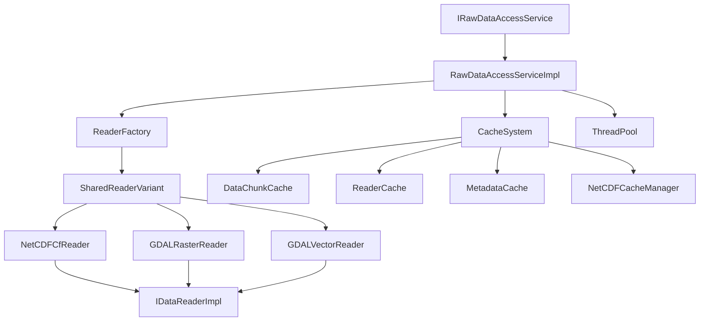
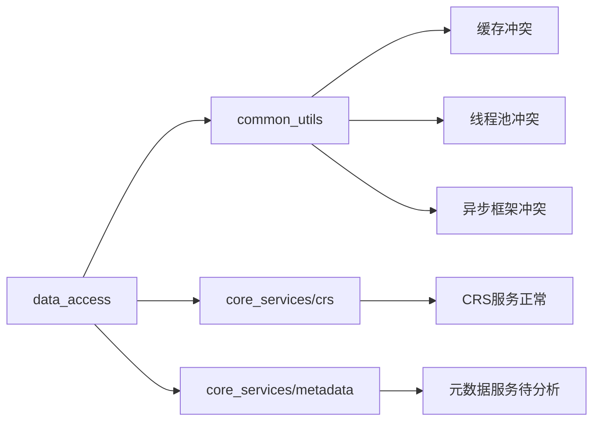

# Data Access模块全面代码分析报告

## 🔍 总体架构分析

### 1. 模块结构概览

```
data_access_service/
├── include/core_services/data_access/          # 公共接口
│   ├── i_raw_data_access_service.h            # 主服务接口
│   ├── i_data_reader_impl.h                   # 数据读取器接口
│   ├── boost_future_config.h                  # boost::future配置
│   └── cache/data_chunk_cache.h               # 缓存接口
├── src/impl/                                  # 核心实现
│   ├── raw_data_access_service_impl.h/cpp     # 主服务实现
│   ├── cache/                                 # 缓存子系统
│   │   ├── data_chunk_cache.h/cpp            # 数据块缓存
│   │   ├── reader_cache.h/cpp                # 读取器缓存
│   │   ├── metadata_cache.h/cpp              # 元数据缓存
│   │   └── netcdf_cache_manager.h/cpp        # NetCDF专用缓存
│   ├── factory/reader_factory.h/cpp          # 读取器工厂
│   └── readers/                              # 读取器实现
│       ├── data_reader_common.h              # 通用定义和SharedReaderVariant
│       ├── gdal/                             # GDAL读取器
│       │   ├── gdal_raster_reader.h/cpp
│       │   ├── gdal_vector_reader.h/cpp
│       │   ├── io/                           # IO操作
│       │   ├── metadata/                     # 元数据提取
│       │   └── utils/                        # 工具类
│       └── netcdf/                           # NetCDF读取器
│           ├── netcdf_cf_reader.h/cpp
│           ├── io/                           # IO操作
│           ├── parsing/                      # 数据解析
│           └── utils/                        # 工具类
```

### 2. 核心类关系图



## 🚨 重大问题识别

### 1. 异步接口不一致性

**问题严重程度：🔴 严重**

#### 1.1 混合使用boost::future和std::future

```cpp
// 文件: raw_data_access_service_impl.h (第27行)
#include <boost/thread/future.hpp>

// 同时存在两种Future类型的使用
boost::future<std::optional<FileMetadata>> extractFileMetadataAsync(...) override;

// 但在某些地方又看到std::future的引用
// cursor_common.md中提到：std::future<InterpolationResult> interpolateAsync(...)
```

#### 1.2 配置不统一
```cpp
// boost_future_config.h 只有9行，配置不完整
#define BOOST_THREAD_PROVIDES_FUTURE_CONTINUATION 

// 缺少与common模块boost_config.h的统一
```

**影响：**
- 代码维护困难，类型转换复杂
- 异步链式调用无法统一
- 第三方库集成困难

### 2. 缓存架构重复冗余

**问题严重程度：🔴 严重**

#### 2.1 多套独立缓存系统

```cpp
// data_access模块自建缓存：
class DataChunkCache { /* 363行实现 */ };
class ReaderCache { /* 独立实现 */ };
class MetadataCache { /* 独立实现 */ };
class NetCDFCacheManager { /* NetCDF专用 */ };

// 与common模块缓存重复：
template<typename Key, typename Value>
class ICacheManager { /* 327行通用缓存接口 */ };
class MultiLevelCacheManager { /* 统一缓存管理器 */ };
```

#### 2.2 缓存策略不一致

**data_access缓存特点：**
- LRU策略硬编码
- 缺乏统一配置
- 内存管理独立
- 无法与其他模块共享缓存

**common模块缓存特点：**
- 多种策略支持(LRU, LFU, TTL)
- 统一配置管理
- 支持异步操作（boost::future）
- 全局缓存管理器

**影响：**
- 内存使用效率低
- 缓存命中率无法优化
- 维护复杂度高
- 模块间数据无法共享

### 3. 工厂模式和依赖注入问题

**问题严重程度：🟡 中等**

#### 3.1 工厂设计不够灵活

```cpp
// reader_factory.h (第139行)
class ReaderFactory {
    // 硬编码的文件格式检测
    std::string detectFileFormat(const std::string& filePath);
    
    // 缺乏动态读取器注册机制
    template <typename ReaderType>
    void registerReader(...); // 存在但使用有限
};
```

#### 3.2 依赖注入不彻底

```cpp
// raw_data_access_service_impl.cpp (第106行)
RawDataAccessServiceImpl::RawDataAccessServiceImpl()
    : m_crsService(oscean::core_services::createCrsService()), // 硬编码依赖
      m_crsServiceExtended(oscean::core_services::createCrsServiceExtended()),
```

### 4. 与其他模块依赖混乱

**问题严重程度：🔴 严重**

#### 4.1 与common模块功能重复

**重复功能列表：**

| 功能 | data_access实现 | common模块实现 | 冲突程度 |
|------|----------------|---------------|----------|
| 缓存管理 | DataChunkCache | ICacheManager | 🔴 高度重复 |
| 线程池 | 独立创建 | GlobalThreadPoolRegistry | 🔴 高度重复 |
| 异步框架 | boost::future混用 | UnifiedAsyncFramework | 🔴 高度重复 |
| 内存管理 | RawDataBlock内存池 | MemoryManager | 🟡 部分重复 |
| 日志管理 | 独立logger | ModuleLogger | 🟡 部分重复 |

#### 4.2 依赖链分析



### 5. 读取器架构分析

**问题严重程度：🟡 中等**

#### 5.1 SharedReaderVariant设计

```cpp
// data_reader_common.h (第287行)
using SharedReaderVariant = std::variant<
    std::shared_ptr<std::monostate>,
    std::shared_ptr<netcdf::NetCDFCfReader>,
    std::shared_ptr<gdal::GDALRasterReader>,
    std::shared_ptr<gdal::GDALVectorReader>
>;
```

**优点：**
- 类型安全
- 统一接口
- 支持多种读取器

**问题：**
- 扩展性有限（需要修改variant定义）
- std::visit调用复杂
- 类型擦除导致性能损失

#### 5.2 读取器接口设计

```cpp
// i_data_reader_impl.h (第277行)
class IDataReaderImpl {
    // 接口过于庞大，违反ISP原则
    virtual std::shared_ptr<GridData> readGridData(...) = 0;
    virtual FeatureCollection readFeatureCollection(...) = 0;
    virtual VariableDataVariant readVariableData(...) = 0;
    // 共17个纯虚函数
};
```

### 6. 文件流和大文件处理分析

**问题严重程度：🟡 中等**

#### 6.1 文件流支持不完整

```cpp
// NetCDF读取器支持分块读取
template <typename DataType>
std::vector<DataType> extractSliceData(
    int varId, const std::vector<size_t>& start, 
    const std::vector<size_t>& count, bool& success);

// 但缺乏统一的流式读取接口
```

#### 6.2 大文件处理策略

**现有机制：**
- 数据块缓存(DataChunkCache)
- NetCDF分片读取
- GDAL瓦片读取

**缺失机制：**
- 背压控制
- 内存预算管理
- 自适应分块大小
- 并发读取协调

### 7. 元数据处理和时间格式转换

**问题严重程度：🟡 中等**

#### 7.1 元数据提取分散

```cpp
// GDAL元数据提取器
class GDALMetadataExtractor { /* 独立实现 */ };
class GDALRasterMetadataExtractor { /* 栅格专用 */ };
class GDALVectorMetadataExtractor { /* 矢量专用 */ };

// NetCDF元数据处理
class NetCDFMetadataManager { /* 独立实现 */ };
```

#### 7.2 时间格式转换

```cpp
// 时间处理分散在各个读取器中
class TimeProcessor; // NetCDF专用
// 缺乏统一的时间格式转换框架
```

## 📊 性能和内存分析

### 1. 内存使用问题

#### 1.1 多级缓存导致内存浪费

```cpp
// 估算内存使用
DataChunkCache: 256MB (默认)
ReaderCache: 50个读取器 × 平均内存
MetadataCache: 未限制大小
NetCDFCacheManager: 独立内存池

// 总计可能超过500MB，且无法统一管理
```

#### 1.2 内存池使用不一致

```cpp
// RawDataBlock中的内存池（data_reader_common.h 第249行）
bool allocateFromPool(std::shared_ptr<void> pool, size_t dataSize) {
    // 简化实现，与common模块内存管理器不兼容
}
```

### 2. 并发性能分析

#### 2.1 锁竞争问题

```cpp
// raw_data_access_service_impl.h (第225行)
mutable std::shared_mutex m_mutex; // 用于保护m_openDataSources

// 多个细粒度锁可能导致死锁
std::shared_mutex m_stateMutex;    // NetCDF状态锁
std::shared_mutex m_metadataMutex; // 元数据锁
std::mutex m_ncAccessMutex;        // NetCDF访问锁
```

#### 2.2 异步任务调度

```cpp
// executeAsyncTask模板过于简单（第244行）
template<typename ResultType>
boost::future<ResultType> executeAsyncTask(std::function<ResultType()> task) {
    // 缺乏优先级、超时、取消等高级功能
}
```

## 🛠️ 重构建议概要

### 1. 统一异步架构 (优先级：🔴 最高)

```cpp
// 建议使用common模块的统一异步框架
#include "common_utils/async/async_framework.h"

template<typename T>
using Future = oscean::common_utils::async::UnifiedFuture<T>;

// 所有接口统一为boost::future
boost::future<std::optional<FileMetadata>> extractFileMetadataAsync(...);
```

### 2. 统一缓存架构 (优先级：🔴 最高)

```cpp
// 移除data_access独立缓存，使用common统一缓存
#include "common_utils/cache/multi_level_cache_manager.h"

class DataAccessService {
private:
    std::shared_ptr<common_utils::cache::MultiLevelCacheManager> m_cacheManager;
    // 移除：DataChunkCache, ReaderCache, MetadataCache等
};
```

### 3. 重构工厂和依赖注入 (优先级：🟡 中等)

```cpp
// 引入依赖注入容器
class DataAccessServiceBuilder {
public:
    DataAccessServiceBuilder& withCacheManager(std::shared_ptr<ICacheManager> cache);
    DataAccessServiceBuilder& withThreadPool(std::shared_ptr<ThreadPool> pool);
    DataAccessServiceBuilder& withReaderFactory(std::shared_ptr<IReaderFactory> factory);
    
    std::shared_ptr<IRawDataAccessService> build();
};
```

### 4. 读取器接口重构 (优先级：🟡 中等)

```cpp
// 拆分大接口，遵循ISP原则
class IGridDataReader {
    virtual Future<std::shared_ptr<GridData>> readGridDataAsync(...) = 0;
};

class IFeatureDataReader {
    virtual Future<FeatureCollection> readFeatureCollectionAsync(...) = 0;
};

class IMetadataReader {
    virtual Future<std::vector<MetadataEntry>> getMetadataAsync(...) = 0;
};
```

### 5. 文件流和性能优化 (优先级：🟡 中等)

```cpp
// 引入流式读取接口
class IStreamingDataReader {
    virtual AsyncGenerator<DataChunk> readStreamAsync(
        const ReadRequest& request,
        const StreamingConfig& config) = 0;
};

// 背压控制和内存预算
class MemoryBudgetManager {
    virtual bool canAllocate(size_t bytes) = 0;
    virtual void notifyAllocation(size_t bytes) = 0;
    virtual void notifyDeallocation(size_t bytes) = 0;
};
```

## 📈 重构优先级和影响评估

### 第一阶段：基础架构统一 (2-3周)
1. **统一异步接口** - 全面替换为boost::future
2. **整合缓存系统** - 移除重复缓存，使用common统一缓存
3. **统一线程池管理** - 使用GlobalThreadPoolRegistry

### 第二阶段：接口重构 (2-3周)
1. **拆分读取器接口** - 遵循SOLID原则
2. **完善工厂模式** - 支持动态注册和依赖注入
3. **优化内存管理** - 与common模块内存管理器集成

### 第三阶段：性能优化 (1-2周)
1. **实现流式读取** - 支持大文件处理
2. **优化并发性能** - 减少锁竞争，提升吞吐量
3. **完善监控和诊断** - 集成性能监控

### 风险评估

| 风险项 | 概率 | 影响 | 缓解措施 |
|--------|------|------|----------|
| 接口破坏性变更 | 高 | 高 | 提供适配器和渐进迁移 |
| 性能回归 | 中 | 高 | 完善基准测试和监控 |
| 依赖模块不稳定 | 中 | 中 | 版本锁定和回退机制 |
| 测试覆盖不足 | 高 | 中 | 优先完善单元测试和集成测试 |

## 💡 结论

data_access模块存在严重的架构问题，主要体现在：

1. **异步接口不一致**导致维护困难
2. **缓存系统重复冗余**导致资源浪费  
3. **与common模块功能重复**违反DRY原则
4. **依赖注入不彻底**影响测试和扩展

建议按照三阶段计划进行重构，优先解决基础架构问题，再逐步优化性能和功能。重构后的模块将更加模块化、可测试和可维护。 