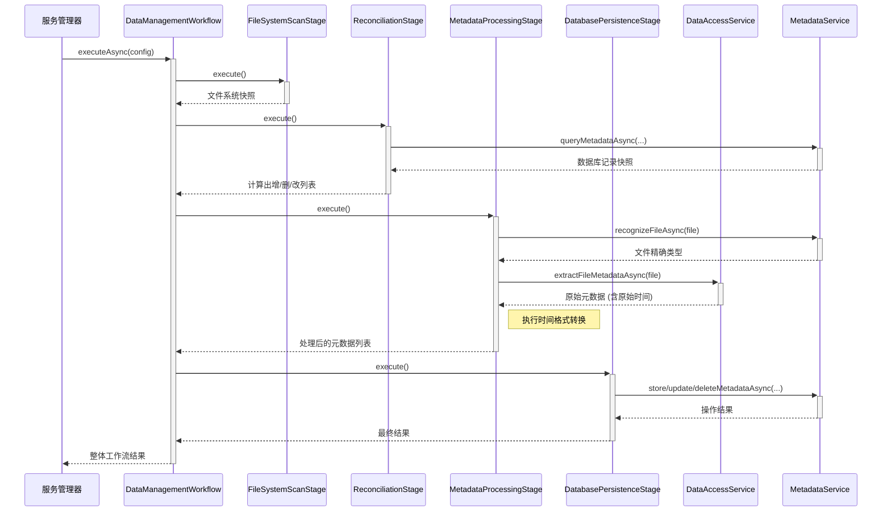

# 数据管理工作流实施计划

**版本:** 1.0
**日期:** 2024-07-27
**作者:** OSCEAN AI Assistant

---

## 1. 概述与目标

本文档旨在为OSCEAN项目提供一个详细、可执行的**数据管理工作流**实施计划。该工作流的目标是创建一个自动化的后端服务，能够持续地扫描指定的数据源目录，与元数据数据库进行双向同步，并提供准确、一致的数据索引与分类，最终实现对海洋环境与声学数据的全面、高效管理。

**核心目标:**

1.  **自动化数据发现:** 自动扫描用户配置的目录，识别新增、变更和删除的数据文件。
2.  **增量同步:** 仅处理发生变化的文件，确保服务高效运行。
3.  **数据一致性:** 保证数据库记录与物理文件系统在路径、名称和基本属性上完全一致。
4.  **智能元数据处理:** 利用现有核心服务（DAS/MDS）提取、转换（特别是时间格式）和智能分类元数据。
5.  **配置驱动:** 整个服务的行为，包括数据库连接、扫描目录、分类规则和工作流阶段，均由外部配置文件管理，具备高度灵活性。

---

## 2. 架构设计

服务将构建于 `workflow_engine/data_management` 模块内，其核心是`DataManagementWorkflow`的实例。该实例将按照预设顺序执行四个职责明确的工作流阶段处理器。

### 2.1. 工作流阶段

1.  **阶段一: 文件系统快照 (FileSystemScanStage)**
    *   **处理器:** `FileSystemScanStageHandler`
    *   **职责:** 完整扫描配置目录，生成当前文件系统的"事实清单"。
2.  **阶段二: 同步协调 (ReconciliationStage)**
    *   **处理器:** `ReconciliationStageHandler`
    *   **职责:** 对比文件系统清单和数据库记录，计算出需要"新增"、"更新"和"删除"的文件/记录列表。
3.  **阶段三: 元数据处理 (MetadataProcessingStage)**
    *   **处理器:** `MetadataExtractionStageHandler` (重命名为`MetadataProcessingStageHandler`更准确)
    *   **职责:** 对"新增"和"更新"列表中的文件执行完整的元数据提取、转换和分类流程。
4.  **阶段四: 数据库事务 (DatabasePersistenceStage)**
    *   **处理器:** `MetadataStorageStageHandler` (重命名为 `DatabasePersistenceStageHandler`更准确)
    *   **职责:** 将前序阶段计算出的所有变更（增、删、改）原子性地应用到数据库。

### 2.2. 核心交互流程



---

## 3. 配置文件设计 (修正版)

经过对 `metadata_service` 现有配置机制的深入分析，我们明确了配置的责任划分，以避免重复和冲突。

### 3.1. 配置责任划分

- **`metadata_service` 独占管理:**
    - **数据库连接:** 通过 `core_services_impl/metadata_service/config/database_config.yaml` 管理。
    - **智能分类规则:** 通过 `core_services_impl/metadata_service/config/variable_classification.yaml` 管理。
- **`data_management_workflow` 新增并管理:**
    - **自身行为:** 如扫描目录、扫描周期等。

### 3.2. 数据管理工作流配置文件 (`data_manager_config.json`)

我们的新服务将使用一个独立的、简化的配置文件。此文件将位于 `workflow_engine/data_management/config/` 目录下。

```json
{
  "service_settings": {
    "log_level": "INFO",
    "scan_interval_seconds": 3600,
    "enable_auto_scan": true
  },
  "scan_targets": [
    "D:/OSCEAN_DATA/ocean_environment/netcdf",
    "E:/ARCHIVE/acoustic_loss_data"
  ],
  "workflow_config": {
    "stage_order": [
      "FileSystemScanStage",
      "ReconciliationStage",
      "MetadataProcessingStage",
      "DatabasePersistenceStage"
    ],
    "stage_handlers": {
      "FileSystemScanStage": "oscean::workflow_engine::data_management::FileSystemScanStageHandler",
      "ReconciliationStage": "oscean::workflow_engine::data_management::ReconciliationStageHandler",
      "MetadataProcessingStage": "oscean::workflow_engine::data_management::MetadataProcessingStageHandler",
      "DatabasePersistenceStage": "oscean::workflow_engine::data_management::DatabasePersistenceStageHandler"
    }
  }
}
```

**关键变更:** 此配置文件中**不再包含** `database_config` 和 `classification_config` 部分。数据管理工作流在执行时，将通过核心服务代理调用 `metadata_service`，而后者会自行加载其专有的配置来完成数据库操作和智能分类。

---

## 4. 实施步骤与文件清单

### 4.1. 步骤一：创建配置文件

- **任务:** 在 `workflow_engine/data_management/config/` 目录下创建 `data_manager_config.json` 文件。
- **产出:**
  - `workflow_engine/data_management/config/data_manager_config.json`
- **注意:** 无需创建或修改 `metadata_service` 下的任何配置文件。

### 4.2. 步骤二：创建阶段处理器与提取器

*   **任务:** 创建新的C++类来实现工作流的四个阶段以及专门的元数据提取器。
*   **新增头文件:**
    *   `workflow_engine/data_management/include/workflow_engine/data_management/handlers/filesystem_scan_stage_handler.h`
    *   `workflow_engine/data_management/include/workflow_engine/data_management/handlers/reconciliation_stage_handler.h`
    *   `workflow_engine/data_management/include/workflow_engine/data_management/handlers/metadata_processing_stage_handler.h`
    *   `workflow_engine/data_management/include/workflow_engine/data_management/handlers/database_persistence_stage_handler.h`
    *   `workflow_engine/data_management/include/workflow_engine/data_management/extractors/netcdf_metadata_extractor.h`
*   **新增源文件:**
    *   `workflow_engine/data_management/src/handlers/filesystem_scan_stage_handler.cpp`
    *   `workflow_engine/data_management/src/handlers/reconciliation_stage_handler.cpp`
    *   `workflow_engine/data_management/src/handlers/metadata_processing_stage_handler.cpp`
    *   `workflow_engine/data_management/src/handlers/database_persistence_stage_handler.cpp`
    *   `workflow_engine/data_management/src/extractors/netcdf_metadata_extractor.cpp`

### 4.3. 步骤三：修改现有核心文件

*   **任务:** 对现有文件进行必要的修改，以集成新组件。
*   **待修改文件:**
    *   `workflow_engine/data_management/src/handlers/metadata_extraction_stage_handler.cpp`: 在其内部的工厂类 `MetadataExtractorFactory` 中，注册新的 `NetcdfMetadataExtractor`。 *(此文件将被重构成`MetadataProcessingStageHandler`)*
    *   `workflow_engine/data_management/include/workflow_engine/data_management/workflow_context.h` 和 `.cpp`: 增加新的字段用于在阶段间传递数据，例如 `setFilesToAdd()`, `getFilesToUpdate()`, `setMetadataToDelete()` 等。

### 4.4. 步骤四：创建服务启动器

*   **任务:** 创建一个高层管理类或一个可执行文件，用于引导和运行整个数据管理服务。
*   **新增文件:**
    *   `app/src/data_management_service_runner.cpp` (或类似位置)
*   **核心逻辑:**
    1.  解析 `data_manager_config.json`。
    2.  初始化 `CoreServiceProxy`。
    3.  创建 `DataManagementWorkflow` 实例。
    4.  根据配置中的 `workflow_config`，动态创建并注册四个阶段处理器实例。
    5.  根据配置中的 `service_settings`，启动一个定时器（或循环），按 `scan_interval_seconds` 周期性调用工作流的 `executeAsync` 方法。

### 4.5. 步骤五：更新构建系统

*   **任务:** 将所有新增的 `.h` 和 `.cpp` 文件添加到相应的 `CMakeLists.txt` 中，确保项目可以成功编译。
*   **待修改文件:**
    *   `workflow_engine/data_management/CMakeLists.txt`
    *   `app/CMakeLists.txt`

---

## 5. 测试计划

1.  **单元测试:** 为每个阶段处理器编写单元测试，使用Mock对象模拟 `CoreServiceProxy` 和 `WorkflowContext`，验证其内部逻辑的正确性。
2.  **集成测试:**
    *   **测试场景1 (首次运行):** 配置一个包含多种文件的目录，运行服务，验证所有文件都被正确识别为"新增"，元数据被正确提取、转换和存储。
    *   **测试场景2 (增量更新):** 在目录下新增一个文件、修改一个文件，然后再次运行服务。验证只有这两个文件被处理。
    *   **测试场景3 (删除文件):** 从目录中删除一个文件，再次运行服务，验证数据库中的对应记录被成功移除。
3.  **端到端测试:** 在一个完整的测试环境中，部署 `data_access_service`, `metadata_service` 和新的数据管理服务，进行完整的端到端流程验证。

--- 