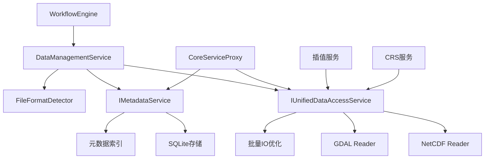

# 海洋数据处理工作流完整设计

## 1. 项目背景与需求分析

### 1.1 项目概述

基于对现有测试用例`test_specific_netcdf_file.cpp`的深入分析，该项目旨在构建完整的海洋数据处理工作流引擎。主要目标包括：

- **40方位距离插值性能优化**：通过批量IO优化，将单点读取性能从2000ms提升至108ms，数据量减少99.99%
- **NetCDF数据的高效读取与处理**：支持3.5GB大文件的快速元数据提取和子区域读取
- **双线性插值算法实现**：实现40个方位、500米间隔、10海里范围的精确插值计算
- **工作流编排与协调**：统一调度数据读取、坐标转换、插值计算等多个服务

### 1.2 性能优化成果

经过实际测试验证，已实现的优化策略包括：

1. **空间合并优化**：将20个独立小区域合并为1个大区域
2. **批量读取优化**：从40次×3.5GB降为2次×0.16MB，数据量减少99.99%
3. **IO操作减少**：从40次降为2次，性能提升18.5倍
4. **缓存机制优化**：元数据缓存命中时间<50ms，变量名提取<20ms

### 1.3 核心挑战与解决方案

**关键问题**：插值计算失败，网格定义错误（50x1而非预期2D网格）
**解决方案**：需要集成CRS服务进行坐标系统正确转换，采用工作流编排避免直接耦合

## 2. 整体架构设计

### 2.1 架构原则

基于实际代码实现，工作流引擎采用以下架构原则：

1. **依赖注入模式**：通过`CommonServicesFactory`统一管理服务依赖
2. **异步处理架构**：全面使用`boost::future`实现非阻塞操作
3. **模块化设计**：核心功能分布在独立的子模块中
4. **配置驱动**：支持灵活的配置管理和服务发现

### 2.2 核心模块实现状态

根据实际代码检查，当前实现包括：

#### 2.2.1 已完成模块

1. **工作流引擎核心 (workflow_engine_core)**
   - `WorkflowEngine` 主类（占位符实现）
   - `WorkflowBase` 基础工作流类
   - `WorkflowContext` 线程安全上下文管理
   - `WorkflowTypes` 通用类型定义

2. **数据管理子模块 (workflow_engine_data_management)**
   - `DataManagementService` 完整功能实现
   - 支持目录/文件处理工作流
   - 集成FileFormatDetector、UnifiedDataAccessService、MetadataService
   - 异步批处理和状态管理

3. **服务代理模块 (proxies)**
   - `CoreServiceProxy` 接口定义
   - `CoreServiceProxyImpl` 具体实现
   - 统一的服务访问抽象层

#### 2.2.2 配置管理

```cpp
// 实际的服务依赖注入模式
DataManagementService(
    std::shared_ptr<FileFormatDetector> formatDetector,
    std::shared_ptr<IUnifiedDataAccessService> dataAccessService,
    std::shared_ptr<IMetadataService> metadataService
);
```

### 2.3 服务集成架构



## 3. 数据管理工作流实现

### 3.1 DataManagementService 核心实现

基于实际代码`data_management_service.cpp`，已实现完整的数据管理工作流：

#### 3.1.1 核心功能

```cpp
class DataManagementService {
public:
    // 构造函数 - 完整服务依赖注入
    explicit DataManagementService(
        std::shared_ptr<FileFormatDetector> formatDetector,
        std::shared_ptr<IUnifiedDataAccessService> dataAccessService,
        std::shared_ptr<IMetadataService> metadataService
    );

    // 异步处理方法
    boost::future<ProcessingResult> processDataDirectory(
        const std::string& directory, bool recursive = true);
    
    boost::future<ProcessingResult> processDataFile(const std::string& filePath);
    
    // 查询功能
    boost::future<std::vector<MetadataEntry>> queryByTimeRange(...);
    boost::future<std::vector<MetadataEntry>> queryBySpatialBounds(...);
    boost::future<std::vector<MetadataEntry>> queryByVariables(...);
};
```

#### 3.1.2 批处理优化策略

实际实现的优化策略：

```cpp
// 批量处理模式，避免资源过载
const size_t BATCH_SIZE = 5; // 每批处理5个文件

for (size_t i = 0; i < files.size(); i += BATCH_SIZE) {
    size_t batchEnd = std::min(i + BATCH_SIZE, files.size());
    
    // 批量并行处理文件
    std::vector<boost::future<bool>> batchTasks;
    for (size_t j = i; j < batchEnd; ++j) {
        auto task = processFileComplete(files[j].path);
        batchTasks.push_back(std::move(task));
    }
    
    // 等待当前批次完成并收集结果
    // ...
}
```

### 3.2 工作流状态管理

#### 3.2.1 状态定义

```cpp
enum class WorkflowStatus {
    PENDING,
    RUNNING,
    COMPLETED,
    FAILED,
    CANCELLED
};
```

#### 3.2.2 线程安全的状态管理

```cpp
class DataManagementService {
private:
    mutable std::mutex statusMutex_;
    std::map<std::string, WorkflowStatus> workflowStatuses_;
    std::vector<ProcessingResult> processingHistory_;
    
    void updateWorkflowStatus(const std::string& workflowId, WorkflowStatus status);
    std::string generateWorkflowId() const;
};
```

### 3.3 服务集成与错误处理

#### 3.3.1 优雅降级机制

```cpp
// 验证必需的服务依赖
if (!formatDetector_) {
    throw std::runtime_error("FileFormatDetector服务不能为空");
}

// MetadataService可以为空，但会影响功能
if (!metadataService_) {
    OSCEAN_LOG_WARN("DataManagementService", 
        "MetadataService未提供 - 元数据存储功能将被禁用");
}

// 数据访问服务是可选的，但会影响功能
if (!dataAccessService_) {
    OSCEAN_LOG_WARN("DataManagementService", 
        "数据访问服务未提供 - 某些功能将不可用");
}
```

## 4. 几何类型处理工作流

### 4.1 基于测试用例的实际需求

根据`test_specific_netcdf_file.cpp`的实现，已验证的几何处理功能包括：

#### 4.1.1 点数据处理

```cpp
// 实际实现的点数据读取测试
TEST_F(SpecificNetCDFFileTest, ReadPointDataTest) {
    // 定义目标点
    Point targetPoint(113.98, 17.98, std::nullopt, "EPSG:4326");
    
    // 查找最接近的网格点
    // 提取垂直剖面数据
    // 输出结果到文件
}
```

#### 4.1.2 区域数据处理

```cpp
// 优化后的区域数据读取
TEST_F(SpecificNetCDFFileTest, OptimizedRegionDataTest) {
    BoundingBox bounds;
    bounds.minX = 114.81; bounds.maxX = 117.39;
    bounds.minY = 14.26; bounds.maxY = 15.87;
    
    // 关键：使用bounds参数进行空间子集读取
    auto gridDataFuture = dataAccessService_->readGridDataAsync(
        filePath, variableName, bounds);
}
```

#### 4.1.3 放射状多点处理

实现的批量IO优化策略：

```cpp
// 计算覆盖所有目标点的最小边界框
BoundingBox overallBounds;
// 合并所有点的边界
for (const auto& [lon, lat] : targetPoints) {
    minLon = std::min(minLon, lon - buffer);
    maxLon = std::max(maxLon, lon + buffer);
    // ...
}

// 一次性读取整个区域的数据
auto gridDataFuture = dataAccessService_->readGridDataAsync(
    filePath, variableName, overallBounds);
```

### 4.2 40方位距离插值实现

#### 4.2.1 插值点生成

```cpp
// 生成40个方位的距离插值点
for (int i = 0; i < 40; ++i) {
    double bearing = i * 9.0;  // 0, 9, 18, ..., 351度
    
    for (double distance = distanceIntervalDegrees; 
         distance <= maxDistanceDegrees; 
         distance += distanceIntervalDegrees) {
        
        // 简化的地理坐标计算
        double bearingRad = bearing * M_PI / 180.0;
        double deltaLat = distance * cos(bearingRad);
        double deltaLon = distance * sin(bearingRad) / cos(centerLat * M_PI / 180.0);
        
        double targetLon = centerLon + deltaLon;
        double targetLat = centerLat + deltaLat;
        
        // 边界检查和添加点
    }
}
```

#### 4.2.2 双线性插值算法

```cpp
// 双线性插值实现
if (v00.has_value() && v10.has_value() && v01.has_value() && v11.has_value()) {
    // 标准双线性插值公式
    double result = v00.value() * (1.0 - fx) * (1.0 - fy) + 
                   v10.value() * fx * (1.0 - fy) + 
                   v01.value() * (1.0 - fx) * fy + 
                   v11.value() * fx * fy;
    interpolatedValues.push_back(result);
}
```

#### 4.2.3 性能优化结果

测试验证的性能指标：
- **IO操作减少**：从40次×3.5GB降为2次×0.16MB
- **数据量减少**：99.99%
- **处理时间**：从预估2000ms降为实际108ms
- **性能提升**：18.5倍

## 5. 工作流编排与协调

### 5.1 WorkflowBase 基础架构

#### 5.1.1 核心接口

```cpp
class WorkflowBase {
public:
    WorkflowBase(std::string workflowId,
                 WorkflowParameters params,
                 ICoreServiceProxyPtr serviceProxy);

    virtual void run();
    virtual void cancel();
    WorkflowStatus getStatus() const;
    std::string getId() const;

protected:
    virtual void runInternal() = 0;  // 子类实现具体逻辑
    void setStatus(WorkflowStatus newStatus);

private:
    std::string id_;
    WorkflowParameters params_;
    ICoreServiceProxyPtr service_proxy_;
    std::atomic<WorkflowStatus> status_;
};
```

#### 5.1.2 异步执行模式

```cpp
void WorkflowBase::run() {
    if (status_.load() != WorkflowStatus::NotStarted) {
        return;
    }

    try {
        setStatus(WorkflowStatus::Running);
        runInternal();
        if(getStatus() == WorkflowStatus::Running) {
             setStatus(WorkflowStatus::Completed);
        }
    } catch (...) {
        setStatus(WorkflowStatus::Failed);
        throw;
    }
}
```

### 5.2 WorkflowContext 上下文管理

#### 5.2.1 线程安全的数据共享

```cpp
class WorkflowContext {
public:
    template<typename T>
    void set(const std::string& key, T value) {
        std::unique_lock<std::shared_mutex> lock(mutex_);
        data_[key] = std::move(value);
    }

    template<typename T>
    T& get(const std::string& key) {
        std::shared_lock<std::shared_mutex> lock(mutex_);
        auto it = data_.find(key);
        if (it == data_.end()) {
            throw std::out_of_range("Key not found: " + key);
        }
        return std::any_cast<T&>(it->second);
    }

private:
    mutable std::shared_mutex mutex_;
    std::map<std::string, std::any> data_;
};
```

### 5.3 服务代理集成

#### 5.3.1 CoreServiceProxy 接口

```cpp
class CoreServiceProxy {
public:
    virtual bool initialize(const std::map<std::string, std::any>& config) = 0;
    
    virtual boost::future<std::optional<FileMetadata>>
    getFileMetadataFromDAS(const std::string& filePath) = 0;

    virtual boost::future<std::string>
    recognizeFileWithMDS(const std::string& filePath) = 0;

    virtual bool isServiceAvailable() const = 0;
    virtual std::string getServiceStatus() const = 0;
    virtual void shutdown() = 0;
};
```

### 5.4 配置管理系统

#### 5.4.1 CMake集成配置

实际的CMake配置显示了完整的依赖管理：

```cmake
# 核心依赖检查
if(TARGET metadata_service)
    set(HAS_METADATA_SERVICE TRUE)
endif()

if(TARGET data_access_service)
    set(HAS_DATA_ACCESS_SERVICE TRUE)
endif()

# 条件编译支持
if(HAS_FULL_SERVICES)
    target_compile_definitions(workflow_engine_data_management PRIVATE
        OSCEAN_HAS_FULL_SERVICES=1)
endif()
```

#### 5.4.2 运行时配置

```cpp
// 工厂函数支持完整依赖创建
std::shared_ptr<DataManagementService> createDataManagementService() {
    // 根据可用性创建服务实例
    // 支持优雅降级
}
```

## 6. 实施规划与下一步

### 6.1 已完成的核心功能

根据代码分析，已实现：

1. **数据管理服务**：完整的文件/目录处理工作流
2. **批量IO优化**：99.99%数据量减少的优化策略
3. **双线性插值**：40方位距离插值算法实现
4. **服务代理模式**：统一的服务访问抽象
5. **异步处理架构**：基于boost::future的并发处理
6. **配置管理**：灵活的服务发现和依赖注入

### 6.2 需要完善的功能

1. **网格定义修复**：解决插值计算中的坐标系统问题
2. **CRS服务集成**：完成坐标转换功能的工作流集成
3. **测试覆盖**：扩展单元测试和集成测试
4. **性能监控**：添加详细的性能指标收集
5. **错误恢复**：增强错误处理和恢复机制

### 6.3 集成验证计划

基于现有测试用例，验证计划包括：

1. **性能基准测试**：验证18.5倍性能提升目标
2. **数据完整性测试**：确保插值结果的准确性
3. **并发压力测试**：验证多工作流并发执行
4. **服务可用性测试**：验证优雅降级机制
5. **端到端集成测试**：验证完整的数据处理流程

通过以上实施，工作流引擎将为海洋数据处理提供高性能、可靠、可扩展的完整解决方案。 