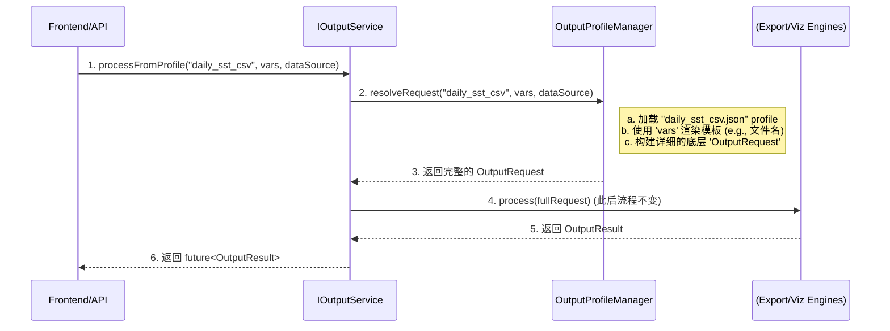

# OSCEAN 核心服务与输出层设计方案 (v9 - Final)

## 1. 架构原则与强制规范

本章节定义的原则是项目范围内的**强制性规范**，所有模块（包括但不限于输出层）的设计与实现都必须严格遵守。

*   **1.1. 统一工具集**: **必须**优先使用 `common_utilities` 模块提供的通用组件。严禁在其他模块中重复实现如线程池、日志、配置管理等基础功能。

*   **1.2. Boost 库优先**:
    *   **异步模型**: 项目**完全采用 Boost 的异步模型**。所有异步操作**必须**返回 `boost::future`，使用 `boost::promise`、`boost::packaged_task` 和 `boost::async`。**严禁**在代码中出现 `std::future`、`std::promise` 或 `std::async`。
    *   **可选值与变体**: **必须**使用 `boost::optional` 和 `boost::variant`，**禁止**使用 `std::optional` 和 `std::variant`。

*   **1.3. 核心设计模式**:
    *   **依赖注入 (Dependency Injection)**: **必须**在整个项目中贯彻依赖注入模式。所有类都应通过其构造函数接收其依赖项（以 `std::shared_ptr` 或引用形式）。严禁在类内部使用 `new` 关键字或服务定位器来创建其依赖。
    *   **工厂模式 (Factory Pattern)**: 当一个类需要创建不同类型的子对象（例如，根据格式字符串创建不同的文件写入器）时，**必须**使用工厂模式。这确保了主类与具体子类的实现解耦。

---

## 2. 概述

本文档是 OSCEAN 项目核心服务交互模式与输出层实现的**最终权威设计方案**。它旨在为后续开发工作提供一份全面、具体、可执行的蓝图，并**严格遵循第1章定义的架构规范**。本文档涵盖：
*   **服务间内存数据流架构**：定义了服务之间如何通过内存高效传递数据，避免不必要的磁盘 I/O。
*   **输出层详细设计**：阐述了输出层的架构、接口、以及基于"输出配置文件"的动态控制系统，包括对**大数据分块输出**的支持。

---

## 3. 服务间内存数据流设计 (In-Memory Data Flow Design)

为了解决服务（如模型计算）之间因中间文件读写导致的效率瓶颈，我们引入**内存数据流**架构。其核心思想是：**将内存中的数据块"伪装"成一个标准的数据读取器（`IDataReader`），从而让消费服务在无感知的情况下直接从内存读取数据。**

### 3.1 核心组件: `InMemoryDataReader`

这是实现内存数据流的"魔法胶水"。它是一个特殊的 `IDataReader` 实现，数据源不是磁盘文件，而是内存中的字节缓冲区。

*   **位置**: `core_services_impl/data_access_service/include/core_services/data_access/in_memory_data_reader.h` (新建)
*   **设计**:
    ```cpp
    #pragma once
    #include "core_services/data_access/i_data_reader.h"
    #include <vector>
    #include <string>
    #include <gdal_priv.h> // For GDALDataset

    namespace oscean {
    namespace data_access {

    // 实现了 IDataReader 接口，但数据源是内存 buffer
    class InMemoryDataReader : public core_services::data_access::IDataReader {
    public:
        // 构造函数：接管 buffer 的所有权，并创建 GDAL 虚拟文件
        InMemoryDataReader(std::vector<unsigned char> buffer, const std::string& formatHint);

        // 析构函数：利用 RAII 自动清理虚拟文件和 GDAL 数据集
        ~InMemoryDataReader() override;

        // --- IDataReader 接口实现 ---
        std::string getFilePath() const override;
        // ... 其他接口方法 (readData, getVariableInfo, etc.) 的实现
        //     将全部基于内部的 m_dataset 句柄操作。

    private:
        std::vector<unsigned char> m_buffer;      // 持有数据
        std::string m_virtualPath;                // GDAL 虚拟文件路径, e.g., "/vsimem/uuid"
        GDALDataset* m_dataset;                   // 打开虚拟文件后得到的 GDAL 句柄
    };

    } // namespace data_access
    } // namespace oscean
    ```
*   **工作原理**:
    1.  **构造**: 接收一个 `std::vector<unsigned char>`，立即调用 `VSIFileFromMemBuffer()` 将其注册到 GDAL 的虚拟文件系统，并得到一个唯一的 `/vsimem/` 路径。然后调用 `GDALOpen()` 打开此虚拟路径，获取 `GDALDataset*` 句柄。
    2.  **析构**: 自动调用 `GDALClose()` 和 `VSIUnlink()`，确保内存和虚拟文件引用被正确释放。

### 3.2 服务层设计 (Producers & Consumers)

服务被设计为只与标准的 `IDataReader` 接口交互，从而解耦其与数据来源的实现。

*   **数据生产者 (Producer)**: 任何生成中间结果的服务。
    *   **示例**: `IModelingService`
    *   **职责**: 运行模型，将结果在内存中编码为特定格式（如NetCDF），然后**创建并返回一个 `InMemoryDataReader`**。
    *   **接口**: `boost::future<std::shared_ptr<IDataReader>> runModel(...)`

*   **数据消费者 (Consumer)**: 任何需要读取数据的服务。
    *   **示例**: `IOutputService`, `ISpatialAnalysisService`
    *   **职责**: 接收一个 `std::shared_ptr<IDataReader>` 并对其进行处理。
    *   **设计优势**: 消费者**无需任何修改**。它不在乎传入的 `IDataReader` 究竟是 `FileReader`还是 `InMemoryDataReader`，可以一视同仁地处理。

### 3.3 工作流层设计 (Orchestration)

工作流是唯一知道完整业务流程的地方。它负责编排服务调用，并将生产者的输出（`InMemoryDataReader`）连接到消费者的输入。

*   **示例**: `ModelChainWorkflow`
    ```cpp
    // 伪代码/设计
    void ModelChainWorkflow::run(const std::vector<std::string>& sourceFilePaths) {
        // 1. 从磁盘准备初始输入
        auto initialReaders = m_dataAccess->createReaders(sourceFilePaths);

        // 2. 调用模型服务，输入是基于文件的 Readers
        auto futureModelResult = m_modelingService->runModel(initialReaders);
        
        // 3. 等待模型计算完成，获取内存中的结果 Reader
        std::shared_ptr<IDataReader> memoryResultReader = futureModelResult.get();

        // 4. 将内存 Reader 作为输入，调用下一个服务（例如输出服务）
        ProfiledRequest outputReq;
        outputReq.profileName = "model_result_preview_png";
        outputReq.dataSource = memoryResultReader; // <-- 传递内存读取器
        
        auto futureOutput = m_outputService->processFromProfile(outputReq);
        futureOutput.wait(); // 等待最终输出完成
    }
    ```

---

## 4. 输出层详细设计 (Output Layer Design)

### 4.1 架构与控制流
核心架构由 `OutputServiceImpl` (外观), `OutputProfileManager` (配置解析), `DataExportEngine` (文件导出), 和 `VisualizationEngine` (图片/瓦片生成) 组成。控制流通过 `processFromProfile` 发起，由 `OutputProfileManager` 解析配置文件，生成底层 `OutputRequest`，再由 `OutputServiceImpl` 分发给相应引擎。

### 4.2 输出配置文件 (`output_profiles/*.json`)
通过JSON文件模板化输出任务，实现对路径、智能文件名、格式、压缩、内容、**分块策略**等的全面动态控制。

一个增加了分块配置的 Profile 示例 (`profile_large_csv_export.json`):
```json
{
  "description": "Export large dataset to a series of chunked CSV files.",
  "targetDirectory": "/data/exports/{{jobId}}/",
  "filenameTemplate": "{{variableName}}_{{timestamp}}_{{chunkIndex}}.csv",
  "format": "csv",
  "chunking": {
    "maxFileSizeMB": 100,
    "strategy": "byRow" 
  },
  "creationOptions": {
    "csv": {
      "includeHeader": true,
      "delimiter": ","
    }
  }
}
```
*   **`chunking`**: (可选) 控制分块输出。如果此对象不存在，则不进行分块。
    *   `maxFileSizeMB`: (必选) 单个文件大小的上限（兆字节）。
    *   `strategy`: (可选, 默认为 `byRow`) 分块策略。`byRow` 用于表格数据，`bySlice` 可用于 NetCDF 等多维数据（例如按时间维度切分）。
*   **`filenameTemplate`**: 在分块模式下，必须包含 `{{chunkIndex}}` 占位符，用于生成序列文件名。

### 4.3 接口定义 (`IOutputService`)
为了支持分块输出返回多个文件路径，并严格遵守项目规范，`OutputResult` 结构和 `IOutputService` 接口定义如下。

```cpp
#pragma once
#include <string>
#include <vector>
#include "boost/variant.hpp"
#include "boost/optional.hpp"
#include "boost/thread/future.hpp" // !! 必须使用 Boost.Future !!
#include "core_services/data_access/i_data_reader.h"

namespace oscean {
namespace core_services {
namespace output {

// 最终输出结果
struct OutputResult {
    // 当输出为文件时，包含所有生成文件的路径列表。
    // 如果不分块，则 vector 中只有一个元素。
    boost::optional<std::vector<std::string>> filePaths; 

    // 当输出为流时，包含二进制数据。分块输出不支持流模式。
    boost::optional<std::vector<unsigned char>> dataStream; 
};

// ... ProfiledRequest and OutputRequest structs remain the same ...

class IOutputService {
public:
    virtual ~IOutputService() = default;

    virtual boost::future<OutputResult> processFromProfile(const ProfiledRequest& request) = 0;
    virtual boost::future<OutputResult> processRequest(const OutputRequest& request) = 0;
};

} // namespace output
} // namespace core_services
} // namespace oscean
```
*   **核心变更**:
    *   所有接口的返回类型已从 `std::future` 更改为 **`boost::future`**。
    *   头文件引用已更改为 `boost/thread/future.hpp`。
*   **约束**: **分块输出不支持流模式 (`streamOutput: true`)**。如果 Profile 中同时指定了分块和流输出，应优先执行分块到文件，并记录一个警告。

### 4.4 输出参数的精确控制
通过"输出 Profile"和 `templateVariables` 实现全面控制。
*   **路径与名称**: 由 Profile 中的 `targetDirectory` 和 `filenameTemplate` 控制。
*   **格式与压缩**: 由 Profile 中的 `format` 和 `creationOptions` 控制。
*   **内容与样式**: 由 Profile 中的 `formatSpecifics`, `styleId`, `boundingBox` 等控制。
*   **流/文件模式**: 由 Profile 中的 `streamOutput` 布尔标志控制。
*   **新增 - 分块控制**: 通过 `chunking` 对象精确控制文件大小和分割方式。

### 4.5 引擎与管理器逻辑
*   **`OutputProfileManager`**: 负责加载、缓存、解析和渲染输出配置文件。
*   **`OutputServiceImpl`**: 负责调度，连接高级接口和底层实现。
*   **`DataExportEngine`**: 管理各种文件 `Writer`。
    *   **依赖注入**: 其构造函数将接收一个 `IWriterFactory` 的实例。
    *   **工厂使用**: 在处理请求时，它**不会**直接创建 Writer 实例，而是调用 `m_writerFactory->createWriter(format)` 来获取合适的 `IWriter`。
    *   在处理请求时，会检查 `OutputRequest` 中是否存在分块配置。
*   **`WriterFactory` (新增组件)**:
    *   **职责**: 实现工厂模式。根据输入的格式字符串（如 "csv", "netcdf"）创建并返回对应的 `IWriter` 实现类的 `std::unique_ptr`。
    *   **位置**: `output_generation/src/writers/writer_factory.h / .cpp`
    *   **接口**: `std::unique_ptr<IWriter> createWriter(const std::string& format) const;`
*   **`VisualizationEngine`**: 
    *   **依赖注入**: 其构造函数将接收 `common_utils::IThreadPool` 等依赖。
    *   依赖 GDAL，通过 `MEM` 驱动和 `/vsimem/` 虚拟文件系统高效实现内存中的图像渲染和双模式输出。

### 4.6 测试策略
*   **新增**: 必须为 `InMemoryDataReader` 编写单元测试，验证其构造、析构以及与 GDAL VFS 的交互是否正确。
*   **新增**: 必须创建**端到端的服务链集成测试**，模拟 `ModelChainWorkflow` 的流程，验证数据能否在完全不接触磁盘的情况下，从一个服务正确流转到下一个服务并最终输出。
*   **新增 - 分块输出集成测试**:
    *   **目的**: 验证 `DataExportEngine` 的分块逻辑是否正确。
    *   **方法**: 准备一个大型数据集（例如一个包含数百万行的 CSV 或一个多时间步的 NetCDF）。创建一个带有 `chunking` 配置的 Profile。调用 `processFromProfile`。
    *   **断言**:
        1.  验证是否生成了多个文件。
        2.  验证每个文件（除了最后一个）的大小是否都在 `maxFileSizeMB` 限制左右。
        3.  验证所有文件的数据内容连接起来是否与原始数据集完全一致，没有丢失或重复。
*   **新增 - 工厂与依赖注入测试**:
    *   **目的**: 验证依赖注入是否正确配置，工厂模式是否能根据输入返回正确的对象实例。
    *   **方法**: 在单元测试中，为 `DataExportEngine` 注入一个 Mock 的 `IWriterFactory`，验证引擎是否正确调用了工厂的 `createWriter` 方法。
*   **保留**: `OutputProfileManager` 的单元测试和输出层各组件的集成测试。

## 5. 核心职责 (Core Responsibilities)
*   **文件导出**: 支持 `.txt`, `.csv`, `.nc`, `.geojson` 等格式。
*   **瓦片与图片生成**: 基于 GDAL，支持多种栅格格式，并提供**二进制流**和**文件**两种输出模式。
*   **动态配置与控制**: 通过外部配置文件（**输出 Profile**）对输出行为（路径、名称、格式、内容、样式）进行全面、动态的控制。

## 6. 架构与控制流

核心架构引入了一个新组件 `OutputProfileManager`，用于解析外部配置文件，实现控制逻辑与执行逻辑的解耦。



## 7. 输出配置文件 (`output_profiles/*.json`)

这是控制系统的核心。通过JSON文件模板化输出任务。

**示例 1: 文件导出 Profile (`daily_sst_report_csv.json`)**
```json
{
  "profileName": "每日海温数据报告-CSV格式",
  "outputType": "export",
  "targetDirectory": "D:/oscean_output/reports/sst/",
  "filenameTemplate": "sst_report_{{YYYY}}-{{MM}}-{{DD}}_{{source_hash_short}}.{{format}}",
  "format": "csv",
  "formatSpecifics": { "columns": ["lat", "lon", "sst"] }
}
```

**示例 2: 图片流 Profile (`preview_map_png.json`)**
```json
{
  "profileName": "数据预览图-PNG格式",
  "outputType": "visualization",
  "streamOutput": true,
  "taskType": "image",
  "format": "PNG", "width": 800, "height": 600,
  "styleId": "default_jet_colormap",
  "creationOptions": { "ZLEVEL": "6" }
}
```

## 8. 接口定义 (C++ Interface Definitions)

`IOutputService` 接口将增加一个高级方法，同时保留底层方法。

```cpp
// file: core_service_interfaces/include/core_services/output/i_output_service.h
#pragma once

#include "core_services/common_data_types.h"
#include "common_utils/async/async_utils.h" // For boost::future
#include <string>
#include <vector>
#include <map>
#include <any>
#include <boost/variant.hpp>
#include <boost/optional.hpp>

namespace oscean {
namespace core_services {

// 前向声明
class IDataReader; 

// 参数: 文件导出
struct ExportParameters {
    std::string targetPath; // 完整文件路径
    std::string format;     // e.g., "txt", "csv", "nc", "geojson"
    // 用于向特定Writer传递额外指令, e.g., {"columns", vector<string>{"lat", "lon"}}
    std::map<std::string, boost::any> formatSpecifics;
};

// 参数: 瓦片生成
struct TileParameters {
    int z, x, y;
    std::string format = "png"; // GDAL-supported format, e.g. "PNG", "JPEG"
    std::string styleId = "default";
    // 如果为空, 结果将以二进制流返回. 如果提供路径, 则保存为文件.
    boost::optional<std::string> targetPath; 
    // GDAL 创建选项, e.g., {"QUALITY", "75"} for JPEG
    std::map<std::string, std::string> creationOptions;
};

// 参数: 静态图片生成
struct ImageParameters {
    std::string format = "PNG"; // GDAL-supported format, e.g. "GTiff"
    int width = 800;
    int height = 600;
    std::string styleId = "default";
    // 如果为空, 结果将以二进制流返回. 如果提供路径, 则保存为文件.
    boost::optional<std::string> targetPath;
    // GDAL 创建选项, e.g., {"COMPRESS", "LZW"} for GTiff
    std::map<std::string, std::string> creationOptions;
    // 可选: 指定渲染的精确空间范围
    boost::optional<BoundingBox> boundingBox; 
};

// 输出请求的统一封装
struct OutputRequest {
    // 数据源: IDataReader 或一组 file_id
    boost::variant<std::shared_ptr<IDataReader>, std::vector<std::string>> dataSource;
    // 任务类型: 使用 boost::variant 区分
    boost::variant<ExportParameters, TileParameters, ImageParameters> task;
};

// 输出结果
struct OutputResult {
    bool success;
    std::string message;

    // 使用 boost::variant 来容纳文件路径或二进制数据
    boost::variant<
        boost::blank,                 // 空状态
        std::string,                  // 文件输出时的路径
        std::vector<unsigned char>    // 二进制流输出时的数据
    > resultData;
};

// 新增: 高级、基于Profile的请求
struct ProfiledRequest {
    std::string profileName;
    // 用于填充模板的变量, e.g., {"date", "2023-10-27"}
    std::map<std::string, std::string> templateVariables; 
    // 数据源依然需要提供
    boost::variant<std::shared_ptr<IDataReader>, std::vector<std::string>> dataSource;
};

// 输出服务接口
class IOutputService : public IService {
public:
    virtual ~IOutputService() = default;

    // 新增: 基于Profile的高级接口
    virtual boost::future<OutputResult> processFromProfile(const ProfiledRequest& request) = 0;

    // 保留: 底层接口，供内部或高级用户使用
    virtual boost::future<OutputResult> processRequest(const OutputRequest& request) = 0;
};

} // namespace core_services
} // namespace oscean
```

## 9. 输出参数的精确控制

通过 **输出 Profile** 和 **`templateVariables`** 实现全面控制。

*   **路径与名称 (`targetDirectory`, `filenameTemplate`)**: Profile 定义了基础目录和智能文件名模板。`OutputProfileManager` 负责渲染生成最终路径。支持的模板变量包括 `{{YYYY}}`, `{{MM}}`, `{{DD}}`, `{{uuid}}`, `{{source_hash_short}}`, 以及所有来自 `templateVariables` 的自定义变量。
*   **格式与压缩 (`format`, `creationOptions`)**: 直接在 Profile 中定义。对于图片/瓦片，`creationOptions` 会被直接传递给 GDAL 驱动，实现精细的压缩控制 (如 JPEG 质量, zlib 压缩级别)。
*   **内容与样式 (`formatSpecifics`, `styleId`, `boundingBox`)**:
    *   `formatSpecifics` (用于文件导出) 定义了要包含的列或变量。
    *   `styleId` (用于可视化) 映射到内部的渲染样式（如颜色表）。
    *   `boundingBox` 可在 Profile 中定义，也可由 `templateVariables` 动态提供，用于裁剪渲染范围。
*   **流/文件模式 (`streamOutput`)**: Profile 中的布尔标志 `streamOutput` (或检查 `targetDirectory` 是否存在) 决定了 `VisualizationEngine` 是输出二进制流还是物理文件。

## 10. 引擎与管理器逻辑

*   **`OutputProfileManager`**:
    *   在服务启动时加载并缓存所有位于 `config/output_profiles/` 的 `.json` 文件。
    *   `resolveRequest` 方法是其核心，它接收 `ProfiledRequest`，执行以下操作：
        1.  查找已加载的 Profile。
        2.  渲染 `filenameTemplate` 和路径。
        3.  合并/覆盖 Profile 中的默认参数和来自请求的动态参数。
        4.  构建并返回一个完整的、可供底层使用的 `OutputRequest`。
*   **`OutputServiceImpl`**:
    *   `processFromProfile` 方法负责调用 `OutputProfileManager` 解析请求，然后将解析后的 `OutputRequest` 传递给 `processRequest` 方法。
    *   `processRequest` 方法的逻辑保持不变，负责将任务分发给具体的引擎。
*   **`VisualizationEngine` (二进制流输出)**:
    *   **效率**: 采用 GDAL 的内存驱动 (`MEM`) 和虚拟文件系统 (`/vsimem/`)，实现零磁盘I/O的内存到内存操作。
    *   **灵活性**: 最终的二进制流 `std::vector<unsigned char>` 可被任何上层应用（如网络服务）直接使用。上层应用可根据 Profile 中的 `format` 字段设置正确的 HTTP `Content-Type` 头，从而实现灵活的前端显示。

## 11. 测试策略

*   **`OutputProfileManager` 单元测试**:
    *   必须为 `resolveRequest` 方法编写详尽的单元测试，验证各种模板渲染和参数合并的正确性。
*   **集成测试**:
    *   测试用例应基于 `processFromProfile` 方法。
    *   **用例**: 创建一个测试 Profile，然后通过 `processFromProfile` 调用它，验证输出的文件/数据流是否与 Profile 定义的完全一致。

## 12. 风险与缓解

*   **依赖管理**: GDAL 和 NetCDF 是大型库，确保 vcpkg 能正确处理其依赖关系至关重要。
    *   **缓解**: 在项目早期就进行构建测试，确保所有开发者都能平滑地获取和链接这些库。
*   **性能**: GDAL 的渲染操作，特别是对于高分辨率输出，可能消耗大量资源。
    *   **缓解**: 在 `VisualizationEngine` 中实现合理的资源管理策略。对于大数据，优先使用概览（Overviews）进行渲染。

## 13. 最终代码结构与文件说明

本节提供了输出生成层 `output_generation` 模块的完整代码结构，并对每个文件的职责进行了说明，以确保严格按设计目标执行。

### 13.1 接口定义 (位于 `core_service_interfaces` 模块)

为了实现项目级的接口统一，输出服务的公共接口被定义在 `core_service_interfaces` 模块中。

| 文件路径                                                      | 核心职责                                                                                                                              | 命名空间                        |
| :------------------------------------------------------------ | :------------------------------------------------------------------------------------------------------------------------------------ | :------------------------------ |
| `core_service_interfaces/include/core_services/output/i_output_service.h` | 定义 `IOutputService` 接口、所有公共数据结构（`ProfiledRequest`, `OutputRequest`, `OutputResult`）以及相关的枚举。这是输出层与项目其他部分交互的**唯一契约**。 | `oscean::core_services::output` |

### 13.2 实现模块 (位于 `output_generation` 模块)

`output_generation` 模块包含所有具体的实现逻辑，并依赖 `core_service_interfaces`。

| 类别       | 文件路径 / 目录                                              | 核心职责与依赖说明                                                                                                                  |
| :--------- | :----------------------------------------------------------- | :---------------------------------------------------------------------------------------------------------------------------------- |
| **构建**   | `output_generation/CMakeLists.txt`                           | 定义 `output_generation` 静态库，管理源文件、依赖项 (GDAL, `core_service_interfaces`, `common_utilities` 等)。                             |
| **配置**   | `output_generation/config/output_profiles/`                  | 存放所有预定义的 JSON 输出配置文件，如 `generic_text.json`, `timeseries_csv.json`。                                                  |
| **入口**   | `output_generation/src/output_service_impl.h/.cpp`           | **`OutputServiceImpl`**: 实现 `IOutputService` 接口。作为外观(Facade)，协调内部所有组件完成工作。**依赖**: `OutputProfileManager`, `DataExportEngine`, `VisualizationEngine`。 |
| **核心组件** | `output_generation/src/profiles/output_profile_manager.h/.cpp` | **`OutputProfileManager`**: 负责加载、解析、缓存和模板渲染输出配置文件。                                                                |
|            | `output_generation/src/engines/data_export_engine.h/.cpp`    | **`DataExportEngine`**: 负责文件导出，管理分块逻辑。**依赖**: `WriterFactory`。                                                       |
|            | `output_generation/src/engines/visualization_engine.h/.cpp`  | **`VisualizationEngine`**: 负责将数据渲染为图像，支持文件和内存流输出。                                                               |
| **写入器** | `output_generation/src/writers/i_writer.h`                   | **`IWriter`**: 定义所有具体文件写入器必须实现的通用接口。                                                                           |
|            | `output_generation/src/writers/writer_factory.h/.cpp`        | **`WriterFactory`**: 实现工厂模式，根据格式字符串创建正确的 `IWriter` 实例。                                                         |
|            | `output_generation/src/writers/text_based_writer.h/.cpp`     | **`TextBasedWriter`**: 实现 `IWriter`，处理 `.txt`, `.csv` 等文本格式。                                                                |
|            | `output_generation/src/writers/netcdf_writer.h/.cpp`         | **`NetcdfWriter`**: 实现 `IWriter`，处理 `.nc` 格式。                                                                                |
|            | `output_generation/src/writers/gdal_raster_writer.h/.cpp`    | **`GdalRasterWriter`**: 实现 `IWriter`，处理 GeoTIFF 等栅格格式。                                                                    |
|            | `output_generation/src/writers/gdal_vector_writer.h/.cpp`    | **`GdalVectorWriter`**: 实现 `IWriter`，处理 Shapefile, GeoJSON 等矢量格式。                                                         |
| **测试**   | `output_generation/tests/`                                   | 包含所有单元测试和集成测试，确保模块功能的正确性和健壮性。                                                                           |

## 14. 分阶段开发与实施计划

为确保开发过程的有序、可控，输出层的实施将遵循以下分阶段计划。每个阶段都有明确的目标和可交付成果。

### 阶段一：基础架构与核心接口 (Foundation & Core Interfaces)
-   **目标**: 搭建模块骨架，定义内部契约，确保项目可编译。
-   **任务**:
    1.  在 `core_service_interfaces` 中创建 `include/core_services/output/i_output_service.h` 文件，并定义完整的 `IOutputService` 接口及所有相关数据结构。
    2.  创建 `output_generation` 模块的完整目录结构。
    3.  编写 `output_generation/CMakeLists.txt`，配置好对 `core_service_interfaces`、`common_utilities`、GDAL 等的依赖。
    4.  创建 `output_generation/src/writers/i_writer.h`，定义 `IWriter` 接口。
    5.  创建所有 `.h` 和 `.cpp` 的空文件或桩实现，确保整个 `output_generation` 模块可以被编译成一个静态库。

### 阶段二：配置加载与引擎骨架 (Configuration & Engine Skeletons)
-   **目标**: 实现输出配置文件的处理能力，搭建核心引擎的框架。
-   **任务**:
    1.  **实现 `OutputProfileManager`**: 完整实现配置文件的加载、解析、缓存和模板替换功能。编写单元测试验证其正确性。
    2.  **实现 `WriterFactory`**: 实现工厂类，能根据字符串返回正确的 `IWriter` 实例。
    3.  **实现引擎骨架**: 创建 `DataExportEngine` 和 `VisualizationEngine` 的类框架，通过构造函数接收所有依赖项（如线程池、工厂等），但方法实现为空。

### 阶段三：文件导出功能实现 (File Export Implementation)
-   **目标**: 完整实现所有文件导出功能，包括分块。
-   **任务**:
    1.  **实现具体 Writers**: 逐一实现 `TextBasedWriter`, `NetcdfWriter`, `GdalRasterWriter`, `GdalVectorWriter`。为每个 Writer 编写独立的单元测试。
    2.  **完善 `DataExportEngine`**: 实现其核心逻辑，使其能够通过 `WriterFactory` 创建写入器，并将数据写入文件。重点实现并测试**文件分块 (Chunking)** 逻辑。
    3.  **集成测试**: 编写集成测试，通过 `DataExportEngine` 实际导出各种格式的文件，并验证其内容的正确性。

### 阶段四：可视化功能实现 (Visualization Implementation)
-   **目标**: 完整实现数据到图像的渲染功能。
-   **任务**:
    1.  **实现 `VisualizationEngine`**: 完整实现其渲染逻辑，包括颜色映射和对 GDAL 虚拟文件系统 (`/vsimem/`) 的使用。
    2.  **实现内存流输出**: 确保引擎可以正确地将渲染结果作为 `std::vector<unsigned char>` 返回。
    3.  **集成测试**: 编写集成测试，将示例 `GridData` 渲染成图像，并验证图像文件或内存流的正确性。

### 阶段五：总装与端到端测试 (Final Assembly & E2E Testing)
-   **目标**: 将所有组件组装起来，形成一个功能完整的输出服务。
-   **任务**:
    1.  **实现 `OutputServiceImpl`**: 实现这个外观类，将 `IOutputService` 接口的调用正确地路由到 `OutputProfileManager` 和两大引擎。
    2.  **端到端测试**: 编写最顶层的测试用例。模拟工作流调用 `IOutputService` 的接口，使用真实的 Profile 文件，执行从数据读取到最终产物（文件或内存流）生成的完整流程。验证整个系统的协同工作能力。
